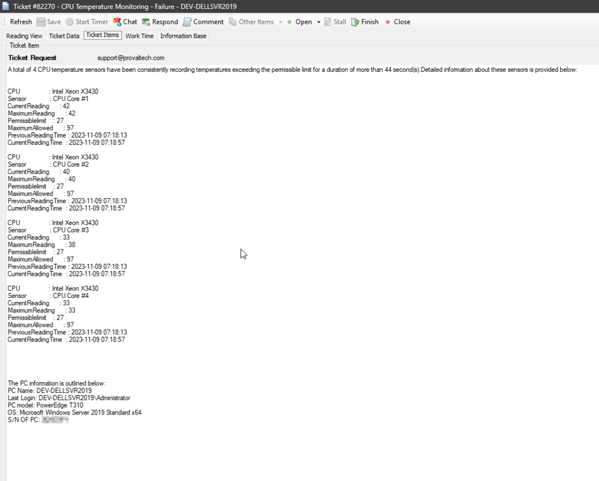

## Summary

The remote monitor is responsible for CPU temperature monitoring on physical Windows machines. It utilizes the [CPUTempMon.exe](https://proval.itglue.com/attachments/13313008) tool to obtain readings from the CPU temperature sensors. This tool is based on the [Libre Hardware Monitor](https://github.com/LibreHardwareMonitor/LibreHardwareMonitor).

The remote monitor verifies if the current temperature readings from the sensors exceed the permissible temperature for more than two consecutive executions of the monitor set. If this condition is met, it triggers a failure.

The monitor set is established by the [EPM - Sensors - Script - CPU Temperature Monitor - Create](/docs/7519f655-224b-4c95-b716-773f59cb7314) script, and its configuration is dependent on the system properties and the EDFs, as detailed in the [script's](/docs/7519f655-224b-4c95-b716-773f59cb7314) documentation.

## Details

**Suggested "Limit to":** Physical Windows machines

**Suggested Alert Style:** Once

**Suggested Alert Template:** `△ Custom - Ticket Creation - Computer` or `△ Custom - Email Creation - Computer`

## Dependencies

- [EPM - Sensors - Script - CPU Temperature Monitor - Create](/docs/7519f655-224b-4c95-b716-773f59cb7314)
- [EPM - Sensors - Internal Monitor - Execute Script - CPU Temperature Monitor - Create](/docs/7519f655-224b-4c95-b716-773f59cb7314)
- [EPM - Sensors - Script - CPU Temperature Monitor - Manage](/docs/56c1260c-a689-45e9-a226-49bf31444750)

## Ticketing

**Subject:** `CPU Temperature Monitoring - Failure - \\<COMPUTER NAME>`

**Sample Screenshot:**  

