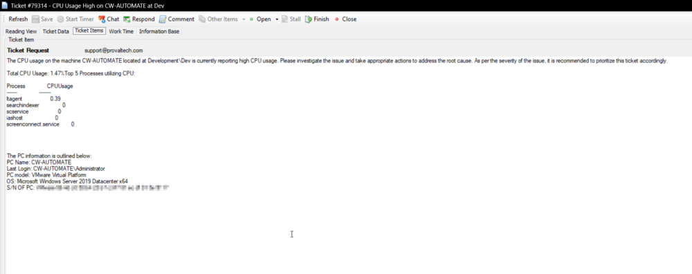
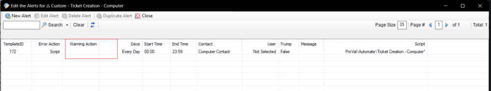

## Summary

This remote monitor uses a high threshold (`$th`) and a low threshold (`$tl`). The low threshold will only be used when the high threshold has been previously triggered.

The ticket will return the Commandline/Script path being run by the PowerShell process if it is one of the top 5 processes.

The Warning Stage represents the PowerShell errors.

## Target

Windows Machines - Should be run on all Windows machines.

## Ticketing

**Subject**  
`CPU Usage High on %Computername% at %locationname%`

**Success Body**  
`This is an automated update to inform you that the high CPU utilization issue reported earlier has now been resolved. The system has detected that the CPU usage has returned to normal and the performance has improved. We appreciate your prompt attention to this matter and thank you for taking the necessary actions to resolve the issue. If you require any further assistance or have any questions, please do not hesitate to contact us.`

**Failure Body**  
`The CPU usage on the machine %computername% located at %clientname%/%locationname% is currently reporting high CPU usage. Please investigate the issue and take appropriate actions to address the root cause. As per the severity of the issue, it is recommended to prioritize this ticket accordingly.`

`%RESULT%`

**Sample %RESULT%**  
`Total CPU Usage: 89.9%`

`Top 5 Processes utilizing CPU:`  
```
Process                           CPUUsage
-------                           --------
platform-sysevents-plugin        42.39
svchost                          16.39
ltagent                          16.39
screenconnect.windowsclient      10.15
idlemon                          5.5
```

**Sample Ticket**  


## Alert Template

**Name:** △ Custom - Ticket Creation - Computer



**Note:** The alert template should not be running the same script for the Warning action unless you want to create a ticket for the PowerShell errors as well.

## How to Import

[Import - Remote Monitor - ProVal - Production - CPU Threshold Violation Monitor](<./ProVal - Production - CPU Threshold Violation Monitor.md>)


