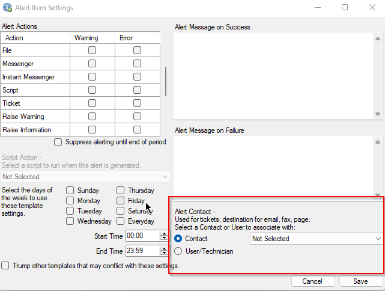

## Summary

This monitor intends to alert partners of any **unsynced** ticket comments for a ticket that has already been synchronized to CW Manage.

## Dependencies

- [Email RAWSQL Monitor Set Failures* [Autofix]](/docs/901470a2-73d2-4d29-b0d3-c5f15cf19c41)  
- CW Manage Plugin  

Use the "△ Email RAWSQL Monitor set results to the Partner" alert template along with the monitor set.

**Note:** The script will send an email to the alert template user/contact. This field must be modified manually after importing the template or while enabling the monitor. The alert template will default to the location contact, and you must set the contact/user that you wish to receive the alerts.

## Target

Global

