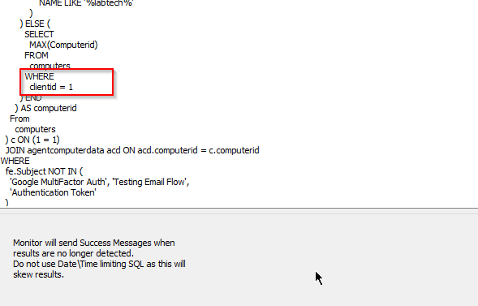

## Summary

This monitor reports any failed email that is not related to 'Google Authenticator', 'Testing Email Flow', or 'Authentication Token' that has occurred within the last hour.

Each hour, a ticket with the details of all the failed emails from the previous hour will be generated.

**Ticket Subject:** Automate Failed Email Detected

**Sample Ticket Body:**

The number of Failed Emails: 2

Below is the information of all the emails that failed in the last hour:

- **To:** [antohe@failed.com](mailto:antohe@failed.com)  
  **From:** something@someone.com  
  **Subject:** Something Else  
  **Body:**  
  **Error Message:** Error  
  **Failure Date:** 2022-07-01 10:05:05  

- **To:** [noone@fakeemail.com](mailto:noone@fakeemail.com)  
  **From:** [doesntmatter@email.com](mailto:doesntmatter@email.com)  
  **Subject:** Stuff  
  **Body:** Things  
  **Error Message:** Bad Stuff  
  **Failure Date:** 2022-07-01 10:03:20  

## Important Notes

For on-prem partners, tickets will be generated for the Automate server.  
For hosted partners, it will be the minimum computer ID of Client ID 1. If Client ID 1 is not the primary client for a hosted partner, then the client ID should be updated in the following location:  

## Dependencies

[Ticket Creation - Without Computer Information And Failures Only [Autofix]](../scripts/Ticket%20Creation%20-%20Without%20Computer%20Information%20And%20Failures%20Only%20Autofix.md)

"△ Custom - Ticket Creation - Without Computer Details" alert template should be applied to the monitor set.

## Target

Global - Should be run without explicitly defined targets.

