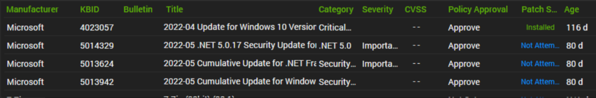

## Summary

The purpose of this monitor is to identify Windows 10 machines that are experiencing patching discrepancies related to cumulative updates and security updates.  

**Suggested Alert Template:** Default - Create Automate Ticket

## Target

The SQL query is limited to supported Windows 10 computers.
