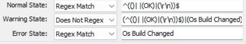

## Summary

The purpose of this remote monitor is to detect if there is any change in the machine's OS build number. If yes, it will run the [CWM - Automate - Script - Get Lastest Installed Cumulative Update](https://proval.itglue.com/DOC-5078775-12849478) script on the machine to update information on [pvl_win_latest_installed_cu](https://proval.itglue.com/DOC-5078775-12849460) table.

## Details

**Suggested "Limit to"**: `Windows OS Excluding EOL machines like Server 2003, 2008, 2012, Windows 7, XP, 8 etc`  
**Suggested Alert Style**: `Continuous`  
**Suggested Alert Template**: `△ Custom - Execute Script - Get Latest Installed Cumulative Update`  

Insert the details of the monitor in the below table.

| Check Action | Server Address | Check Type | Execute Info | Comparator   | Interval | Result |
|--------------|----------------|-------------|---------------|---------------|----------|--------|
| System       | 127.0.0.1     | Run File    | **REDACTED**  | State Based    | 3600     |  |

## Target

Windows OS

## How To Import

[Implement - Remote Monitor - Monitor OS Build](https://proval.itglue.com/DOC-5078775-13799403)

