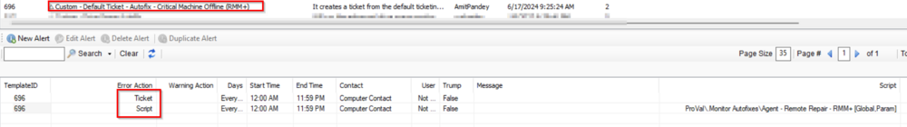
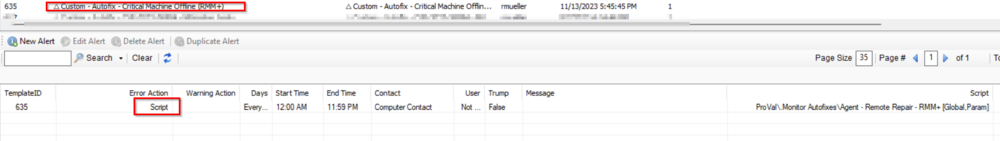
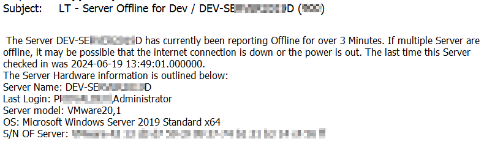

## Purpose

The goal of this solution is to provide accurate offline server/critical agent reporting while also validating the machine is actually offline in ScreenConnect. If the machine is online in ScreenConnect but not Automate, remediation steps will be taken and output into the ticket. If the remediation is successful, the tickets will get auto-closed.

## Associated Content

| Content                                                                 | Type     | Function                                                                                                                                                                                                                                                                                       |
|-------------------------------------------------------------------------|----------|------------------------------------------------------------------------------------------------------------------------------------------------------------------------------------------------------------------------------------------------------------------------------------------------|
| [Script - Agent - Remote Repair - RMM +](https://proval.itglue.com/DOC-5078775-12439587) | Script   | The script utilizes the ConnectWise Automate RMM+ plugin to reinstall the Automate agent on machines that are showing offline, while the ScreenConnect agent is online. This script deprecates CW Control RMM+ API - Offline Server AutoFix*                                                                 |
| [Monitor - Offline Server](https://proval.itglue.com/DOC-5078775-8030359)           | Monitor  | This internal monitor detects offline servers based on the last contact and last heartbeat time with the RMM.                                                                                                                                                                                |
| **△ Custom - Autofix - Critical Machine Offline (RMM+)**               | Alert Template | This alert template is used with the [Monitor - Offline Server](https://proval.itglue.com/DOC-5078775-8030359) to run the [Script - Agent - Remote Repair - RMM +](https://proval.itglue.com/DOC-5078775-12439587) as an autofix. In this template, the script performs the autofix and does ticket creation/commenting/finish as well. |
| **△ Custom - Default Ticket - Autofix - Critical Machine Offline (RMM+)** | Alert Template | This alert template is used with the [Monitor - Offline Server](https://proval.itglue.com/DOC-5078775-8030359) to run the [Script - Agent - Remote Repair - RMM +](https://proval.itglue.com/DOC-5078775-12439587) as an autofix. In this template, the ticket is created separately using the default create ticket functionality of Alert Template and the script performs the autofix and does ticket commenting and ticket finish based on autofix status of failure and success respectively. |

Note: For working of this solution, it is mandatory to have the RMM+ configured in the CW Control.

## Additional Content

| Content                                                                 | Type      | Function                                                                                                                                                                                                                                           |
|-------------------------------------------------------------------------|-----------|----------------------------------------------------------------------------------------------------------------------------------------------------------------------------------------------------------------------------------------------------|
| [CWM - Automate - RMM+ Plugin Configuration](https://proval.itglue.com/DOC-5078775-9770217) | Document  | This document helps with Configuring the RMM+ Plugin and explains how to create sessions for machines that have not checked in for over '**X**' number of days.                                                                                                                                 |

## Implementation

1. Import the following content using the ProSync Plugin:
   - Import the Script [Script - Agent - Remote Repair - RMM +](https://proval.itglue.com/DOC-5078775-12439587)
   - Import the monitor [Internal Monitor - Offline Server](https://proval.itglue.com/DOC-5078775-8030359)
   - Import the Alert Template "**△ Custom - Autofix - Critical Machine Offline (RMM+)**"
   - Import the Alert Template "**△ Custom - Default Ticket - Autofix - Critical Machine Offline (RMM+)**"

2. Reload the system cache:
   

3. Configure the solution as outlined below:
   - Navigate to Automation -> Monitors within the CWA Control Center and setup the following:
     - [Monitor - ProVal - Production - Agent - Offline Server](https://proval.itglue.com/DOC-5078775-8030359)
       - Here are two options for the alert template applicability. They are:
         - `△ Custom - Default Ticket - Autofix - Critical Machine Offline (RMM+)` OR
         - `△ Custom - Autofix - Critical Machine Offline (RMM+)`
       - **If this has not been specified by the consultant, the default should be:**
         - `△ Custom - Default Ticket - Autofix - Critical Machine Offline (RMM+)`
       - Right-click and Run Now to start the monitor

### Things to Note about the Alert Templates:

- `△ Custom - Default Ticket - Autofix - Critical Machine Offline (RMM+)`
  - This will create a ticket using the default create ticket functionality rather than using the script to create the ticket. This ensures that the ticket gets generated whether the scripting engine is overloaded or not. The downside of using this is the initial description of the tickets are not as detailed with additional computer information.
  

- `△ Custom - Autofix - Critical Machine Offline (RMM+)`
  - This will create the ticket entirely through the autofix script, ensuring the initial description of the ticket contains helpful computer information as well as automatically adapted for different types of machines, such as critical workstations, Linux, and Mac machines.
  

## FAQ

1. **Does this create a ticket during agent reinstallation failure and does it have an auto-ticket close feature once the agent starts check-in?**
   - Yes, it creates a ticket for the failed attempt for the agent reinstallation and also automatically finishes the ticket if the agent check-in.

2. **What are the differences between the two tickets and how they look?**
   - For the Default Ticket creation alert template, the initial description should look something like this:
     

   - For the ticket creation from the script, the initial description should look something like this:
     
     - Keep in mind as well, for any other machine types the word 'Server' will get replaced with what critical machine is offline. Those potential options are as follows:
       - 'Critical Mac Machine'
       - 'Linux Machine'
       - 'Critical Workstation'
       - 'Server'
     - It is recommended that you use this alert template only if you are confident that the scripting engine should not get overloaded based on your current configuration OR if you are OK with accepting the potential risk if the scripting engine has a problem during an offline server issue.

