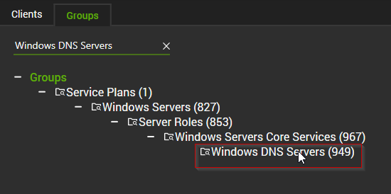
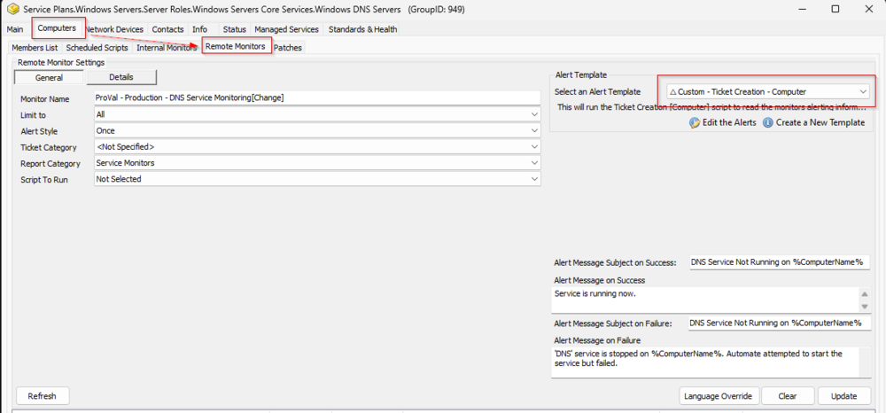

## Implementation Steps

1. Execute the following SQL query from a RAWSQL monitor set to import the monitor:

   ```sql
   SET @Groupid = (SELECT Groupid FROM MasterGroups WHERE `GUID` = '3ac86a4d-f1fb-11e1-b4ec-1231391d2d19');
   SET @Alertaction = (SELECT alertactionid FROM alerttemplate WHERE `GUID` = 'ee4bc754-faf7-4667-8bba-8d3923c22c3e');
   INSERT INTO groupagents 
   SELECT '' AS `AgentID`,
   `groupid` AS `GroupID`,
   '0' AS `SearchID`,
   'ProVal - Production - DNS Service Monitoring' AS `Name`,
   '6' AS `CheckAction`,
   @Alertaction AS `AlertAction`,
   'DNS Service Not Running on %ComputerName%~~~Service is running now.!!!DNS Service Not Running on %ComputerName%~~~//DNS// service is stopped on %ComputerName%. Automate attempted to start the service but failed.' AS `AlertMessage`,
   '0' AS `ContactID`,
   '600' AS `interval`,
   '127.0.0.1' AS `Where`,
   '7' AS `What`,
   'C://Windows//System32//WindowsPowerShell//v1.0//powershell.exe -ExecutionPolicy Bypass -Command "$service = (Get-Service -Name //DNS// -ErrorAction SilentlyContinue); if ($Service) { if ($Service.Status -ne //Running//) { try { Restart-Service -Name //DNS// -Force -WarningAction SilentlyContinue -ErrorAction Stop } catch { return /////"Failed to start the //DNS// service. Reason: $($Error[0].Exception.Message)/////"; } } }"' AS `DataOut`,
   '16' AS `Comparor`,
   '10|((^((OK){0,}(//r//n){0,}[//r//n]{0,}//s{0,})$)%7C(^$))|11|((^((OK){0,}(//r//n){0,}[//r//n]{0,}//s{0,})$)%7C(^$))%7C(^((//r//n){0,}[//r//n]{0,}//s{0,})Failed to start the)|10|^((//r//n){0,}[//r//n]{0,}//s{0,})Failed to start the' AS `DataIn`,
   '0' AS `IDField`,
   '1' AS `AlertStyle`,
   '0' AS `ScriptID`,
   '' AS `datacollector`,
   '5' AS `Category`,
   '0' AS `TicketCategory`,
   '1' AS `ScriptTarget`,
   CONCAT(
   SUBSTRING('abcdef0123456789', FLOOR(RAND()*16+1), 1),
   SUBSTRING('abcdef0123456789', FLOOR(RAND()*16+1), 1),
   SUBSTRING('abcdef0123456789', FLOOR(RAND()*16+1), 1),
   SUBSTRING('abcdef0123456789', FLOOR(RAND()*16+1), 1),
   SUBSTRING('abcdef0123456789', FLOOR(RAND()*16+1), 1),
   SUBSTRING('abcdef0123456789', FLOOR(RAND()*16+1), 1),
   SUBSTRING('abcdef0123456789', FLOOR(RAND()*16+1), 1),
   SUBSTRING('abcdef0123456789', FLOOR(RAND()*16+1), 1),
   '-',
   SUBSTRING('abcdef0123456789', FLOOR(RAND()*16+1), 1),
   SUBSTRING('abcdef0123456789', FLOOR(RAND()*16+1), 1),
   SUBSTRING('abcdef0123456789', FLOOR(RAND()*16+1), 1),
   SUBSTRING('abcdef0123456789', FLOOR(RAND()*16+1), 1),
   '-',
   SUBSTRING('abcdef0123456789', FLOOR(RAND()*16+1), 1),
   SUBSTRING('abcdef0123456789', FLOOR(RAND()*16+1), 1),
   SUBSTRING('abcdef0123456789', FLOOR(RAND()*16+1), 1),
   SUBSTRING('abcdef0123456789', FLOOR(RAND()*16+1), 1),
   '-',
   SUBSTRING('abcdef0123456789', FLOOR(RAND()*16+1), 1),
   SUBSTRING('abcdef0123456789', FLOOR(RAND()*16+1), 1),
   SUBSTRING('abcdef0123456789', FLOOR(RAND()*16+1), 1),
   SUBSTRING('abcdef0123456789', FLOOR(RAND()*16+1), 1),
   '-',
   SUBSTRING('abcdef0123456789', FLOOR(RAND()*16+1), 1),
   SUBSTRING('abcdef0123456789', FLOOR(RAND()*16+1), 1),
   SUBSTRING('abcdef0123456789', FLOOR(RAND()*16+1), 1),
   SUBSTRING('abcdef0123456789', FLOOR(RAND()*16+1), 1),
   SUBSTRING('abcdef0123456789', FLOOR(RAND()*16+1), 1),
   SUBSTRING('abcdef0123456789', FLOOR(RAND()*16+1), 1),
   SUBSTRING('abcdef0123456789', FLOOR(RAND()*16+1), 1),
   SUBSTRING('abcdef0123456789', FLOOR(RAND()*16+1), 1),
   SUBSTRING('abcdef0123456789', FLOOR(RAND()*16+1), 1),
   SUBSTRING('abcdef0123456789', FLOOR(RAND()*16+1), 1),
   SUBSTRING('abcdef0123456789', FLOOR(RAND()*16+1), 1),
   SUBSTRING('abcdef0123456789', FLOOR(RAND()*16+1), 1)
   ) AS `GUID`,
   'root' AS `UpdatedBy`,
   (NOW()) AS `UpdateDate`
   FROM mastergroups m
   WHERE m.groupid = @groupid
   AND m.groupid NOT IN (SELECT DISTINCT groupid FROM groupagents WHERE `Name` = 'ProVal - Production - DNS Service Monitoring')
   ```

2. Open the `Windows DNS Servers` group  
   

3. Check the remote monitor and ensure the proper alert template is applied to it.  
   


