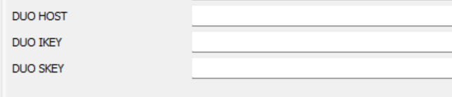
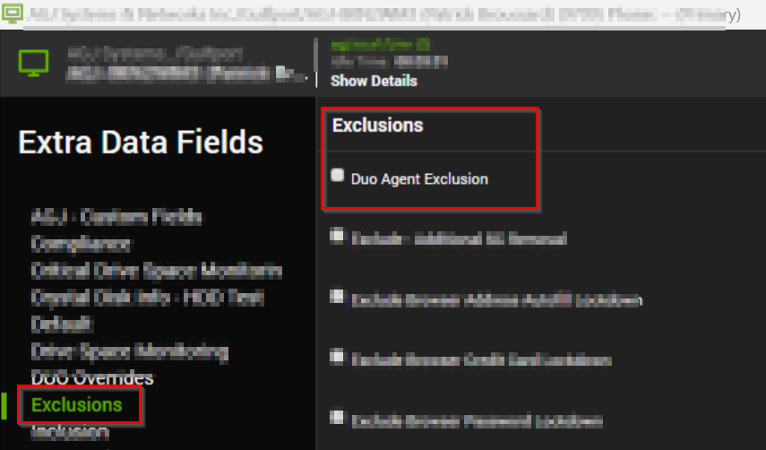

## Summary

This monitor will detect the online Windows agent where the outdated DUO Authentication for Windows Logon is installed or it also detects the agents whose client EDFs are set with values and the exclusions EDF "DUO Agent Exclusion" are not checked at the location or computer level.

Client EDFs:

Client Exclusion EDF:  
**<u></u>**  

Location Exclusion EDFs:

Computer Exclusion EDFs:

## Dependencies

[Script - DUO Install/Upgrade - Latest Version](https://proval.itglue.com/DOC-5078775-9713528)

## Target

Windows OS

## Ticketing

---

**Subject:**  
DUO Authentication Install/Update Failed on %ComputerName% at %ClientName%

---

**Body**

**When installation failed**  
Failed to Install the @ApplicationVersion@ of DUO Authentication for Windows Logon. Here's the result of the installation Command: %ShellResult%

**When Argument Missing**  
Arguments required to install DUO Authentication for Windows Login is not set.

