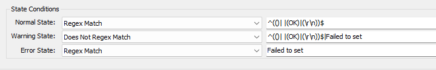

## Summary

This monitor disables the AI recall feature on Windows 11 machines.

For more details on this feature, visit the following link:  
[https://learn.microsoft.com/en-us/windows/client-management/manage-recall](https://learn.microsoft.com/en-us/windows/client-management/manage-recall)

## Details

**Suggested "Limit to"**: Windows 11 machines  
**Suggested Alert Style**: Once  
**Suggested Alert Template**: △ Custom - Ticket Creation - Computer  

| Check Action | Server Address | Check Type | Execute Info | Comparator | Interval | Result |
|--------------|----------------|------------|---------------|------------|----------|--------|
| System       | 127.0.0.1     | Run File   | **REDACTED**  | Regex Match | 1800     |  |

## Target

Windows 11 machines only.

## Ticketing

**Subject**: `Failed to Disable AI Recall on %COMPUTERNAME%`

**Body**: `Failed to Disable AI Recall on %COMPUTERNAME% on %CLIENTNAME%\%COMPUTERNAME% at %LOCATIONNAME%` 

## How To Import

[Import - Remote Monitor - Disable AI Recall](<./Import%20-%20Remote%20Monitor%20-%20Disable%20AI%20Recall.md>)
