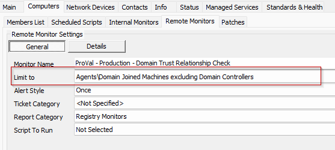

## Summary

This monitor is used to generate a ticket whenever the trust relationship between the domain and the workstation is broken.

## Details

**Suggested "Limit to"**: Domain Joined Machines excluding Domain Controllers  
**Suggested Alert Style**: Once  
**Suggested Alert Template**: `△ Custom - Ticket Creation - Computer`

| Check Action | Server Address | Check Type | Execute Info | Comparator | Interval |
|--------------|----------------|------------|---------------|------------|----------|
| System       | 127.0.0.1     | Run File   | **REDACTED**  | State Based | 3600     |

## Dependencies

[CWM - Automate - Script - Ticket Creation - Computer](https://proval.itglue.com/DOC-5078775-9098338)

## Target



## Ticketing

**Subject:** Domain trust relationship failure detected on %ComputerName%

**Body:**  

The trust relationship between this workstation and the primary domain failed for %ComputerName%.  

%RESULT%  

**Example %Result%:**

```
Domain trust relationship failure detected.
Reason:
Flags: b0 HAS_IP  HAS_TIMESERV 
Trusted DC Name //DEV-Server2019DC.provaldev.local 
Trusted DC Connection Status Status = 0 0x0 NERR_Success
Trust Verification Status = 1 0x1 NERR_Failed
The command was completed with a failure
```

## Implementation

[https://proval.itglue.com/5078775/docs/17975723](https://proval.itglue.com/5078775/docs/17975723)


