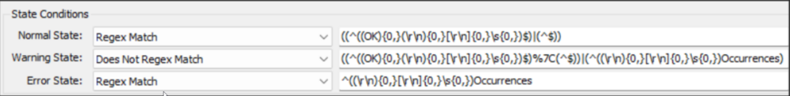
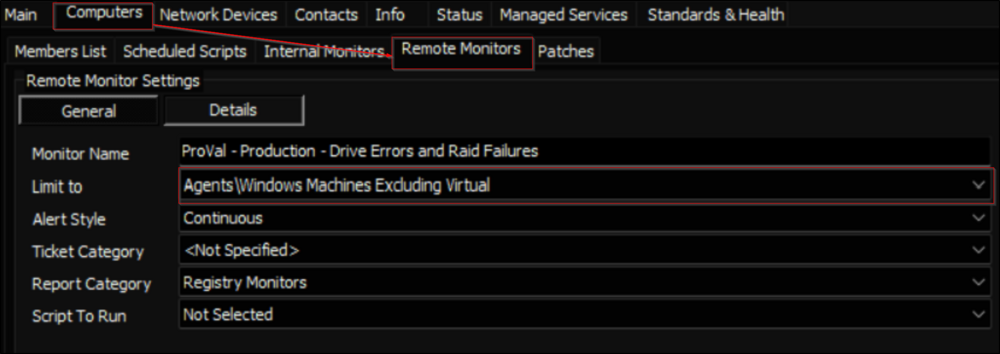

## Summary

This monitor checks for any problems with the Drive or Raid in the past hour. You can also choose how many `Controller errors` and `bad block detected` errors you want to allow in the past hour before the monitor makes a ticket for them. You can set these numbers when you import the monitor set. If you set them to 0, the monitor will not ignore any errors. That means, the monitor will make a ticket even if there is only one of these errors when the number is 0. You can find more information and examples about these variables in the implementation document.

```
SET @AllowedControllerErrors = \\<How many Controller Errors you want to allow>;
```

```
SET @AllowedBadBlocks = \\<How many Bad Blocks you want to allow>;
```

**Warning**:  
- The monitor set may not work well for the machines that have an old version of PowerShell (less than 5).
- The monitor set does not work for the virtual machines.

## Details

**Suggested "Limit to"**: `Windows Machines Excluding Virtual`  
**Suggested Alert Style**: Continuous  
**Suggested Alert Template**: `△ Custom - Ticket Creation - Computer - Failures Only`  

Insert the details of the monitor in the below table.

| Check Action | Server Address | Check Type | Execute Info | Comparator | Interval | Result |
|--------------|----------------|-------------|---------------|------------|----------|--------|
| System       | 127.0.0.1     | Run File    | **REDACTED**  | State Based | 3600     |  |

## Dependencies

[CWM - Automate - Script - Ticket Creation - Computer](<../scripts/Ticket Creation - Computer.md>)

## Target

Managed Windows Computer (Excluding Virtual Machines)

  

The monitor set should be limited to the `Windows Machines Excluding Virtual` search.

## Implementation

[Implement - Remote Monitor - Drive Errors and Raid Failures](<./Drive Errors and Raid Failures.md>)

## Ticketing

**Subject:**  
`Drive Error Detected on %CLIENTNAME%/%COMPUTERNAME%`

**Body:**  
```
Drive Error Detected on %CLIENTNAME%/%COMPUTERNAME%.

Details:  

%RESULT%
```


