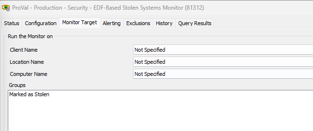

## Summary

Executes the [SEC - Encryption - Script - Lock Stolen System](https://proval.itglue.com/DOC-5078775-7798917) script against the machines where the `Mark System As Stolen` EDF is marked and starts checking back with Automate.

## Dependencies

[SEC - Encryption - Script - Lock Stolen System](https://proval.itglue.com/DOC-5078775-7798917)

## Target

`Marked as Stolen` Group

