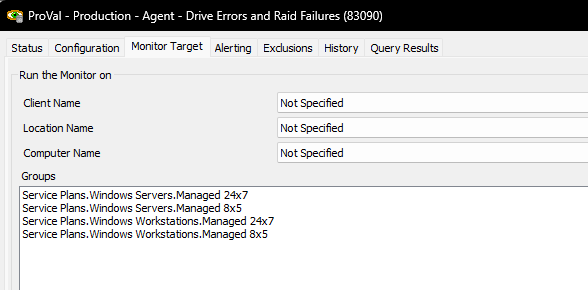
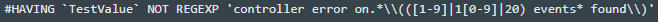
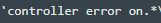
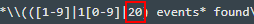

## Summary

This monitor proactively looks for all the drive errors and RAID failure events generated in the last 24 hours.

**Note:**  
- The monitor set explicitly excludes virtual machines.  
- The monitor set works on the event logs stored/gathered in Automate, so it's not 100% reliable.

## Target

Managed Windows Computers

## FAQ

**Q:** How do I ignore certain error types or only alert on a number of events?  
**A:** At the end of the query, there is a commented-out (by default) line for this behavior.  
  
Remove the `#` from this line, and that will allow this line to go into production. In this example, we want to ignore controller errors if there are fewer than 20 of them on a specific drive. The portion:  
  
is the subject line of the event log that we want to exclude unless there are X results. The portion here:  
  
is the number of events.

Translated from programming to human, this essentially says, "Do not tell me about controller errors unless there are more than 20 of them."

This could work for Paging Errors, Bad Blocks, or really anything you can match.

