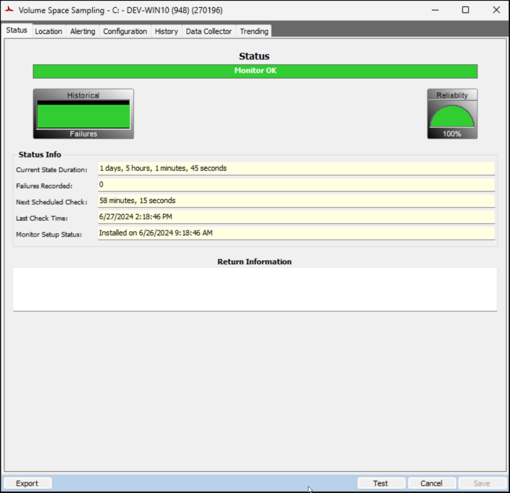
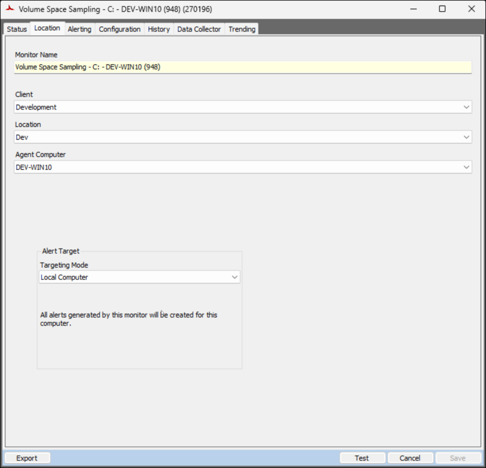
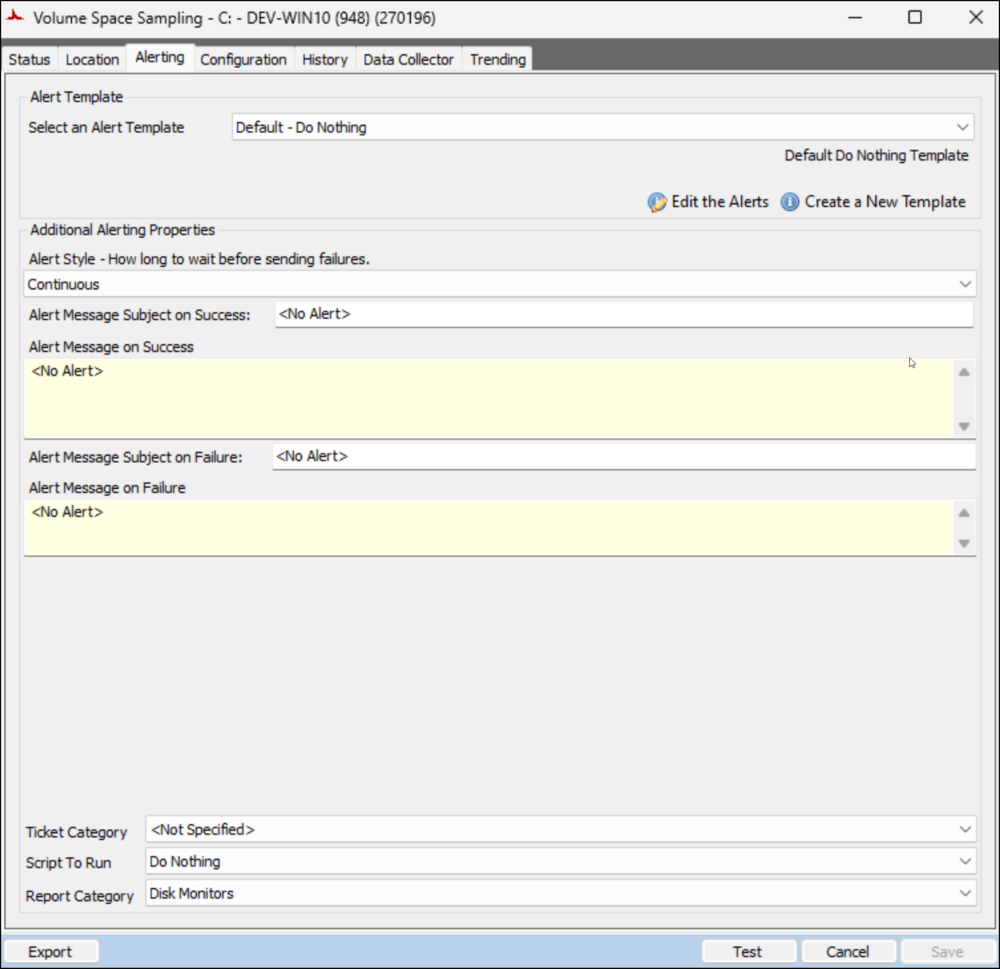
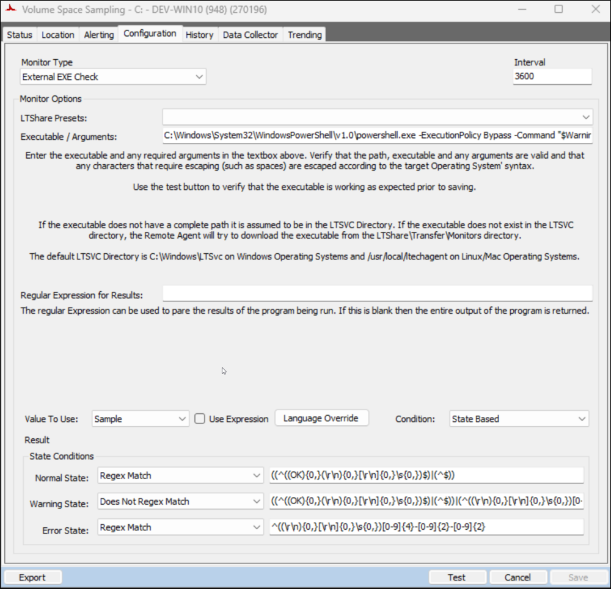

## Summary

The [Predictive Volume Exhaustion Monitor Creation](<../scripts/Predictive Volume Exhaustion Monitor Creation.md>) script generates the monitor set. It utilizes the [Get-VolumeExhaustionEstimate](<../../powershell/Get-VolumeExhaustionEstimate.md>) agnostic script to assess and return an estimation of the number of days remaining before the drive space is entirely occupied, utilizing the trend data/samples gathered. The parameters for the script are configured according to the system properties detailed in the [script's documentation](<../scripts/Predictive Volume Exhaustion Monitor Creation.md>).

The data returned by the monitor set is displayed by the [Volume Exhaustion Estimations [Remote Monitor]](<../dataviews/Volume Exhaustion Estimations Remote Monitor.md>) dataview.

## Dependencies

- [EPM - Disk - Script - Predictive Volume Exhaustion Monitor Creation](<../scripts/Predictive Volume Exhaustion Monitor Creation.md>)
- [EPM - Disk - Dataview - Volume Exhaustion Estimations [Remote Monitor]](<../dataviews/Volume Exhaustion Estimations Remote Monitor.md>)

## Monitor

#### Status



#### Location



#### Alerting



#### Configuration



**Executable/Arguments:** 
```plaintext
C://Windows//System32//WindowsPowerShell//v1.0//powershell.exe -ExecutionPolicy Bypass -Command "$WarningPreference = 'SilentlyContinue'; [Net.ServicePointManager]::SecurityProtocol = [enum]::ToObject([Net.SecurityProtocolType], 3072); $ProjectName = 'Get-VolumeExhaustionEstimate'; $WorkingDirectory = 'C://ProgramData//_Automation//Script//$ProjectName//'; $scriptpath = '$($WorkingDirectory)//$($ProjectName).ps1'; $scripturl = 'https://file.provaltech.com/repo/script/Get-VolumeExhaustionEstimate.ps1'; if (!(Test-Path $WorkingDirectory)) {mkdir $WorkingDirectory | Out-Null}; (New-Object System.Net.WebClient).DownloadFile($scripturl,$scriptpath); $op = & $scriptpath -MinimumSamples 30 -Path $WorkingDirectory -DaysToReport 14 -DaysToLead 7 -Quiet -Force; $exDate = ($op | Where-Object { $_.DriveLetter -eq 'C' }).ExhaustionEstimationDate; if ($exDate) { ($exdate).ToString('yyyy-MM-dd HH:mm:ss') }"
```

The parameter values highlighted in the provided example are regulated by the system properties and the Extra Data Fields (EDFs).

