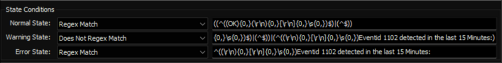

## Summary

This Remote Monitor will alert if security events were deleted or cleared in the last 15 minutes, it is specifically looking for security event 1102. The remote monitor should be set to run at an interval less than or equal to 15 minutes.

Event 1102 is logged whenever the **Security log is cleared**, REGARDLESS of the status of the Audit System Events audit policy. The Account Name and Domain Name fields identify the user who cleared the log.

**Note:** If the computer's PowerShell version is older than 5, the monitor set may not function properly.

## Details

**Suggested "Limit to"**: All  
**Suggested Alert Style**: Continuous  
**Suggested Alert Template**: △ Custom - Ticket Creation Computer - Failures Only  

Insert the details of the monitor in the below table.

| Check Action | Server Address | Check Type | Execute Info | Comparator | Interval | Result                |
|--------------|----------------|------------|---------------|------------|----------|-----------------------|
| System       | Default        | Run File   | REDACTED      | State Based | 900      | \<Screenshot Below\>    |

## Dependencies

[CWM - Automate - Script - Ticket Creation - Computer [Failures Only]*](https://proval.itglue.com/DOC-5078775-13459854)

## Target

Windows Computers

## Ticketing

| Subject          | Security Event Log Cleared on %CLIENTNAME%//%COMPUTERNAME% |
|------------------|--------------------------------------------------------------|
| Ticket Summary    | Security Event logs cleared/deleted for %CLIENTNAME%//%COMPUTERNAME%: %Result% |

## Implementation

[Import - Remote Monitor - Security event logs cleared/deleted](https://proval.itglue.com/DOC-5078775-14946240)

