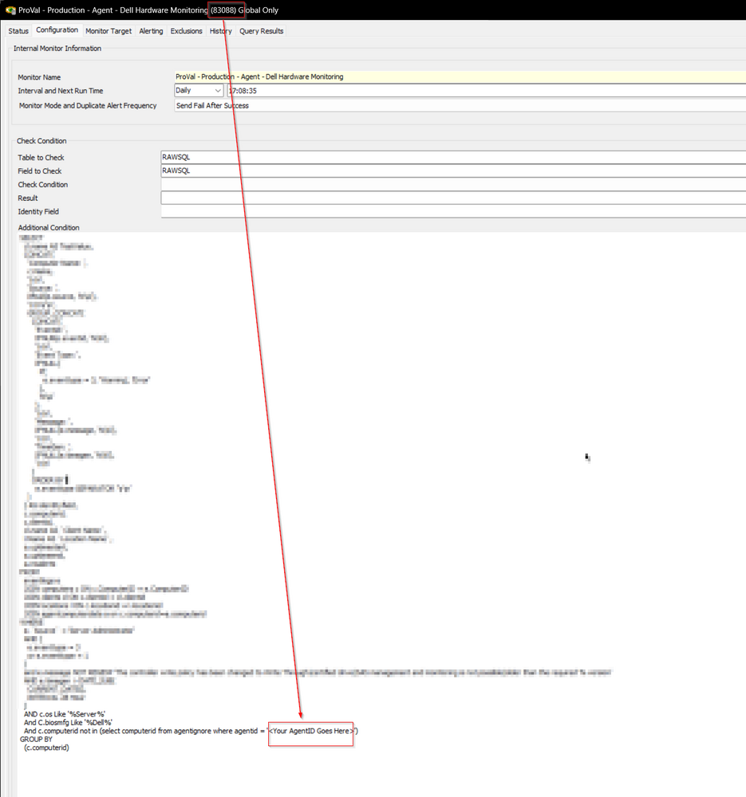

## Summary

This internal monitor detects critical and error Dell event logs via the "Server Administrator" event source, filtering out noisy event log types.

"~Custom - Ticket Creation - Computer" Alert template should be used. 

Replace \<Your AgentID Goes Here\> with the ID of the monitor set before enabling it. 

## Target

Dell Servers

