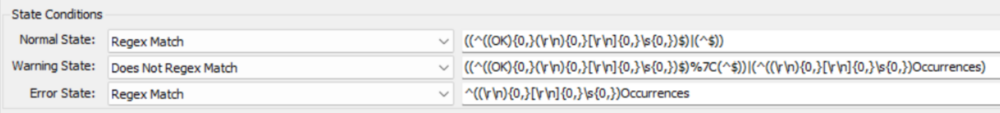
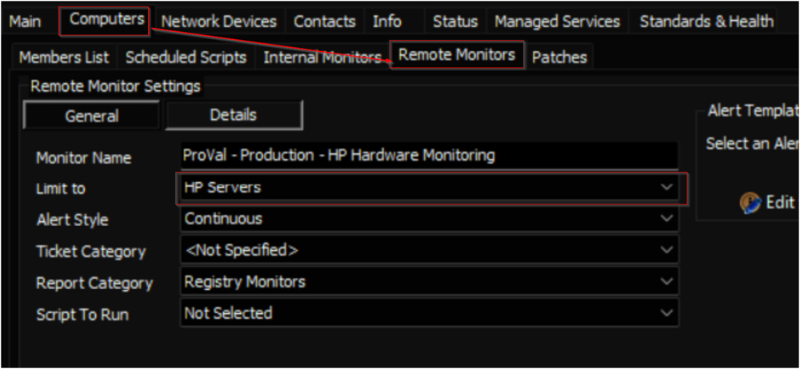

## Summary

This remote monitor looks for several event types and IDs coming from the HP Server management software installed on the HP Servers.

**Notes:**

- **`HP(E) Insight Management Agents`** software should be installed on the server.
  - Pulls event logs generated only when this software is installed and running.

## Details

**Suggested "Limit to"**: HP Servers  
**Suggested Alert Style**: Continuous  
**Suggested Alert Template**: `△ Custom - Ticket Creation - Computer [Failures Only]`

Insert the details of the monitor in the table below.

| Check Action | Server Address | Check Type | Execute Info | Comparator   | Interval | Result                                                                 |
|--------------|----------------|------------|---------------|--------------|----------|------------------------------------------------------------------------|
| System       | 127.0.0.1      | Run File   | **REDACTED**  | State Based  | 3600     |  |

## Target

Managed Servers (HP Servers only)  
  
The monitor set should be limited to the `HP Servers` search.

## Implementation

[Implement - Remote Monitor - HP Hardware Monitoring](<./Implement - Remote Monitor - HP Hardware Monitoring.md>)

## Ticketing

**Subject:** `HP Event Log Errors Detected on %CLIENTNAME%/%COMPUTERNAME%`  

**Body:** `HP Hardware Monitoring has detected an issue with %Computername% at %clientname%. The message details are outlined below:  
%RESULT%`
