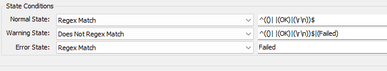

## Summary

This monitor enables the following BitLocker features on the Windows server if they are not already installed:

- BitLocker Drive Encryption Administration Utilities
- BitLocker Recovery Password Viewer
- BitLocker Drive Encryption Tools

## Details

**Suggested "Limit to"**: Windows Servers  
**Suggested Alert Style**: Once  
**Suggested Alert Template**: Default Do Nothing  

Insert the details of the monitor in the table below.

| Check Action | Server Address | Check Type | Check Value | Comparator   | Interval | Result                                                  |
|--------------|----------------|------------|-------------|--------------|----------|---------------------------------------------------------|
| System       | 127.0.0.1     | Run File   | **REDACTED**    | State Based  | 21600    |  |

## Target

Windows Servers

## How to Import

[Import - Remote Monitor - Enable BitLocker Feature](<./Import- Enable Bitlocker Feature.md>)