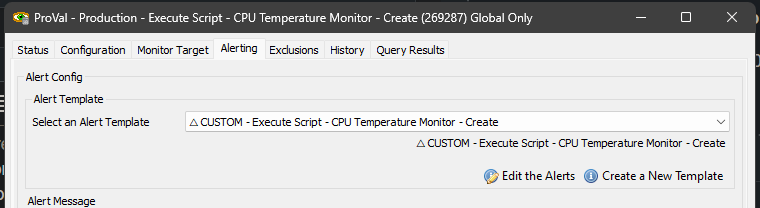
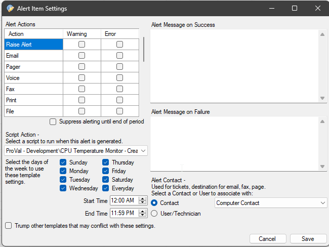

## Summary

The monitor set runs the [EPM - Sensors - Script - CPU Temperature Monitor - Create](<../scripts/CPU Temperature Monitor - Create.md>) script once a week on Windows machines where CPU temperature monitoring is enabled. Monitoring can be turned on or off using the system properties and the EDFs, as explained in the [script’s](<../scripts/CPU Temperature Monitor - Create.md>) documentation.

## Dependencies

[EPM - Sensors - Script - CPU Temperature Monitor - Create](<../scripts/CPU Temperature Monitor - Create.md>)

## Target

Global

## Alert Template

**Name:** △ CUSTOM - Execute Script - CPU Temperature Monitor - Create

**The alert template should run the** [EPM - Sensors - Script - CPU Temperature Monitor - Create](<../scripts/CPU Temperature Monitor - Create.md>) **script for `Error`.**

  

