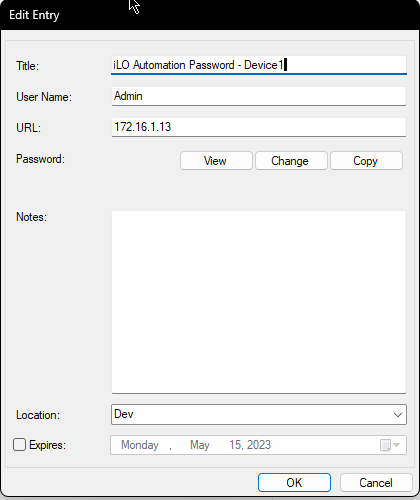
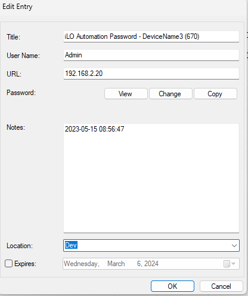
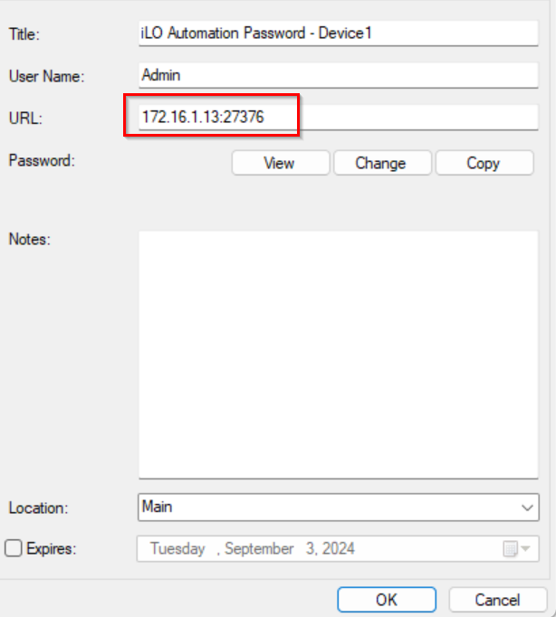
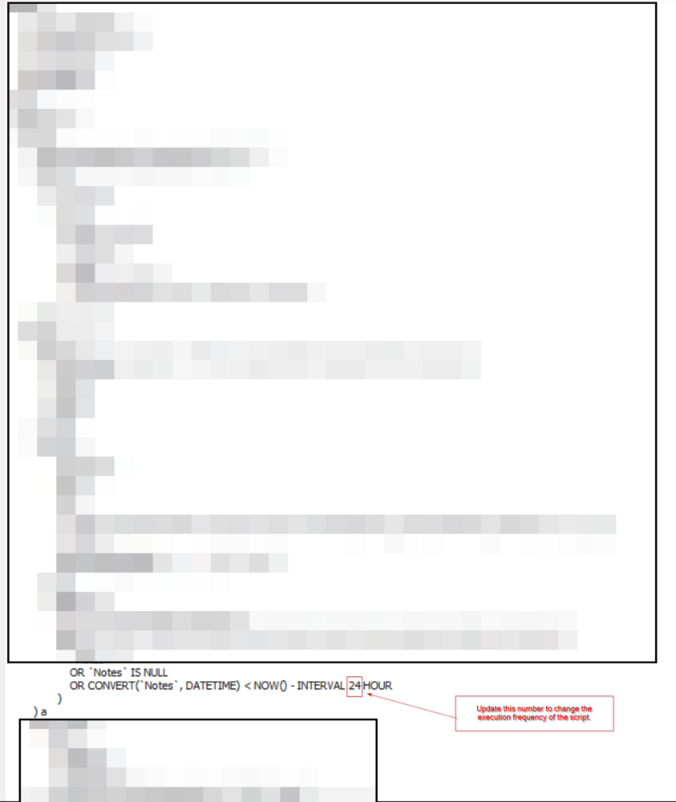
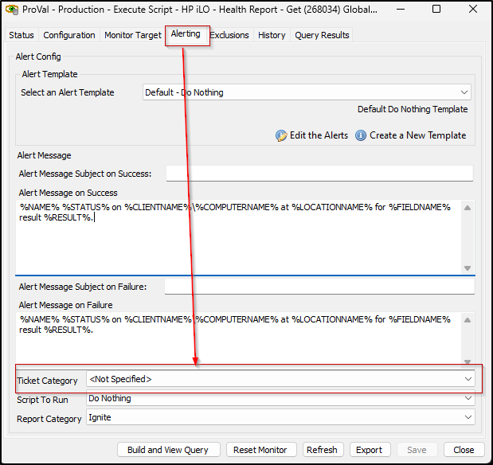

## Summary

The automated internal monitor is configured to run the [EPM - Data Collection - Script - HP iLO - Health Report - Get](<../scripts/HP iLO - Health Report - Get.md>) script every week. Its functionality relies on the method used to store credentials for the HP iLO device in the client-level password tab.

- If the password entry title follows the format `iLO Automation Password - \\\\<iLO Device Name> (\\\\<Computer ID to Connect to the device>)`, the monitor will execute the [EPM - Data Collection - Script - HP iLO - Health Report - Get](<../scripts/HP iLO - Health Report - Get.md>) script using the specified Computer ID enclosed within parentheses.  
  Example: iLO Automation Password - DeviceName3

- If the password entry title follows the format `iLO Automation Password - \\\\<iLO Device Name>`, the monitor will execute the [EPM - Data Collection - Script - HP iLO - Health Report - Get](<../scripts/HP iLO - Health Report - Get.md>) script against a random computer from the same network as the IP address stored in the `URL` field of the password entry.  
  Example: iLO Automation Password - DeviceName2

**Note:** If the iLO IP is bound to a port, it is mandatory to provide the IP with its port in the URL section of the password tab. This is valid for both options. The objective is to ensure that the [EPM - Vendor Specific - Dataview - HP iLO Health Report](<../dataviews/HP iLO Health Report.md>) dataview is consistently updated with the latest data, eliminating the need for manual script scheduling for each computer associated with an iLO device.

If the script is executed by the internal monitor and the Computer ID is not specified in the password entry, or if the monitor set cannot locate any online computer on the client's network that matches the network of the IP address specified in the URL field of the password entry for the HP iLO device, then the script will execute to create a ticket, but data collection will not be performed.

Successful execution of the script requires either a Computer ID or a valid and accessible computer within the specified network.

## Requirements

The **client-level** password entry `iLO Automation Password` must be set properly.

**Title:** There are two supported methods to store the password title.
- `iLO Automation Password - \\\\<iLO Device Name> (\\\\<Computer ID to Connect to the device>)`
- `iLO Automation Password - \\\\<iLO Device Name>`

**Username:** It should be the username of an admin user.

**Password:** The password for the admin user.

**URL:** The IP address of the HP iLO device associated with these credentials.

**Notes:** Please leave this field blank as any additional information may cause automation issues. The [EPM - Data Collection - Script - HP iLO - Health Report - Get](<../scripts/HP iLO - Health Report - Get.md>) script utilizes this field to store the last run date.

**Examples:**  
  
  
Note: If the iLO IP is bound to a port, it is mandatory to provide the IP with its port in the URL section of the password tab. This is valid for both options.  
Please refer to the screenshot:  

## Modifications

The monitor set is configured to execute the script once per day by default, thereby updating the data in the [EPM - Vendor Specific - Dataview - HP iLO Health Report](<../dataviews/HP iLO Health Report.md>) dataview daily.  
You can adjust the execution frequency of the script by updating the number of hours in the `additional Condition` field of the monitor set, as shown in the screenshot. Increasing or decreasing the number of hours in this field will accordingly adjust how often the script is executed, allowing for finer control over the update frequency.  

## Dependencies

- [EPM - Data Collection - Script - HP iLO - Health Report - Get](<../scripts/HP iLO - Health Report - Get.md>)
- [plugin_proval_ilo_health_report](<../tables/plugin_proval_ilo_health_report.md>)

## Target

Global

## Alert Template

**Name:** `△ CUSTOM - Execute Script - HP iLO - Health Report - Get`  
The alert template should run the [EPM - Data Collection - Script - HP iLO - Health Report - Get](<../scripts/HP iLO - Health Report - Get.md>) script on failure.

## Additional Notes

The ticketing feature of the [EPM - Data Collection - Script - HP iLO - Health Report - Get](<../scripts/HP iLO - Health Report - Get.md>) script can be enabled by setting the ticket category in the monitor set.  

