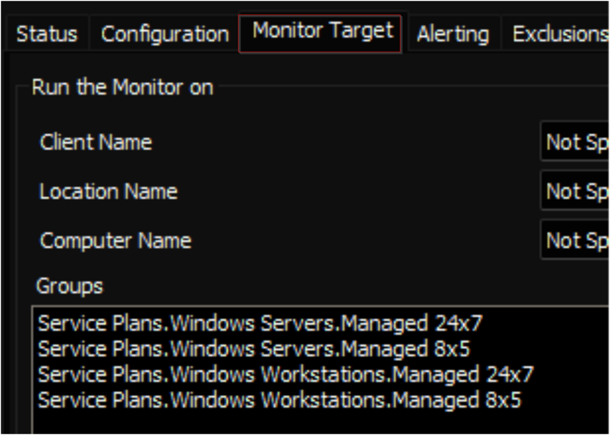

## Summary

This internal monitor executes the [Microsoft 365 - Click-to-Run - Get Details](https://proval.itglue.com/DOC-5078775) script on online machines with Microsoft Office 365 installed. It will execute the script on machines where it has not been run for over 14 days. Additionally, the monitor selectively targets machines with a Managed Mode policy in Automate.

## Dependencies

- [SWM - Data Collection - Script - Microsoft 365 - Click-to-Run - Get Details](https://proval.itglue.com/DOC-5078775-13932545)
- [SWM - Software Configuration - Custom Table - pvl_m365_update_channel_audit](<../../unsorted/SWM - Software Configuration - Custom Table - pvl_m365_update_channel_audit.md>)

## Target

Managed Windows Computers

## Alert Template

**Name:** `△ Custom - Execute Script - Microsoft 365 - Click-to-Run - Get Details`

