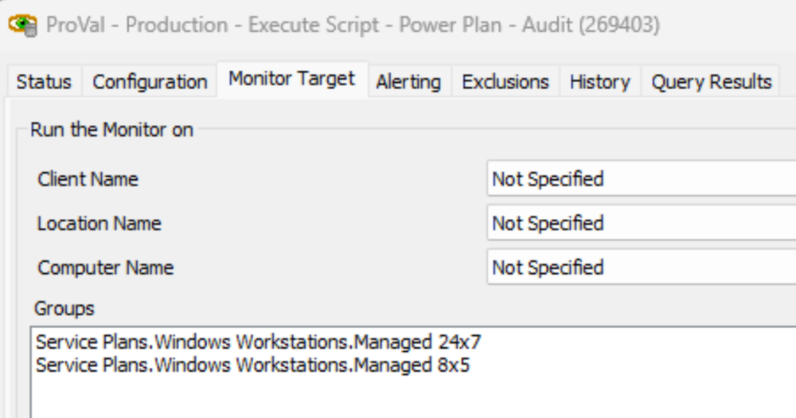
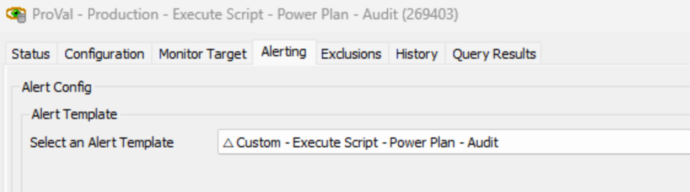
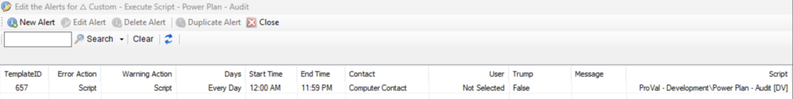

## Summary

The internal monitor executes the [EPM - Data Collection - Script - Power Plan - Audit [DV]](<../scripts/Power Plan - Audit DV.md>) script once per week against the physical Windows workstations.

## Dependencies

- [EPM - Data Collection - Script - Power Plan - Audit [DV]](<../scripts/Power Plan - Audit DV.md>)
- [EPM - Data Collection - Custom Table - pvl_powerplan_audit](<../tables/pvl_powerplan_audit.md>)

## Target

Managed Workstations  

## Alert Template

**Name:** `△ Custom - Execute Script - Power Plan - Audit`  

  

The alert template should execute the [EPM - Data Collection - Script - Power Plan - Audit [DV]](<../scripts/Power Plan - Audit DV.md>) script.  

  

