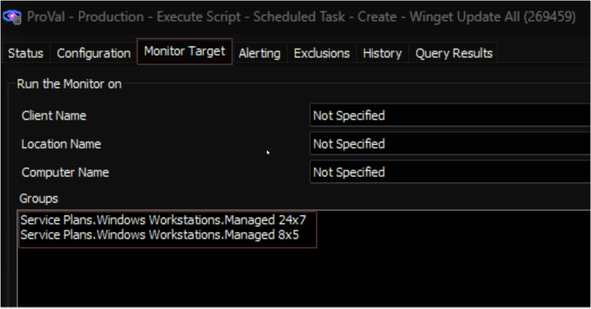

## Summary

The monitor executes the [Script - Scheduled Task - Create - Winget Update All [Autofix]](https://proval.itglue.com/DOC-5078775-14825195) script on the Windows Workstations (Windows 10 and 11) where either of `Winget Update All [Logged on User]` and `Winget Update All [System]` scheduled tasks are missing.

1. Ensure that the **Client-Level EDF** named `Winget Update All Task - Create` is checked to initiate the task.
2. If needed, you can utilize the **Location-Level** and **Computer-Level EDFs** named `Winget Update All Task - Exclude` to exclude specific machine(s).

## Dependencies

[Script - Scheduled Task - Create - Winget Update All [Autofix]](https://proval.itglue.com/DOC-5078775-14825195)

## Target

Managed Windows Workstations

## Alert Template

**Name**: `△ CUSTOM - Execute Script - Scheduled Task - Create - Winget Update All`

The alert template executes the [Script - Scheduled Task - Create - Winget Update All [Autofix]](https://proval.itglue.com/DOC-5078775-14825195)

