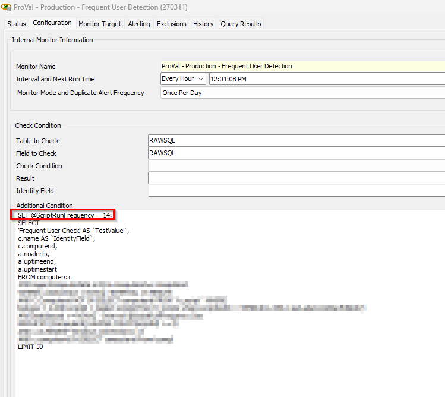

## Summary

This internal monitor is designed to detect the online Windows workstation agent where frequent user detection has not been detected in the last 14 days.

You can change this day number on the monitor to set different script run frequencies and freely set it to any number as the dates are compared from the stored value of the EDF "LogonUserCheckDate".

## Dependencies

[CWM - Automate - Script - Stitching Frequent Logon User (Set Computer Contact)](https://proval.itglue.com/DOC-5078775-16300164)

## Target

Windows Workstations

