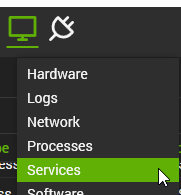
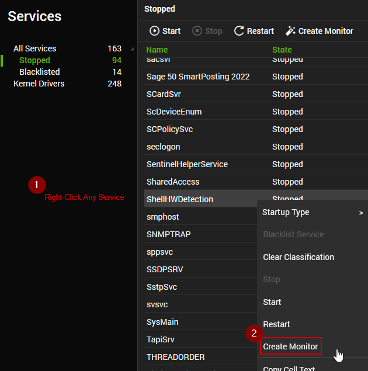

## How To - Individual Monitor (Non - Group Based)

1. Navigate to the computer for which you would like to create a monitor. Right-click on the Monitor icon and select Services.  
   

2. Right-click on the service you would like to monitor and select 'Create Monitor'.  
    

3. Navigate to the Alerting Tab of the monitor you just created and select the alert template 'Custom - Autofix - Restart Service' (Import if it does not exist).

## Details

**Suggested "Limit to"**: Workstations, Windows Machines, etc.  
**Suggested Alert Style**: Once, Twice, etc.  
**Suggested Alert Template**: \<Name of the Alert Template\>  

Insert the details of the monitor in the table below.

| Check Action | Server Address | Check Type | Check Value | Comparator | Interval | Result |
|--------------|----------------|-------------|-------------|------------|----------|--------|
|              |                |             |             |            |          |        |

## Dependencies

This should be a list of ITGlue documents listed in the Related Items sidebar on which this monitor depends.

- Autofix Script Doc Link
- Custom Table Doc Link
- EDF Doc Link
- etc.

## Target

The suggested target for the monitor. This will be partially generalized as search and group names can vary between Automate systems. Ideally, these would be limited by the "Limit To" section of a group-based monitor, and a new group would **_NOT_** need to be created. In most cases, a custom remote monitor should be applied to an existing service plan.

Examples:  
- Workstations - Should be run on non-servers  
- Servers - Should be run on servers  
- Windows Machines - Should be run on all Windows machines  
- Machines with Software Installed - Should be run on machines with specific software installed.  

There can also be composite definitions. Examples:  
- Non-Windows Workstations - Should be run on all workstations not running a Windows OS.  
- Windows Servers - Should be run on all Windows-based servers.

## Ticketing

*Note to ProVal Team: Ticket subject lines should be short and simple. The body of the ticket should provide a detailed explanation of why a ticket was generated and, ideally, what the next steps should be when a user is looking at the ticket.*

If the monitor is intended to create tickets, please note the Subject and Body of the ticket below. Include an example ticket if possible.

**Subject**  

**Body**  
