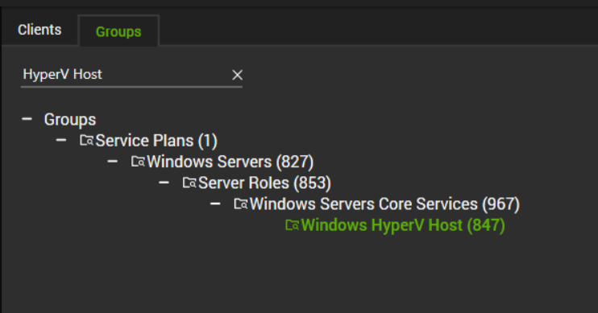

## Summary

The monitor set detects Hyper-V hosts with problematic replication status for virtual machines.

The replication state/status of a virtual machine refers to the current status of the replication process for that virtual machine. In a virtualized environment, replication is used to create a duplicate copy of a virtual machine's data on another physical machine or storage location. This is done to provide redundancy and protect against data loss in case of hardware failure or other issues.

If the replication state of a virtual machine is showing as "Critical" or "Warning", it may indicate that there is a problem with the replication process or that the replication target is not receiving updates. By monitoring this state, administrators can quickly identify and resolve these issues, ensuring the continued availability and integrity of their virtualized environments.

## Details

**Suggested "Limit to"**: HyperV Host Servers.  
**Suggested Alert Style**: Once, Twice, etc.  
**Suggested Alert Template**: △ Custom - Ticket Creation - Computer  

Insert the details of the monitor in the below table.

| Check Action | Server Address | Check Type | Execute Info | Comparator | Interval | Result |
|--------------|----------------|-------------|---------------|------------|----------|--------|
| System       | 127.0.0.1     | Run File    | C:/Windows/System32/WindowsPowerShell/v1.0/powershell.exe -ExecutionPolicy Bypass -Command "$ErroractionPreference= 'SilentlyContinue'; Get-VMReplication | Where-Object \{($_.health -like 'Critical') -or ($_.health -like 'Warning')} | Foreach-Object \{Write-Output /"$( $_.name) replication state: $( $_.health)/"}" | Does Not Contain | 3600 | replication state: |

## Target

Windows HyperV Host  

## Ticketing

**Subject:**  
Hyper-V Replication Failed on %CLIENTNAME%/%COMPUTERNAME%

**Body:**  
Replication state of each problematic VM is outlined below:

%RESULT%

It indicates that there is an issue with the replication process or with the replication target. Here are some basic troubleshooting steps that can help to address these issues:
1. Check the replication settings: Ensure that the replication settings are configured correctly and that they are enabled for the virtual machine. Also, check that the replication target is configured correctly and is accessible.
2. Check the replication network: Ensure that the replication network is functioning properly and that there are no issues with connectivity or bandwidth. Verify that firewalls and other security measures are not blocking replication traffic.
3. Check the health of the virtual machine: Check the health of the virtual machine to ensure that it is not experiencing any issues that could affect replication. This includes checking for storage or network issues, as well as any errors or warnings in the virtual machine logs.
4. Check the replication logs: Review the replication logs to identify any errors or warnings that could be causing the replication state to show as "Critical" or "Warning". This can help to pinpoint the source of the issue and guide further troubleshooting steps.
5. Restart the replication process: Try restarting the replication process to see if this resolves the issue. This can be done by stopping and starting the replication services or by disabling and re-enabling replication for the virtual machine.

**Example %RESULT%:**  
TESTpub01 replication state: Critical  
TESTDHC01 replication state: Warning  
TESTDom01 replication state: Warning  
TESTSQL01 replication state: Critical  
TESTDNS01 replication state: Warning  

## Implementation

Please follow the below article for the implementation:  
[Implementation Article](https://proval.itglue.com/5078775/docs/15601954)

