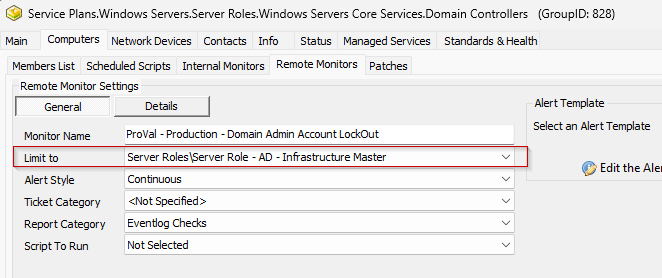

## Steps to Follow

### 1.
Import the Alert Template ' `△ Custom - Ticket Creation Computer - Failures Only` '

### 2.
Validate that the [CWM - Automate - Script - Ticket Creation - Computer [Failures Only]*](https://proval.itglue.com/DOC-5078775-13459854) script was imported as well and the alert template is executing this script for failures only.

### 3.
Run this SQL query from a RAWSQL monitor set to create and set the remote monitor on the Domain Controllers group and limit to the server role - AD Infrastructure Master.

```sql
SET @Groupid= (SELECT Groupid FROM mastergroups WHERE `GUID` = '3ac455da-f1fb-11e1-b4ec-1231391d2d19');
SET @Searchid= (SELECT sensid FROM sensorchecks WHERE `GUID` = '430a4640-9c97-4344-bfe8-7a786b110729');

INSERT INTO groupagents 
SELECT '' as `AgentID`,
`groupid` as `GroupID`,
@Searchid as `SearchID`,
'ProVal - Production - Domain Admin Account Lockout' as `Name`,
'6' as `CheckAction`,
'1' as `AlertAction`,
'Domain Admin Locked Account Detected on %computername%~~~No domain admin account locked. All good.!!!Domain Admin Locked Account Detected on %computername%~~~Domain Admin Locked Account Detected on %computername%. Refer to the below detail:%RESULT%.' as `AlertMessage`,
'0' as `ContactID`,
'900' as `interval`,
'127.0.0.1' as `Where`,
'7' as `What`,
'C://Windows//System32//WindowsPowerShell//v1.0//powershell.exe -ExecutionPolicy Bypass -Command "$st = (Get-Date).AddMinutes(-15); $r = Get-WinEvent -ErrorAction SilentlyContinue -FilterHashtable @{LogName = ''Security''; Id = 4740; StartTime = $st } | ForEach-Object {$ex = ([xml]$_.ToXml()).Event; $e = [ordered]@{EventDate = [DateTime]$ex.System.TimeCreated.SystemTime }; $ex.EventData.ChildNodes | ForEach-Object { $e[$_.Name] = $_.'#text' }; [PsCustomObject]$e};if ($r) {$domainAdmins = Get-ADGroupMember -Identity ''Domain Admins'' -Recursive | Select-Object -ExpandProperty SamAccountName; $lockedOutAdmins = $r | Where-Object { $domainAdmins -contains $_.TargetUserName };$lockedOutAdmins | ForEach-Object {$user = $_.TargetUserName; $lastLogin = (Get-ADUser -Identity $user -Properties LastLogonDate).LastLogonDate; $lockoutTime = $_.EventDate; $endpoint = $_.TargetDomainName; $domain = $_.SubjectDomainName; [PSCustomObject]@{Username = $user; LastLogin = $lastLogin; LockoutTime = $lockoutTime; Endpoint = $endpoint; Domain = $domain}} | Format-List}"' as `DataOut`,
'16' as `Comparor`,
'10|((^((OK){0,}(//r//n){0,}[//r//n]{0,}//s{0,})$)%7C(^$))|11|((^((OK){0,}(//r//n){0,}[//r//n]{0,}//s{0,})$)%7C(^$))%7C(^((//r//n){0,}[//r//n]{0,}//s{0,})Username)|10|^((//r//n){0,}[//r//n]{0,}//s{0,})Username' as `DataIn`,
'0' as `IDField`,
'0' as `AlertStyle`,
'0' as `ScriptID`,
'' as `datacollector`,
'11' as `Category`,
'0' as `TicketCategory`,
'1' as `ScriptTarget`,
UUID() as `GUID`,
'root' as `UpdatedBy`,
(NOW()) as `UpdateDate`
FROM mastergroups m
WHERE m.groupid = @groupid
AND m.groupid NOT IN  (SELECT DISTINCT groupid FROM groupagents WHERE `Name` = 'ProVal - Production - Domain Admin Account Lockout')
```

### 4.
Check the `Domain Controllers` group and ensure that the monitor set is created and configured with the correct search.  
**Limit To:** `Server Role - AD - Infrastructure Master`  

  


### 5.
Assign the required alert template. It is suggested to use '`△ Custom - Ticket Creation Computer - Failures Only`' for the best results.


