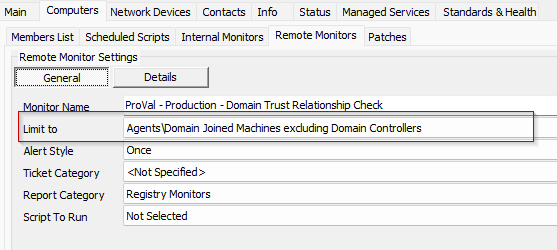

## Step 1
Run this SQL query from a RAWSQL monitor set to import the required search.

```sql
INSERT INTO `sensorchecks`  
   (`Name`, `SQL`, `QueryType`, `ListDATA`, `FolderID`, `GUID`, `SearchXML`) 
SELECT  
   'Domain Joined Machines excluding Domain Controllers' as `Name`,
   'SELECT 
   computers.computerid as `Computer Id`,
   computers.name as `Computer Name`,
   clients.name as `Client Name`,
   computers.domain as `Computer Domain`,
   computers.username as `Computer User`,
   Computers.Domain as `Computer.Network.Domain`
FROM Computers 
LEFT JOIN inv_operatingsystem ON (Computers.ComputerId=inv_operatingsystem.ComputerId)
LEFT JOIN Clients ON (Computers.ClientId=Clients.ClientId)
LEFT JOIN Locations ON (Computers.LocationId=Locations.LocationID)
WHERE 
((((NOT ((Computers.Domain like 'DC:%'))) AND (Computers.Domain like '%.%'))))' as `SQL`,
   '4' as `QueryType`,
   'Select||=||=||=|^Select|||||||^' as `ListDATA`,
   '3' as `FolderID`,
   '664b9d5e-b0b0-4e5b-b0e3-3ea9ad184462' as `GUID`, 
   '\\<LabTechAbstractSearch>\\<asn>\\<st>AndNode\\</st>\\<cn>\\<asn>\\<st>AndNode\\</st>\\<cn>\\<asn>\\<st>NotNode\\</st>\\<cn>\\<asn>\\<st>ComparisonNode\\</st>\\<lon>Computer.Network.Domain\\</lon>\\<lok>Computer.Network.Domain\\</lok>\\<lmo>TextLike\\</lmo>\\<dv>DC:%\\</dv>\\<dk>DC:%\\</dk>\\</asn>\\</cn>\\</asn>\\<asn>\\<st>ComparisonNode\\</st>\\<lon>Computer.Network.Domain\\</lon>\\<lok>Computer.Network.Domain\\</lok>\\<lmo>TextLike\\</lmo>\\<dv>%.%\\</dv>\\<dk>%.%\\</dk>\\</asn>\\</cn>\\</asn>\\</cn>\\</asn>\\</LabTechAbstractSearch>' as `SearchXML`
FROM  
   (SELECT MIN(computerid) FROM computers) a
WHERE  
   (SELECT Count(0) From sensorchecks where `GUID` = '664b9d5e-b0b0-4e5b-b0e3-3ea9ad184462') = 0;
```

## Step 2
Obtain the group ID(s) of the group(s) that the remote monitor should be applied to.

## Step 3
Copy the following query and replace **YOUR COMMA SEPARATED LIST OF GROUPID(S)** with the Group ID(s) of the relevant groups. (The string to replace can be found at the very bottom of the query, right after **WHERE**)

```sql
SET @searchid = (SELECT MIN(sensid) FROM sensorchecks WHERE GUID = '664b9d5e-b0b0-4e5b-b0e3-3ea9ad184462');    
INSERT INTO groupagents 
SELECT '' as `AgentID`,
`groupid` as `GroupID`,
@searchid as `SearchID`,
'ProVal - Production - Domain Trust Relationship Check' as `Name`,
'6' as `CheckAction`,
'1' as `AlertAction`,
'Domain trust relationship failure detected on %ComputerName%~~~The trust relationship between this workstation and the primary domain has been reestablished.!!!Domain trust relationship failure detected on %ComputerName%~~~The trust relationship between this workstation and the primary domain failed for %ComputerName%. %RESULT%' as `AlertMessage`,
'0' as `ContactID`,
'3600' as `interval`,
'127.0.0.1' as `Where`,
'7' as `What`,
'C://Windows//System32//WindowsPowerShell//v1.0//powershell.exe -ExecutionPolicy Bypass -Command "$output = cmd.exe /c nltest /sc_verify:$env:userdomain; if ($LASTEXITCODE -gt 0) { return 'Domain trust relationship failure detected.' + $($output | Out-String)}"' as `DataOut`,
'16' as `Comparor`,
'10|((^((OK){0,}(//r//n){0,}[//r//n]{0,}//s{0,})$)%7C(^$))|11|((^((OK){0,}(//r//n){0,}[//r//n]{0,}//s{0,})$)%7C(^$))%7C(failed: Status)|10|(failed: Status)' as `DataIn`,
'' as `IDField`,
'1' as `AlertStyle`,
'0' as `ScriptID`,
'' as `datacollector`,
'21' as `Category`,
'0' as `TicketCategory`,
'1' as `ScriptTarget`,
CONCAT(
SUBSTRING('abcdef0123456789', FLOOR(RAND()*16+1), 1),
SUBSTRING('abcdef0123456789', FLOOR(RAND()*16+1), 1),
SUBSTRING('abcdef0123456789', FLOOR(RAND()*16+1), 1),
SUBSTRING('abcdef0123456789', FLOOR(RAND()*16+1), 1),
SUBSTRING('abcdef0123456789', FLOOR(RAND()*16+1), 1),
SUBSTRING('abcdef0123456789', FLOOR(RAND()*16+1), 1),
SUBSTRING('abcdef0123456789', FLOOR(RAND()*16+1), 1),
SUBSTRING('abcdef0123456789', FLOOR(RAND()*16+1), 1),
'-',
SUBSTRING('abcdef0123456789', FLOOR(RAND()*16+1), 1),
SUBSTRING('abcdef0123456789', FLOOR(RAND()*16+1), 1),
SUBSTRING('abcdef0123456789', FLOOR(RAND()*16+1), 1),
SUBSTRING('abcdef0123456789', FLOOR(RAND()*16+1), 1),
'-',
SUBSTRING('abcdef0123456789', FLOOR(RAND()*16+1), 1),
SUBSTRING('abcdef0123456789', FLOOR(RAND()*16+1), 1),
SUBSTRING('abcdef0123456789', FLOOR(RAND()*16+1), 1),
SUBSTRING('abcdef0123456789', FLOOR(RAND()*16+1), 1),
'-',
SUBSTRING('abcdef0123456789', FLOOR(RAND()*16+1), 1),
SUBSTRING('abcdef0123456789', FLOOR(RAND()*16+1), 1),
SUBSTRING('abcdef0123456789', FLOOR(RAND()*16+1), 1),
SUBSTRING('abcdef0123456789', FLOOR(RAND()*16+1), 1),
'-',
SUBSTRING('abcdef0123456789', FLOOR(RAND()*16+1), 1),
SUBSTRING('abcdef0123456789', FLOOR(RAND()*16+1), 1),
SUBSTRING('abcdef0123456789', FLOOR(RAND()*16+1), 1),
SUBSTRING('abcdef0123456789', FLOOR(RAND()*16+1), 1),
'-',
SUBSTRING('abcdef0123456789', FLOOR(RAND()*16+1), 1),
SUBSTRING('abcdef0123456789', FLOOR(RAND()*16+1), 1),
SUBSTRING('abcdef0123456789', FLOOR(RAND()*16+1), 1),
SUBSTRING('abcdef0123456789', FLOOR(RAND()*16+1), 1),
'-',
SUBSTRING('abcdef0123456789', FLOOR(RAND()*16+1), 1),
SUBSTRING('abcdef0123456789', FLOOR(RAND()*16+1), 1),
SUBSTRING('abcdef0123456789', FLOOR(RAND()*16+1), 1),
SUBSTRING('abcdef0123456789', FLOOR(RAND()*16+1), 1),
'-',
SUBSTRING('abcdef0123456789', FLOOR(RAND()*16+1), 1),
SUBSTRING('abcdef0123456789', FLOOR(RAND()*16+1), 1),
SUBSTRING('abcdef0123456789', FLOOR(RAND()*16+1), 1),
SUBSTRING('abcdef0123456789', FLOOR(RAND()*16+1), 1),
'-',
SUBSTRING('abcdef0123456789', FLOOR(RAND()*16+1), 1),
SUBSTRING('abcdef0123456789', FLOOR(RAND()*16+1), 1),
SUBSTRING('abcdef0123456789', FLOOR(RAND()*16+1), 1),
SUBSTRING('abcdef0123456789', FLOOR(RAND()*16+1), 1),
'-',
SUBSTRING('abcdef0123456789', FLOOR(RAND()*16+1), 1),
SUBSTRING('abcdef0123456789', FLOOR(RAND()*16+1), 1),
SUBSTRING('abcdef0123456789', FLOOR(RAND()*16+1), 1),
SUBSTRING('abcdef0123456789', FLOOR(RAND()*16+1), 1),
'-',
SUBSTRING('abcdef0123456789', FLOOR(RAND()*16+1), 1),
SUBSTRING('abcdef0123456789', FLOOR(RAND()*16+1), 1),
SUBSTRING('abcdef0123456789', FLOOR(RAND()*16+1), 1),
SUBSTRING('abcdef0123456789', FLOOR(RAND()*16+1), 1),
'-',
SUBSTRING('abcdef0123456789', FLOOR(RAND()*16+1), 1),
SUBSTRING('abcdef0123456789', FLOOR(RAND()*16+1), 1),
SUBSTRING('abcdef0123456789', FLOOR(RAND()*16+1), 1),
SUBSTRING('abcdef0123456789', FLOOR(RAND()*16+1), 1)
) as `GUID`,
'root' as `UpdatedBy`,
(NOW()) as `UpdateDate`
FROM mastergroups m
WHERE m.groupid IN (<strong>YOUR COMMA SEPARATED LIST OF GROUPID(S)</strong>)
AND m.groupid NOT IN  (SELECT DISTINCT groupid FROM groupagents WHERE `Name` = 'ProVal - Production - Domain Trust Relationship Check');
```

## Step 4
An example of the query with group IDs and modified thresholds.

```sql
SET @searchid = (SELECT MIN(sensid) FROM sensorchecks WHERE GUID = '664b9d5e-b0b0-4e5b-b0e3-3ea9ad184462');    
INSERT INTO groupagents 
SELECT '' as `AgentID`,
`groupid` as `GroupID`,
@searchid as `SearchID`,
'ProVal - Production - Domain Trust Relationship Check' as `Name`,
'6' as `CheckAction`,
'1' as `AlertAction`,
'Domain trust relationship failure detected on %ComputerName%~~~The trust relationship between this workstation and the primary domain has been reestablished.!!!Domain trust relationship failure detected on %ComputerName%~~~The trust relationship between this workstation and the primary domain failed for %ComputerName%. %RESULT%' as `AlertMessage`,
'0' as `ContactID`,
'3600' as `interval`,
'127.0.0.1' as `Where`,
'7' as `What`,
'C://Windows//System32//WindowsPowerShell//v1.0//powershell.exe -ExecutionPolicy Bypass -Command "$output = cmd.exe /c nltest /sc_verify:$env:userdomain; if ($LASTEXITCODE -gt 0) { return 'Domain trust relationship failure detected.' + $($output | Out-String)}"' as `DataOut`,
'16' as `Comparor`,
'10|((^((OK){0,}(//r//n){0,}[//r//n]{0,}//s{0,})$)%7C(^$))|11|((^((OK){0,}(//r//n){0,}[//r//n]{0,}//s{0,})$)%7C(^$))%7C(failed: Status)|10|(failed: Status)' as `DataIn`,
'' as `IDField`,
'1' as `AlertStyle`,
'0' as `ScriptID`,
'' as `datacollector`,
'21' as `Category`,
'0' as `TicketCategory`,
'1' as `ScriptTarget`,
CONCAT(
SUBSTRING('abcdef0123456789', FLOOR(RAND()*16+1), 1),
SUBSTRING('abcdef0123456789', FLOOR(RAND()*16+1), 1),
SUBSTRING('abcdef0123456789', FLOOR(RAND()*16+1), 1),
SUBSTRING('abcdef0123456789', FLOOR(RAND()*16+1), 1),
SUBSTRING('abcdef0123456789', FLOOR(RAND()*16+1), 1),
SUBSTRING('abcdef0123456789', FLOOR(RAND()*16+1), 1),
SUBSTRING('abcdef0123456789', FLOOR(RAND()*16+1), 1),
SUBSTRING('abcdef0123456789', FLOOR(RAND()*16+1), 1),
'-',
SUBSTRING('abcdef0123456789', FLOOR(RAND()*16+1), 1),
SUBSTRING('abcdef0123456789', FLOOR(RAND()*16+1), 1),
SUBSTRING('abcdef0123456789', FLOOR(RAND()*16+1), 1),
SUBSTRING('abcdef0123456789', FLOOR(RAND()*16+1), 1),
'-',
SUBSTRING('abcdef0123456789', FLOOR(RAND()*16+1), 1),
SUBSTRING('abcdef0123456789', FLOOR(RAND()*16+1), 1),
SUBSTRING('abcdef0123456789', FLOOR(RAND()*16+1), 1),
SUBSTRING('abcdef0123456789', FLOOR(RAND()*16+1), 1),
'-',
SUBSTRING('abcdef0123456789', FLOOR(RAND()*16+1), 1),
SUBSTRING('abcdef0123456789', FLOOR(RAND()*16+1), 1),
SUBSTRING('abcdef0123456789', FLOOR(RAND()*16+1), 1),
SUBSTRING('abcdef0123456789', FLOOR(RAND()*16+1), 1),
'-',
SUBSTRING('abcdef0123456789', FLOOR(RAND()*16+1), 1),
SUBSTRING('abcdef0123456789', FLOOR(RAND()*16+1), 1),
SUBSTRING('abcdef0123456789', FLOOR(RAND()*16+1), 1),
SUBSTRING('abcdef0123456789', FLOOR(RAND()*16+1), 1),
'-',
SUBSTRING('abcdef0123456789', FLOOR(RAND()*16+1), 1),
SUBSTRING('abcdef0123456789', FLOOR(RAND()*16+1), 1),
SUBSTRING('abcdef0123456789', FLOOR(RAND()*16+1), 1),
SUBSTRING('abcdef0123456789', FLOOR(RAND()*16+1), 1),
'-',
SUBSTRING('abcdef0123456789', FLOOR(RAND()*16+1), 1),
SUBSTRING('abcdef0123456789', FLOOR(RAND()*16+1), 1),
SUBSTRING('abcdef0123456789', FLOOR(RAND()*16+1), 1),
SUBSTRING('abcdef0123456789', FLOOR(RAND()*16+1), 1),
'-',
SUBSTRING('abcdef0123456789', FLOOR(RAND()*16+1), 1),
SUBSTRING('abcdef0123456789', FLOOR(RAND()*16+1), 1),
SUBSTRING('abcdef0123456789', FLOOR(RAND()*16+1), 1),
SUBSTRING('abcdef0123456789', FLOOR(RAND()*16+1), 1),
'-',
SUBSTRING('abcdef0123456789', FLOOR(RAND()*16+1), 1),
SUBSTRING('abcdef0123456789', FLOOR(RAND()*16+1), 1),
SUBSTRING('abcdef0123456789', FLOOR(RAND()*16+1), 1),
SUBSTRING('abcdef0123456789', FLOOR(RAND()*16+1), 1)
) as `GUID`,
'root' as `UpdatedBy`,
(NOW()) as `UpdateDate`
FROM mastergroups m
WHERE m.groupid IN (<strong>2,3,855,856</strong>)
AND m.groupid NOT IN  (SELECT DISTINCT groupid FROM groupagents WHERE `Name` = 'ProVal - Production - Domain Trust Relationship Check');
```

## Step 5
Check the concerned groups and ensure the monitor set is created and configured with the correct search.

**Limit to:** `Domain Joined Machines excluding Domain Controllers`



## Step 6
Set the appropriate alert template.

