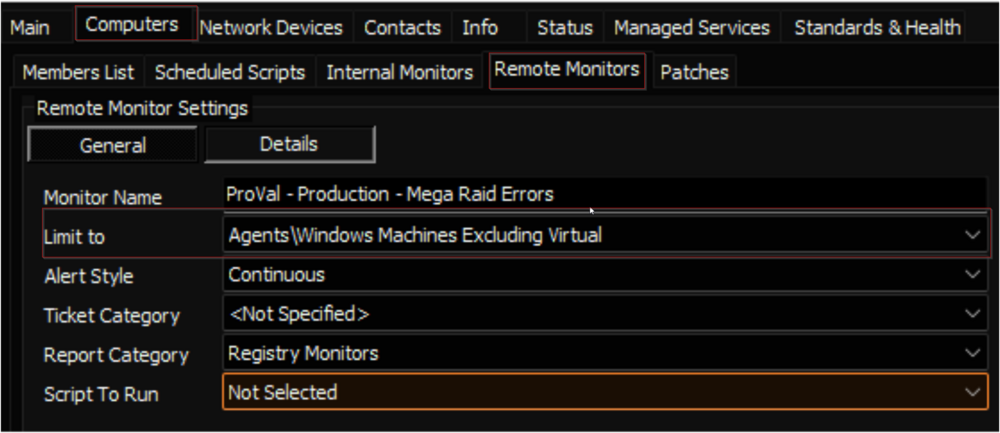

## Steps

### 1.
Import the Alert Template `△ Custom - Ticket Creation Computer - Failures Only`. The alert template should not perform any action.

---

### 2.
Validate that the [CWM - Automate - Script - Ticket Creation - Computer [Failures Only]](../scripts/Ticket Creation - Computer Failures Only.md) script was imported as well.

---

### 3.
Run this SQL query from a RAWSQL monitor set to import the required search.

```
INSERT INTO `sensorchecks`
SELECT
'' as `SensID`,
'Windows Machines Excluding Virtual' as `Name`,
'SSELECT //r//n   computers.computerid as `Computer Id`,//r//n   computers.name as `Computer Name`,//r//n   clients.name as `Client Name`,//r//n   computers.domain as `Computer Domain`,//r//n   computers.username as `Computer User`,//r//n   IF((Computers.flags & 2048) &lt;&gt; 0, 1, 0) as `Computer.Hardware.IsVirtual`,//r//n   IF(INSTR(IFNULL(inv_operatingsystem.Name, Computers.OS), //'windows//')&gt;0, 1, IF(INSTR(IFNULL(inv_operatingsystem.Name, Computers.OS), //'darwin//') &gt;0, 2, 3)) as `Computer.OS.Type`//r//nFROM Computers //r//nLEFT JOIN inv_operatingsystem ON (Computers.ComputerId=inv_operatingsystem.ComputerId)//r//nLEFT JOIN Clients ON (Computers.ClientId=Clients.ClientId)//r//nLEFT JOIN Locations ON (Computers.LocationId=Locations.LocationID)//r//n WHERE //r//n((((IF((Computers.flags & 2048) &lt;&gt; 0, 1, 0)=0) AND (IF(INSTR(IFNULL(inv_operatingsystem.Name, Computers.OS), //'windows//')&gt;0, 1, IF(INSTR(IFNULL(inv_operatingsystem.Name, Computers.OS), //'darwin//') &gt;0, 2, 3)) = //'1//'))))//r//n' as `SQL`,
'4' as `QueryType`,
'Select||=||=||=|^Select|||||||^' as `ListData`,
'3' as `FolderID`,
'c4008496-11c3-497b-8b4d-2d53c38c9d2e' as `GUID`,
'&lt;LabTechAbstractSearch&gt;&lt;asn&gt;&lt;st&gt;AndNode&lt;/st&gt;&lt;cn&gt;&lt;asn&gt;&lt;st&gt;AndNode&lt;/st&gt;&lt;cn&gt;&lt;asn&gt;&lt;st&gt;ComparisonNode&lt;/st&gt;&lt;lon&gt;Computer.Hardware.IsVirtual&lt;/lon&gt;&lt;lok&gt;Computer.Hardware.IsVirtual&lt;/lok&gt;&lt;lmo&gt;IsFalse&lt;/lmo&gt;&lt;dv&gt;NULL&lt;/dv&gt;&lt;dk&gt;NULL&lt;/dk&gt;&lt;/asn&gt;&lt;asn&gt;&lt;st&gt;ComparisonNode&lt;/st&gt;&lt;lon&gt;Computer.OS.Type&lt;/lon&gt;&lt;lok&gt;Computer.OS.Type&lt;/lok&gt;&lt;lmo&gt;Equals&lt;/lmo&gt;&lt;dv&gt;Windows&lt;/dv&gt;&lt;dk&gt;1&lt;/dk&gt;&lt;/asn&gt;&lt;/cn&gt;&lt;/asn&gt;&lt;/cn&gt;&lt;/asn&gt;&lt;/LabTechAbstractSearch&gt;' as `SearchXML`,
(NULL) as `UpdatedBy`,
(NULL) as `UpdateDate`
FROM  (SELECT MIN(computerid) FROM computers) a
WHERE (SELECT count(*) From SensorChecks where `GUID` = 'c4008496-11c3-497b-8b4d-2d53c38c9d2e') = 0;
```

---

### 4.
Obtain the group ID(s) of the group(s) that the remote monitor should be applied to.

---

### 5.
Copy the following query and replace `YOUR COMMA SEPARATED LIST OF GROUPID(S)` with the group ID(s) of the relevant groups. (The string to replace can be found at the very bottom of the query, right after **WHERE**).

```
SET @searchid = (SELECT sensid FROM sensorchecks WHERE `GUID` = 'c4008496-11c3-497b-8b4d-2d53c38c9d2e');
INSERT INTO groupagents 
SELECT '' as `AgentID`,
`groupid` as `GroupID`,
@searchid as `SearchID`,
'ProVal - Production - Mega Raid Errors' as `Name`,
'6' as `CheckAction`,
'1' as `AlertAction`,
'Mega Raid Error Detected on %CLIENTNAME%////%COMPUTERNAME%~~~No mega raid errors have been detected in the last 60 minutes.!!!Mega Raid Error Detected on %CLIENTNAME%////%COMPUTERNAME%~~~Mega Raid Error Detected on %CLIENTNAME%////%COMPUTERNAME%.' as `AlertMessage`,
'0' as `ContactID`,
'3600' as `interval`,
'127.0.0.1' as `Where`,
'7' as `What`,
'C:////Windows////System32////WindowsPowerShell////v1.0////powershell.exe -ExecutionPolicy Bypass -Command \"$ErroractionPreference= //'SilentlyContinue//'; $startTime = (Get-Date).AddMinutes(-60); Get-WinEvent -FilterHashtable @{LogName = //'Application//'; StartTime = $starttime; Level = 1,2; ProviderName = //'MR_MONITOR//'} | Select-Object Id, TimeCreated, LogName, ProviderName, LevelDisplayName, Message | Group-Object -Property Id | Sort-Object -Property Count -Descending | Select-Object -Property count, group | Foreach-Object {$mostrecent = $_.Group | Sort-Object -Property TimeCreated -Descending | Select-Object -First 1; [pscustomobject]@{Occurrences=$_.Count; EventID=$mostrecent.id; Logname=$Mostrecent.Logname; Source=$MostRecent.ProviderName; MostRecentDate=$mostrecent.TimeCreated; Level=$Mostrecent.LevelDisplayName; Message = $MostRecent.Message }}\"' as `DataOut`,
'16' as `Comparor`,
'10|((^((OK){0,}(////r////n){0,}[////r////n]{0,}////s{0,})$)%7C(^$))|11|((^((OK){0,}(////r////n){0,}[////r////n]{0,}////s{0,})$)%7C(^$))%7C(^((////r////n){0,}[////r////n]{0,}////s{0,})Occurrences)|10|^((////r////n){0,}[////r////n]{0,}////s{0,})Occurrences' as `DataIn`,
'' as `IDField`,
'0' as `AlertStyle`,
'0' as `ScriptID`,
'' as `datacollector`,
'21' as `Category`,
'0' as `TicketCategory`,
'1' as `ScriptTarget`,
CONCAT(
SUBSTRING('abcdef0123456789', FLOOR(RAND()*16+1), 1),
SUBSTRING('abcdef0123456789', FLOOR(RAND()*16+1), 1),
SUBSTRING('abcdef0123456789', FLOOR(RAND()*16+1), 1),
SUBSTRING('abcdef0123456789', FLOOR(RAND()*16+1), 1),
SUBSTRING('abcdef0123456789', FLOOR(RAND()*16+1), 1),
SUBSTRING('abcdef0123456789', FLOOR(RAND()*16+1), 1),
SUBSTRING('abcdef0123456789', FLOOR(RAND()*16+1), 1),
SUBSTRING('abcdef0123456789', FLOOR(RAND()*16+1), 1),
'-',
SUBSTRING('abcdef0123456789', FLOOR(RAND()*16+1), 1),
SUBSTRING('abcdef0123456789', FLOOR(RAND()*16+1), 1),
SUBSTRING('abcdef0123456789', FLOOR(RAND()*16+1), 1),
SUBSTRING('abcdef0123456789', FLOOR(RAND()*16+1), 1),
'-',
SUBSTRING('abcdef0123456789', FLOOR(RAND()*16+1), 1),
SUBSTRING('abcdef0123456789', FLOOR(RAND()*16+1), 1),
SUBSTRING('abcdef0123456789', FLOOR(RAND()*16+1), 1),
SUBSTRING('abcdef0123456789', FLOOR(RAND()*16+1), 1),
'-',
SUBSTRING('abcdef0123456789', FLOOR(RAND()*16+1), 1),
SUBSTRING('abcdef0123456789', FLOOR(RAND()*16+1), 1),
SUBSTRING('abcdef0123456789', FLOOR(RAND()*16+1), 1),
SUBSTRING('abcdef0123456789', FLOOR(RAND()*16+1), 1),
'-',
SUBSTRING('abcdef0123456789', FLOOR(RAND()*16+1), 1),
SUBSTRING('abcdef0123456789', FLOOR(RAND()*16+1), 1),
SUBSTRING('abcdef0123456789', FLOOR(RAND()*16+1), 1),
SUBSTRING('abcdef0123456789', FLOOR(RAND()*16+1), 1),
'SUBSTRING('abcdef0123456789', FLOOR(RAND()*16+1), 1),
SUBSTRING('abcdef0123456789', FLOOR(RAND()*16+1), 1),
SUBSTRING('abcdef0123456789', FLOOR(RAND()*16+1), 1),
SUBSTRING('abcdef0123456789', FLOOR(RAND()*16+1), 1),
'SUBSTRING('abcdef0123456789', FLOOR(RAND()*16+1), 1),
SUBSTRING('abcdef0123456789', FLOOR(RAND()*16+1), 1),
SUBSTRING('abcdef0123456789', FLOOR(RAND()*16+1), 1)
) as `GUID`,
'root' as `UpdatedBy`,
(NOW()) as `UpdateDate`
FROM mastergroups m
WHERE m.groupid IN (YOUR COMMA SEPARATED LIST OF GROUPID(S))
AND m.groupid NOT IN  (SELECT DISTINCT groupid FROM groupagents WHERE `Name` = 'ProVal - Production - Mega Raid Errors');
```

---

### 6.
An example of the query with group IDs and modified thresholds.

```
SET @searchid = (SELECT sensid FROM sensorchecks WHERE `GUID` = 'c4008496-11c3-497b-8b4d-2d53c38c9d2e');
INSERT INTO groupagents 
SELECT '' as `AgentID`,
`groupid` as `GroupID`,
@searchid as `SearchID`,
'ProVal - Production - Mega Raid Errors' as `Name`,
'6' as `CheckAction`,
'1' as `AlertAction`,
'Mega Raid Error Detected on %CLIENTNAME%////%COMPUTERNAME%~~~No mega raid errors have been detected in the last 60 minutes.!!!Mega Raid Error Detected on %CLIENTNAME%////%COMPUTERNAME%~~~Mega Raid Error Detected on %CLIENTNAME%////%COMPUTERNAME%.' as `AlertMessage`,
'0' as `ContactID`,
'3600' as `interval`,
'127.0.0.1' as `Where`,
'7' as `What`,
'C:////Windows////System32////WindowsPowerShell////v1.0////powershell.exe -ExecutionPolicy Bypass -Command \"$ErroractionPreference= //'SilentlyContinue//'; $startTime = (Get-Date).AddMinutes(-60); Get-WinEvent -FilterHashtable @{LogName = //'Application//'; StartTime = $starttime; Level = 1,2; ProviderName = //'MR_MONITOR//'} | Select-Object Id, TimeCreated, LogName, ProviderName, LevelDisplayName, Message | Group-Object -Property Id | Sort-Object -Property Count -Descending | Select-Object -Property count, group | Foreach-Object {$mostrecent = $_.Group | Sort-Object -Property TimeCreated -Descending | Select-Object -First 1; [pscustomobject]@{Occurrences=$_.Count; EventID=$mostrecent.id; Logname=$Mostrecent.Logname; Source=$MostRecent.ProviderName; MostRecentDate=$mostrecent.TimeCreated; Level=$Mostrecent.LevelDisplayName; Message = $MostRecent.Message }}\"' as `DataOut`,
'16' as `Comparor`,
'10|((^((OK){0,}(////r////n){0,}[////r////n]{0,}////s{0,})$)%7C(^$))|11|((^((OK){0,}(////r////n){0,}[////r////n]{0,}////s{0,})$)%7C(^$))%7C(^((////r////n){0,}[////r////n]{0,}////s{0,})Occurrences)|10|^((////r////n){0,}[////r////n]{0,}////s{0,})Occurrences' as `DataIn`,
'' as `IDField`,
'0' as `AlertStyle`,
'0' as `ScriptID`,
'' as `datacollector`,
'21' as `Category`,
'0' as `TicketCategory`,
'1' as `ScriptTarget`,
CONCAT(
SUBSTRING('abcdef0123456789', FLOOR(RAND()*16+1), 1),
SUBSTRING('abcdef0123456789', FLOOR(RAND()*16+1), 1),
SUBSTRING('abcdef0123456789', FLOOR(RAND()*16+1), 1),
SUBSTRING('abcdef0123456789', FLOOR(RAND()*16+1), 1),
SUBSTRING('abcdef0123456789', FLOOR(RAND()*16+1), 1),
SUBSTRING('abcdef0123456789', FLOOR(RAND()*16+1), 1),
SUBSTRING('abcdef0123456789', FLOOR(RAND()*16+1), 1),
SUBSTRING('abcdef0123456789', FLOOR(RAND()*16+1), 1),
'-',
SUBSTRING('abcdef0123456789', FLOOR(RAND()*16+1), 1),
SUBSTRING('abcdef0123456789', FLOOR(RAND()*16+1), 1),
SUBSTRING('abcdef0123456789', FLOOR(RAND()*16+1), 1),
SUBSTRING('abcdef0123456789', FLOOR(RAND()*16+1), 1),
'-',
SUBSTRING('abcdef0123456789', FLOOR(RAND()*16+1), 1),
SUBSTRING('abcdef0123456789', FLOOR(RAND()*16+1), 1),
SUBSTRING('abcdef0123456789', FLOOR(RAND()*16+1), 1),
SUBSTRING('abcdef0123456789', FLOOR(RAND()*16+1), 1),
'-',
SUBSTRING('abcdef0123456789', FLOOR(RAND()*16+1), 1),
SUBSTRING('abcdef0123456789', FLOOR(RAND()*16+1), 1),
SUBSTRING('abcdef0123456789', FLOOR(RAND()*16+1), 1),
SUBSTRING('abcdef0123456789', FLOOR(RAND()*16+1), 1),
'-',
SUBSTRING('abcdef0123456789', FLOOR(RAND()*16+1), 1),
SUBSTRING('abcdef0123456789', FLOOR(RAND()*16+1), 1),
SUBSTRING('abcdef0123456789', FLOOR(RAND()*16+1), 1),
SUBSTRING('abcdef0123456789', FLOOR(RAND()*16+1), 1),
'-',
SUBSTRING('abcdef0123456789', FLOOR(RAND()*16+1), 1),
SUBSTRING('abcdef0123456789', FLOOR(RAND()*16+1), 1),
SUBSTRING('abcdef0123456789', FLOOR(RAND()*16+1), 1),
SUBSTRING('abcdef0123456789', FLOOR(RAND()*16+1), 1),
'SUBSTRING('abcdef0123456789', FLOOR(RAND()*16+1), 1),
SUBSTRING('abcdef0123456789', FLOOR(RAND()*16+1), 1),
SUBSTRING('abcdef0123456789', FLOOR(RAND()*16+1), 1)
) as `GUID`,
'root' as `UpdatedBy`,
(NOW()) as `UpdateDate`
FROM mastergroups m
WHERE m.groupid IN (855,856)
AND m.groupid NOT IN  (SELECT DISTINCT groupid FROM groupagents WHERE `Name` = 'ProVal - Production - Mega Raid Errors');
```

---

### 7.
Check the concerned groups and ensure the monitor set is created and configured with the correct search.

**Limit to:** `Windows Machines Excluding Virtual`



---

### 8.
Set the appropriate alert template.


