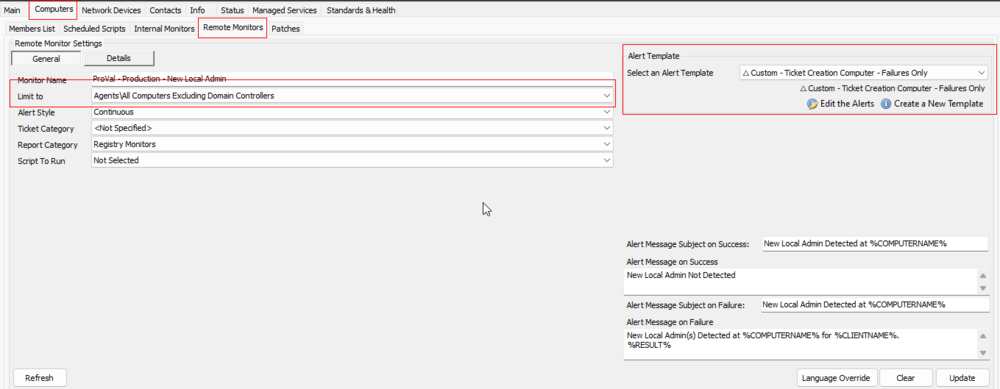
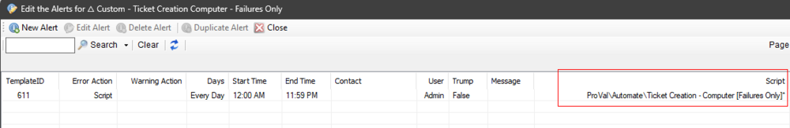

## Implementation Steps

- Import the Alert Template `△ Custom - Ticket Creation Computer - Failures Only`
  - Validate that the [CWM - Automate - Script - Ticket Creation - Computer [Failures Only]*](https://proval.itglue.com/DOC-5078775-13459854) script was imported as well.
  
- Run this SQL query from a RAWSQL monitor set to import the required search.
  ```
  INSERT INTO `sensorchecks` 
  SELECT 
  '' as `SensID`,
  'All Computers Excluding Domain Controllers' as `Name`,
  'SELECT /r/n computers.computerid as `Computer Id`,/r/n computers.name as `Computer Name`,/r/n clients.name as `Client Name`,/r/n computers.domain as `Computer Domain`,/r/n computers.username as `Computer User`,/r/n Computers.Domain as `Computer.Network.Domain`,/r/n IF(INSTR(IFNULL(inv_operatingsystem.Name, Computers.OS), /'windows/')>0, 1, IF(INSTR(IFNULL(inv_operatingsystem.Name, Computers.OS), /'darwin/') >0, 2, 3)) as `Computer.OS.Type`/r/nFROM Computers /r/nLEFT JOIN inv_operatingsystem ON (Computers.ComputerId=inv_operatingsystem.ComputerId)/r/nLEFT JOIN Clients ON (Computers.ClientId=Clients.ClientId)/r/nLEFT JOIN Locations ON (Computers.LocationId=Locations.LocationID)/r/n WHERE /r/n((((NOT ((Computers.Domain like /'DC:%/'))) AND (IF(INSTR(IFNULL(inv_operatingsystem.Name, Computers.OS), /'windows/')>0, 1, IF(INSTR(IFNULL(inv_operatingsystem.Name, Computers.OS), /'darwin/') >0, 2, 3)) = /'1/'))))/r/n' as `SQL`,
  '4' as `QueryType`,
  'Select||=||=||=|^Select|||||||^' as `ListData`,
  '3' as `FolderID`,
  '459e03de-ff42-4165-bab6-0b105e80f185' as `GUID`,
  '\\<LabTechAbstractSearch>\\<asn>\\<st>AndNode\\</st>\\<cn>\\<asn>\\<st>AndNode\\</st>\\<cn>\\<asn>\\<st>NotNode\\</st>\\<cn>\\<asn>\\<st>ComparisonNode\\</st>\\<lon>Computer.Network.Domain\\</lon>\\<lok>Computer.Network.Domain\\</lok>\\<lmo>TextLike\\</lmo>\\<dv>DC:%\\</dv>\\<dk>DC:%\\</dk>\\</asn>\\</cn>\\</asn>\\<asn>\\<st>ComparisonNode\\</st>\\<lon>Computer.OS.Type\\</lon>\\<lok>Computer.OS.Type\\</lok>\\<lmo>Equals\\</lmo>\\<dv>Windows\\</dv>\\<dk>1\\</dk>\\</asn>\\</cn>\\</asn>\\</cn>\\</asn>\\</LabTechAbstractSearch>' as `SearchXML`,
  (NULL) as `UpdatedBy`,
  (NULL) as `UpdateDate`
  FROM  (SELECT MIN(computerid) FROM computers) a
  Where (SELECT count(*) From SensorChecks where `GUID` = '459e03de-ff42-4165-bab6-0b105e80f185') = 0 ;
  ```

- Obtain the groupid(s) of the group(s) that the remote monitor should be applied to.

- Copy the following query and replace `YOUR COMMA SEPARATED LIST OF GROUPID(S)` with the Groupid(s) of the relevant groups: (The string to replace can be found at the very bottom of the query, right after **WHERE**)
  ```
  Set @searchid = (SELECT sensid FROM sensorchecks WHERE `GUID` = '459e03de-ff42-4165-bab6-0b105e80f185');
  INSERT INTO groupagents 
    SELECT '' as `AgentID`,
    `groupid` as `GroupID`,
    @Searchid as `SearchID`,
    'ProVal - Production - New Local Admin' as `Name`,
    '6' as `CheckAction`,
    '1' as `AlertAction`,
    'New Local Admin Detected at %COMPUTERNAME%~~~New Local Admin Not Detected!!!New Local Admin Detected at %COMPUTERNAME%~~~New Local Admin(s) Detected at %COMPUTERNAME% for %CLIENTNAME%. %RESULT%' as `AlertMessage`,
    '0' as `ContactID`,
    '3600' as `interval`,
    '127.0.0.1' as `Where`,
    '7' as `What`,
    'C://Windows//System32//WindowsPowerShell//v1.0//powershell.exe -ExecutionPolicy Bypass -Command "$domaincheck = ( Get-Ciminstance -Class Win32_ComputerSystem -ErrorAction SilentlyContinue ).domainrole -notin (4,5); $psversion = $psversiontable.psversion.Major -ge 5; if ( $domaincheck -and $psversion ) {[Net.ServicePointManager]::SecurityProtocol = [enum]::ToObject([Net.SecurityProtocolType], 3072); $ProjectName = /'Get-NewLocalAdmin/'; $WorkingDirectory = "C://ProgramData//_Automation//Script//$ProjectName//"; $scriptpath = "$($WorkingDirectory)//$($ProjectName).ps1//"; $scripturl = /'https://file.provaltech.com/repo/script/Get-NewLocalAdmin.ps1/'; if( !(Test-Path $WorkingDirectory) ) {mkdir $WorkingDirectory | Out-Null}; (New-Object System.Net.WebClient).DownloadFile($scripturl,$scriptpath);$op= & $scriptpath; $op | Select-Object -Property Name, Sid, ProfileImagePath | Where-Object { $_.Name -Match /'[A-z0-9//._]/' } | Format-List} else {return /'Unsupported/'}"' as `DataOut`,
    '16' as `Comparor`,
    '10|((^((OK){0,}(//r//n){0,}[//r//n]{0,}//s{0,})$)%7C(^$))|11|((^((OK){0,}(//r//n){0,}[//r//n]{0,}//s{0,})$)%7C(^$))%7C(^((//r//n){0,}[//r//n]{0,}//s{0,})Name)|10|^((//r//n){0,}[//r//n]{0,}//s{0,})Name' as `DataIn`,
    '' as `IDField`,
    '0' as `AlertStyle`,
    '0' as `ScriptID`,
    '' as `datacollector`,
    '21' as `Category`,
    '0' as `TicketCategory`,
    '1' as `ScriptTarget`,
    CONCAT(
    SUBSTRING('abcdef0123456789', FLOOR(RAND()*16+1), 1),
    SUBSTRING('abcdef0123456789', FLOOR(RAND()*16+1), 1),
    SUBSTRING('abcdef0123456789', FLOOR(RAND()*16+1), 1),
    SUBSTRING('abcdef0123456789', FLOOR(RAND()*16+1), 1),
    SUBSTRING('abcdef0123456789', FLOOR(RAND()*16+1), 1),
    SUBSTRING('abcdef0123456789', FLOOR(RAND()*16+1), 1),
    SUBSTRING('abcdef0123456789', FLOOR(RAND()*16+1), 1),
    SUBSTRING('abcdef0123456789', FLOOR(RAND()*16+1), 1),
    '-',
    SUBSTRING('abcdef0123456789', FLOOR(RAND()*16+1), 1),
    SUBSTRING('abcdef0123456789', FLOOR(RAND()*16+1), 1),
    SUBSTRING('abcdef0123456789', FLOOR(RAND()*16+1), 1),
    SUBSTRING('abcdef0123456789', FLOOR(RAND()*16+1), 1),
    '-',
    SUBSTRING('abcdef0123456789', FLOOR(RAND()*16+1), 1),
    SUBSTRING('abcdef0123456789', FLOOR(RAND()*16+1), 1),
    SUBSTRING('abcdef0123456789', FLOOR(RAND()*16+1), 1),
    SUBSTRING('abcdef0123456789', FLOOR(RAND()*16+1), 1),
    '-',
    SUBSTRING('abcdef0123456789', FLOOR(RAND()*16+1), 1),
    SUBSTRING('abcdef0123456789', FLOOR(RAND()*16+1), 1),
    SUBSTRING('abcdef0123456789', FLOOR(RAND()*16+1), 1),
    SUBSTRING('abcdef0123456789', FLOOR(RAND()*16+1), 1),
    '-',
    SUBSTRING('abcdef0123456789', FLOOR(RAND()*16+1), 1),
    SUBSTRING('abcdef0123456789', FLOOR(RAND()*16+1), 1),
    SUBSTRING('abcdef0123456789', FLOOR(RAND()*16+1), 1),
    SUBSTRING('abcdef0123456789', FLOOR(RAND()*16+1), 1),
    '-',
    SUBSTRING('abcdef0123456789', FLOOR(RAND()*16+1), 1),
    SUBSTRING('abcdef0123456789', FLOOR(RAND()*16+1), 1),
    SUBSTRING('abcdef0123456789', FLOOR(RAND()*16+1), 1),
    SUBSTRING('abcdef0123456789', FLOOR(RAND()*16+1), 1),
    SUBSTRING('abcdef0123456789', FLOOR(RAND()*16+1), 1),
    SUBSTRING('abcdef0123456789', FLOOR(RAND()*16+1), 1),
    SUBSTRING('abcdef0123456789', FLOOR(RAND()*16+1), 1),
    SUBSTRING('abcdef0123456789', FLOOR(RAND()*16+1), 1),
    SUBSTRING('abcdef0123456789', FLOOR(RAND()*16+1), 1),
    SUBSTRING('abcdef0123456789', FLOOR(RAND()*16+1), 1),
    SUBSTRING('abcdef0123456789', FLOOR(RAND()*16+1), 1),
    SUBSTRING('abcdef0123456789', FLOOR(RAND()*16+1), 1)
    ) as `GUID`,
    'root' as `UpdatedBy`,
    (NOW()) as `UpdateDate`
    FROM mastergroups m
    WHERE m.groupid IN (YOUR COMMA SEPARATED LIST OF GROUPID(S))
    AND m.groupid NOT IN  (SELECT DISTINCT groupid FROM groupagents WHERE `Name` = 'ProVal - Production - New Local Admin')
  ```

- An example of a query with a groupid:
  ```
  Set @searchid = (SELECT sensid FROM sensorchecks WHERE `GUID` = '459e03de-ff42-4165-bab6-0b105e80f185');
  INSERT INTO groupagents 
    SELECT '' as `AgentID`,
    `groupid` as `GroupID`,
    @Searchid as `SearchID`,
    'ProVal - Production - New Local Admin' as `Name`,
    '6' as `CheckAction`,
    '1' as `AlertAction`,
    'New Local Admin Detected at %COMPUTERNAME%~~~New Local Admin Not Detected!!!New Local Admin Detected at %COMPUTERNAME%~~~New Local Admin(s) Detected at %COMPUTERNAME% for %CLIENTNAME%. %RESULT%' as `AlertMessage`,
    '0' as `ContactID`,
    '3600' as `interval`,
    '127.0.0.1' as `Where`,
    '7' as `What`,
    'C://Windows//System32//WindowsPowerShell//v1.0//powershell.exe -ExecutionPolicy Bypass -Command "$domaincheck = ( Get-Ciminstance -Class Win32_ComputerSystem -ErrorAction SilentlyContinue ).domainrole -notin (4,5); $psversion = $psversiontable.psversion.Major -ge 5; if ( $domaincheck -and $psversion ) {[Net.ServicePointManager]::SecurityProtocol = [enum]::ToObject([Net.SecurityProtocolType], 3072); $ProjectName = /'Get-NewLocalAdmin/'; $WorkingDirectory = "C://ProgramData//_Automation//Script//$ProjectName//"; $scriptpath = "$($WorkingDirectory)//$($ProjectName).ps1//"; $scripturl = /'https://file.provaltech.com/repo/script/Get-NewLocalAdmin.ps1/'; if( !(Test-Path $WorkingDirectory) ) {mkdir $WorkingDirectory | Out-Null}; (New-Object System.Net.WebClient).DownloadFile($scripturl,$scriptpath);$op= & $scriptpath; $op | Select-Object -Property Name, Sid, ProfileImagePath | Where-Object { $_.Name -Match /'[A-z0-9//._]/' } | Format-List} else {return /'Unsupported/'}"' as `DataOut`,
    '16' as `Comparor`,
    '10|((^((OK){0,}(//r//n){0,}[//r//n]{0,}//s{0,})$)%7C(^$))|11|((^((OK){0,}(//r//n){0,}[//r//n]{0,}//s{0,})$)%7C(^$))%7C(^((//r//n){0,}[//r//n]{0,}//s{0,})Name)|10|^((//r//n){0,}[//r//n]{0,}//s{0,})Name' as `DataIn`,
    '' as `IDField`,
    '0' as `AlertStyle`,
    '0' as `ScriptID`,
    '' as `datacollector`,
    '21' as `Category`,
    '0' as `TicketCategory`,
    '1' as `ScriptTarget`,
    CONCAT(
    SUBSTRING('abcdef0123456789', FLOOR(RAND()*16+1), 1),
    SUBSTRING('abcdef0123456789', FLOOR(RAND()*16+1), 1),
    SUBSTRING('abcdef0123456789', FLOOR(RAND()*16+1), 1),
    SUBSTRING('abcdef0123456789', FLOOR(RAND()*16+1), 1),
    SUBSTRING('abcdef0123456789', FLOOR(RAND()*16+1), 1),
    SUBSTRING('abcdef0123456789', FLOOR(RAND()*16+1), 1),
    SUBSTRING('abcdef0123456789', FLOOR(RAND()*16+1), 1),
    SUBSTRING('abcdef0123456789', FLOOR(RAND()*16+1), 1),
    '-',
    SUBSTRING('abcdef0123456789', FLOOR(RAND()*16+1), 1),
    SUBSTRING('abcdef0123456789', FLOOR(RAND()*16+1), 1),
    SUBSTRING('abcdef0123456789', FLOOR(RAND()*16+1), 1),
    SUBSTRING('abcdef0123456789', FLOOR(RAND()*16+1), 1),
    '-',
    SUBSTRING('abcdef0123456789', FLOOR(RAND()*16+1), 1),
    SUBSTRING('abcdef0123456789', FLOOR(RAND()*16+1), 1),
    SUBSTRING('abcdef0123456789', FLOOR(RAND()*16+1), 1),
    SUBSTRING('abcdef0123456789', FLOOR(RAND()*16+1), 1),
    '-',
    SUBSTRING('abcdef0123456789', FLOOR(RAND()*16+1), 1),
    SUBSTRING('abcdef0123456789', FLOOR(RAND()*16+1), 1),
    SUBSTRING('abcdef0123456789', FLOOR(RAND()*16+1), 1),
    SUBSTRING('abcdef0123456789', FLOOR(RAND()*16+1), 1),
    '-',
    SUBSTRING('abcdef0123456789', FLOOR(RAND()*16+1), 1),
    SUBSTRING('abcdef0123456789', FLOOR(RAND()*16+1), 1),
    SUBSTRING('abcdef0123456789', FLOOR(RAND()*16+1), 1),
    SUBSTRING('abcdef0123456789', FLOOR(RAND()*16+1), 1),
    '-',
    SUBSTRING('abcdef0123456789', FLOOR(RAND()*16+1), 1),
    SUBSTRING('abcdef0123456789', FLOOR(RAND()*16+1), 1),
    SUBSTRING('abcdef0123456789', FLOOR(RAND()*16+1), 1),
    SUBSTRING('abcdef0123456789', FLOOR(RAND()*16+1), 1),
    '-',
    SUBSTRING('abcdef0123456789', FLOOR(RAND()*16+1), 1),
    SUBSTRING('abcdef0123456789', FLOOR(RAND()*16+1), 1),
    SUBSTRING('abcdef0123456789', FLOOR(RAND()*16+1), 1),
    SUBSTRING('abcdef0123456789', FLOOR(RAND()*16+1), 1),
    '-',
    SUBSTRING('abcdef0123456789', FLOOR(RAND()*16+1), 1),
    SUBSTRING('abcdef0123456789', FLOOR(RAND()*16+1), 1),
    SUBSTRING('abcdef0123456789', FLOOR(RAND()*16+1), 1),
    SUBSTRING('abcdef0123456789', FLOOR(RAND()*16+1), 1),
    SUBSTRING('abcdef0123456789', FLOOR(RAND()*16+1), 1),
    SUBSTRING('abcdef0123456789', FLOOR(RAND()*16+1), 1),
    SUBSTRING('abcdef0123456789', FLOOR(RAND()*16+1), 1),
    SUBSTRING('abcdef0123456789', FLOOR(RAND()*16+1), 1),
    SUBSTRING('abcdef0123456789', FLOOR(RAND()*16+1), 1),
    SUBSTRING('abcdef0123456789', FLOOR(RAND()*16+1), 1),
    SUBSTRING('abcdef0123456789', FLOOR(RAND()*16+1), 1)
    ) as `GUID`,
    'root' as `UpdatedBy`,
    (NOW()) as `UpdateDate`
    FROM mastergroups m
    WHERE m.groupid IN (2,3,855,856)
    AND m.groupid NOT IN  (SELECT DISTINCT groupid FROM groupagents WHERE `Name` = 'ProVal - Production - New Local Admin')
  ```

- Check the concerned groups, ensure the monitor set is created and configured with the correct search, and apply the appropriate alert template.  
  **Limit To:** `All Computers Excluding Domain Controllers`  
  **Alert Template:** `△ Custom - Ticket Creation Computer - Failures Only`  
  

- Click `Edit the Alerts` and ensure that the alert template is using the correct script, [CWM - Automate - Script - Ticket Creation - Computer [Failures Only]*](https://proval.itglue.com/DOC-5078775-13459854)  
  


