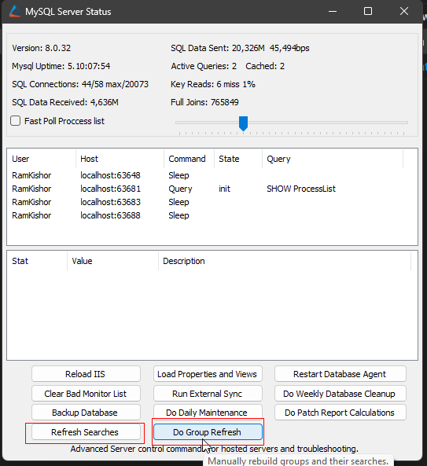
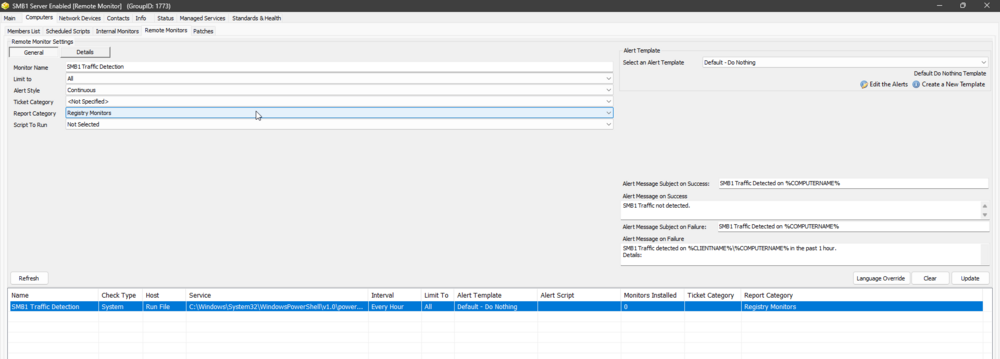

## Step 1.
Run the provided SQL query using a RAWSQL monitor set to establish the `SMB1 Traffic Detection` Remote Monitor, `SMB1 Server Enabled [Remote Monitor]` search, and `SMB1 Server Enabled [Remote Monitor]` group.

```sql
#Insert `SMB1 Server Enabled [Remote Monitor]` search
INSERT INTO `sensorchecks` (`Name`, `SQL`, `QueryType`, `ListDATA`, `FolderID`, `GUID) 
SELECT 
'SMB1 Server Enabled [Remote Monitor]', 
'Select DISTINCT Computers.ComputerID, [Clients.Name](http://clients.Name) as `Client Name`, [Computers.Name](http://computers.Name) as `Computer Name`, Computers.Domain, Computers.UserName as `Username`, Computers.ComputerID
From Computers, Clients
Where Computers.ClientID = Clients.ClientID
 and ((Computers.ComputerID in (select DISTINCT c.computerid from computers c JOIN agents a ON a.computerid=c.computerid AND a.`Name` = 'ProVal - Production - SMB1 Detection' JOIN h_agents h ON c.computerid=h.Lastcomputerid AND a.agentid=h.AgentID AND REPLACE(h.LastFailData,'/r/n', '') =  'True')))',
'4', 
'Computer ID||>=|*(select DISTINCT c.computerid from computers c JOIN agents a ON a.computerid=c.computerid AND a.`Name` = 'ProVal - Production - SMB1 Detection' JOIN h_agents h ON c.computerid=h.Lastcomputerid AND a.agentid=h.AgentID AND REPLACE(h.LastFailData,'/r/n', '') =  'True')|=||=|^Select|||||||^',
'0', 
'a3890b94-d878-4916-80b3-67b31a8695f4'
FROM  (SELECT MIN(computerid) FROM computers) a
Where (SELECT count(*) From SensorChecks where `GUID` = 'a3890b94-d878-4916-80b3-67b31a8695f4') = 0 ;
```

```sql
SET @searchid = (SELECT max(sensid) from sensorchecks where GUID = 'a3890b94-d878-4916-80b3-67b31a8695f4');
```

```sql
#Insert `SMB1 Server Enabled [Remote Monitor]` Group
INSERT INTO `mastergroups` (`ParentID`, `Parents`, `Children`, `depth`, `Name`, `FullName`, `Permissions`, `Template`, `AutoJoinScript`, `Master`, `LimitToParent`, `Control`, `ControlID`, `Notes`, `MaintenanceID`, `MaintWindowApplied`, `GroupType`, `Priority`, `GUID`, `NetworkJoin`, `NetworkJoinOptions`,`ContactJoin`, `ContactJoinOptions) 
SELECT 
'0',
',',
',',
'0',
'SMB1 Server Enabled [Remote Monitor]',
'SMB1 Server Enabled [Remote Monitor]',
'0',
'0',
@searchid,
'2',
'1',
'0',
'0',
'',
'0',
(NOW()),
'0',
'5',
'e24d9e5e-8d4a-11ee-b15d-960002890dfa',
'0',
'0',
'0',
'0'
FROM  (SELECT MIN(computerid) FROM computers) a
Where (SELECT count(*) From Mastergroups where `GUID` = 'e24d9e5e-8d4a-11ee-b15d-960002890dfa') = 0 ;
```

```sql
SET @Groupid = (SELECT groupid from mastergroups where `GUID` =  'e24d9e5e-8d4a-11ee-b15d-960002890dfa');
```

```sql
#Insert `SMB1 Traffic Detection` Remote Monitor
INSERT INTO groupagents 
SELECT '' as `AgentID`,
`groupid` as `GroupID`,
@searchid as `SearchID`,
'SMB1 Traffic Detection' as `Name`,
'6' as `CheckAction`,
'1' as `AlertAction`,
'SMB1 Traffic Detected on %COMPUTERNAME%~~~SMB1 Traffic not detected.!!!SMB1 Traffic Detected on %COMPUTERNAME%~~~SMB1 Traffic detected on %CLIENTNAME%//%COMPUTERNAME% in the past 1 hour. 
Details: 
%RESULT%' as `AlertMessage`,
'0' as `ContactID`,
'3600' as `interval`,
'127.0.0.1' as `Where`,
'7' as `What`,
'C://Windows//System32//WindowsPowerShell//v1.0//powershell.exe -ExecutionPolicy Bypass -Command "if ( !( (Get-SmbServerConfiguration).AuditSmb1Access ) ) { try { Set-SmbServerConfiguration –AuditSmb1Access $true -Force -confirm:$false -ErrorAction Stop } catch { return /"Failure Reason: $($Error[0].Exception.Message)/" } } else {function Get-SMB1AccessLogs { param([int[]]$Level,[int[]]$EventID,[int]$Hours); $filter = @{LogName = 'Microsoft-Windows-SMBServer*'; Level = $Level};if ($EventID) {$filter.ID = $EventID};if ($Hours) {$filter.StartTime = (Get-Date).AddHours(-$Hours)};try {Get-WinEvent -FilterHashtable $filter -ErrorAction Stop } catch { if ( $Error[0].Exception.Message -match 'No events were found' ) { return 'No events were found that match the specified selection criteria'} else { return /"Complete Failure: $($Error[0].Exception.Message)/" } } }; Get-SMB1AccessLogs -Level 4 -EventID 1001,3000 -Hours 1 | Format-List}"' as `DataOut`,
'16' as `Comparor`,
'10|(^$)%7C^(//r//n%7C//s%7COK)$%7C(No events were found)|11|(^$)%7C^(//r//n%7C//s%7COK)$%7C(No events were found)%7C(Microsoft-Windows-SMBServer)|10|Microsoft-Windows-SMBServer' as `DataIn`,
'' as `IDField`,
'0' as `AlertStyle`,
'0' as `ScriptID`,
'' as `datacollector`,
'21' as `Category`,
'0' as `TicketCategory`,
'1' as `ScriptTarget`,
CONCAT(
SUBSTRING('abcdef0123456789', FLOOR(RAND()*16+1), 1),
SUBSTRING('abcdef0123456789', FLOOR(RAND()*16+1), 1),
SUBSTRING('abcdef0123456789', FLOOR(RAND()*16+1), 1),
SUBSTRING('abcdef0123456789', FLOOR(RAND()*16+1), 1),
SUBSTRING('abcdef0123456789', FLOOR(RAND()*16+1), 1),
SUBSTRING('abcdef0123456789', FLOOR(RAND()*16+1), 1),
SUBSTRING('abcdef0123456789', FLOOR(RAND()*16+1), 1),
SUBSTRING('abcdef0123456789', FLOOR(RAND()*16+1), 1),
'-',
SUBSTRING('abcdef0123456789', FLOOR(RAND()*16+1), 1),
SUBSTRING('abcdef0123456789', FLOOR(RAND()*16+1), 1),
SUBSTRING('abcdef0123456789', FLOOR(RAND()*16+1), 1),
SUBSTRING('abcdef0123456789', FLOOR(RAND()*16+1), 1),
'-',
SUBSTRING('abcdef0123456789', FLOOR(RAND()*16+1), 1),
SUBSTRING('abcdef0123456789', FLOOR(RAND()*16+1), 1),
SUBSTRING('abcdef0123456789', FLOOR(RAND()*16+1), 1),
SUBSTRING('abcdef0123456789', FLOOR(RAND()*16+1), 1),
'-',
SUBSTRING('abcdef0123456789', FLOOR(RAND()*16+1), 1),
SUBSTRING('abcdef0123456789', FLOOR(RAND()*16+1), 1),
SUBSTRING('abcdef0123456789', FLOOR(RAND()*16+1), 1),
SUBSTRING('abcdef0123456789', FLOOR(RAND()*16+1), 1),
'-',
SUBSTRING('abcdef0123456789', FLOOR(RAND()*16+1), 1),
SUBSTRING('abcdef0123456789', FLOOR(RAND()*16+1), 1),
SUBSTRING('abcdef0123456789', FLOOR(RAND()*16+1), 1),
SUBSTRING('abcdef0123456789', FLOOR(RAND()*16+1), 1),
'-',
SUBSTRING('abcdef0123456789', FLOOR(RAND()*16+1), 1),
SUBSTRING('abcdef0123456789', FLOOR(RAND()*16+1), 1),
SUBSTRING('abcdef0123456789', FLOOR(RAND()*16+1), 1),
SUBSTRING('abcdef0123456789', FLOOR(RAND()*16+1), 1),
SUBSTRING('abcdef0123456789', FLOOR(RAND()*16+1), 1),
SUBSTRING('abcdef0123456789', FLOOR(RAND()*16+1), 1),
SUBSTRING('abcdef0123456789', FLOOR(RAND()*16+1), 1),
SUBSTRING('abcdef0123456789', FLOOR(RAND()*16+1), 1),
SUBSTRING('abcdef0123456789', FLOOR(RAND()*16+1), 1),
SUBSTRING('abcdef0123456789', FLOOR(RAND()*16+1), 1),
SUBSTRING('abcdef0123456789', FLOOR(RAND()*16+1), 1)
) as `GUID`,
'root' as `UpdatedBy`,
(NOW()) as `UpdateDate`
FROM mastergroups m
WHERE m.groupid = @groupid
AND m.groupid NOT IN  (SELECT DISTINCT groupid FROM groupagents WHERE `Name` = 'SMB1 Traffic Detection');
```

## Step 2.
Perform `Refresh Searches` and `Do Group Refresh` from `MySQL Server Status` tool.




## Step 3.
Reload System Cache after a couple of minutes.

## Step 4.
Refresh Groups and Look for the `SMB1 Server Enabled [Remote Monitor]` group.

## Step 5.
Validate the presence of the `SMB1 Traffic Detection` remote monitor on the group.



## Step 6.
Apply the `△ Custom - Ticket Creation Computer - Failures Only` alert template to the remote monitor to enable alerting. The alert template should execute the [CWM - Automate - Script - Ticket Creation - Computer [Failures Only]](https://proval.itglue.com/DOC-5078775-13459854) script for errors/failures.


