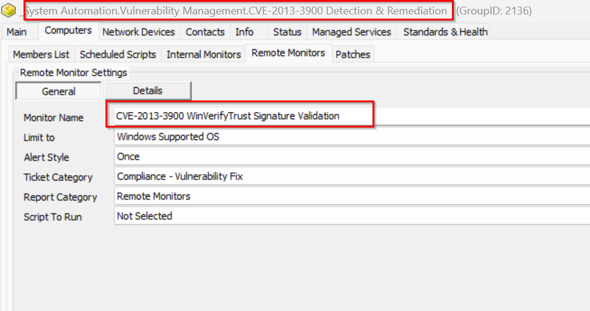
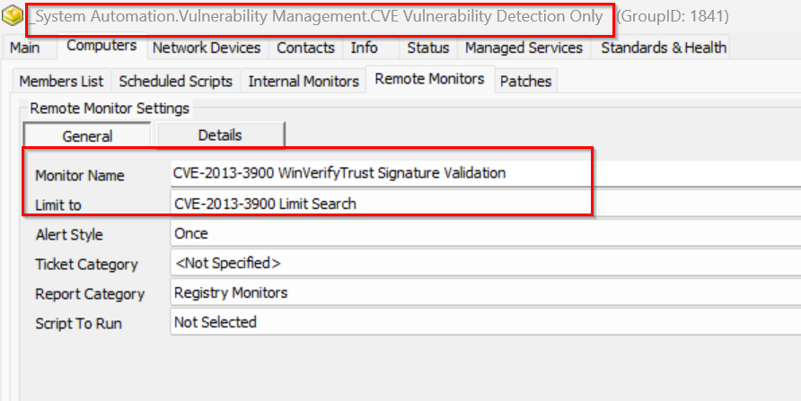

## Implementation

### 1. 

#### #Insert EDFs
```sql
INSERT IGNORE INTO `extrafield` (`Form`, `Name`, `Sort`, `NoBreak`, `FType`, `Section`, `UnEditable`, `Collapsed`, `Fill`, `LtGuid`, `IsPassword`, `IsEncrypted`, `IsHidden`, `IsRestricted`, `ViewPermissions`, `EditPermissions`) VALUES (3, 'CVE-2013-3900 Vul Detection and Remediation', 0, 0, 1, 'Vulnerability', 0, 0, 'This put agent on detection and remediation', '76fb0491-c8e8-4118-a87d-adb3de03a008', 0, 0, 0, 0, '', '');
INSERT IGNORE INTO `extrafield` (`Form`, `Name`, `Sort`, `NoBreak`, `FType`, `Section`, `UnEditable`, `Collapsed`, `Fill`, `LtGuid`, `IsPassword`, `IsEncrypted`, `IsHidden`, `IsRestricted`, `ViewPermissions`, `EditPermissions`) VALUES (1, 'CVE-2013-3900 Vulnerability', 0, 0, 0, 'Vulnerability', 0, 0, 'This contains vulnerability state of the agent', 'e2fd14cc-e35f-488c-9c8c-3ee8bdd6f7c0', 0, 0, 0, 0, '', '');
INSERT IGNORE INTO `extrafield` (`Form`, `Name`, `Sort`, `NoBreak`, `FType`, `Section`, `UnEditable`, `Collapsed`, `Fill`, `LtGuid`, `IsPassword`, `IsEncrypted`, `IsHidden`, `IsRestricted`, `ViewPermissions`, `EditPermissions`) VALUES (1, 'CVE-2013-3900 Detection Date', 0, 0, 0, 'Vulnerability', 0, 0, '', '13d1fd02-9558-4d1b-86be-cb16842e62c8', 0, 0, 0, 0, '', '');
INSERT IGNORE INTO `extrafield` (`Form`, `Name`, `Sort`, `NoBreak`, `FType`, `Section`, `UnEditable`, `Collapsed`, `Fill`, `LtGuid`, `IsPassword`, `IsEncrypted`, `IsHidden`, `IsRestricted`, `ViewPermissions`, `EditPermissions`) VALUES (1, 'CVE-2013-3900 Logging', 0, 0, 0, 'Vulnerability', 0, 0, '', 'd275edc9-781f-47ae-8769-848662f251ac', 0, 0, 0, 0, '', '');
INSERT IGNORE INTO `extrafield` (`Form`, `Name`, `Sort`, `NoBreak`, `FType`, `Section`, `UnEditable`, `Collapsed`, `Fill`, `LtGuid`, `IsPassword`, `IsEncrypted`, `IsHidden`, `IsRestricted`, `ViewPermissions`, `EditPermissions`) VALUES (1, 'CVE-2013-3900 Status', 0, 0, 0, 'Vulnerability', 0, 0, '', 'ec8a1920-c6a7-42c4-aacb-ba4538084f81', 0, 0, 0, 0, '', '');
INSERT IGNORE INTO `extrafield` (`Form`, `Name`, `Sort`, `NoBreak`, `FType`, `Section`, `UnEditable`, `Collapsed`, `Fill`, `LtGuid`, `IsPassword`, `IsEncrypted`, `IsHidden`, `IsRestricted`, `ViewPermissions`, `EditPermissions`) VALUES (1, 'CVE-2013-3900 Vul Detection and Remediation', 0, 0, 1, 'Vulnerability', 0, 0, '', '6bf79cd8-828b-405a-929f-a032b029babb', 0, 0, 0, 0, '', '');
INSERT IGNORE INTO `extrafield` (`Form`, `Name`, `Sort`, `NoBreak`, `FType`, `Section`, `UnEditable`, `Collapsed`, `Fill`, `LtGuid`, `IsPassword`, `IsEncrypted`, `IsHidden`, `IsRestricted`, `ViewPermissions`, `EditPermissions`) VALUES (1, 'CVE-2013-3900 Vul Detection and Remediation Exclude', 0, 0, 1, 'Exclusions', 0, 0, '', 'c061137b-8e95-4418-a435-7f5e87e9b9c4', 0, 0, 0, 0, '', '');
INSERT IGNORE INTO `extrafield` (`Form`, `Name`, `Sort`, `NoBreak`, `FType`, `Section`, `UnEditable`, `Collapsed`, `Fill`, `LtGuid`, `IsPassword`, `IsEncrypted`, `IsHidden`, `IsRestricted`, `ViewPermissions`, `EditPermissions`) VALUES (2, 'CVE-2013-3900 Vul Detection and Remediation Exclude', 0, 0, 1, 'Exclusions', 0, 0, '', '028d22d3-c82b-409c-bc55-abdb73a6e863', 0, 0, 0, 0, '', '');
```

#### #Insert Search:
`CVE Vulnerability Detection Only`
```sql
INSERT INTO `sensorchecks` 
SELECT 
'' as `SensID`,
'CVE Vulnerability Detection Only' as `Name`,
'SELECT 
   computers.computerid as `Computer Id`,
   computers.name as `Computer Name`,
   clients.name as `Client Name`,
   computers.domain as `Computer Domain`,
   computers.username as `Computer User`,
   IFNULL(IFNULL(edfAssigned1.Value,edfDefault1.value),'0') as `Computer - Client - Extra Data Field - Vulnerability - CVE Vulnerability Detection Only`,
   IFNULL(IFNULL(edfAssigned2.Value,edfDefault2.value),'0') as `Computer - Extra Data Field - Exclusions - CVE Vulnerability Detection Only Exclude`,
   IFNULL(IFNULL(edfAssigned3.Value,edfDefault3.value),'0') as `Computer - Location - Extra Data Field - Exclusions - CVE Vulnerability Detection Only Exclude`,
   IFNULL(IFNULL(edfAssigned4.Value,edfDefault4.value),'0') as `Computer - Extra Data Field - Vulnerability - CVE Vulnerability Detection Only`
FROM Computers 
LEFT JOIN inv_operatingsystem ON (Computers.ComputerId=inv_operatingsystem.ComputerId)
LEFT JOIN Clients ON (Computers.ClientId=Clients.ClientId)
LEFT JOIN Locations ON (Computers.LocationId=Locations.LocationID)
LEFT JOIN ExtraFieldData edfAssigned1 ON (edfAssigned1.id=Clients.ClientId and edfAssigned1.ExtraFieldId =(Select ExtraField.id FROM ExtraField WHERE LTGuid='b2a8e137-716d-4e63-a710-92bca0fb14aa'))
LEFT JOIN ExtraFieldData edfDefault1 ON (edfDefault1.id=0 and edfDefault1.ExtraFieldId =(Select ExtraField.id FROM ExtraField WHERE LTGuid='b2a8e137-716d-4e63-a710-92bca0fb14aa'))
LEFT JOIN ExtraFieldData edfAssigned2 ON (edfAssigned2.id=Computers.ComputerId and edfAssigned2.ExtraFieldId =(Select ExtraField.id FROM ExtraField WHERE LTGuid='a6a948ec-93e1-4b4d-8dec-31a1bc9bd244'))
LEFT JOIN ExtraFieldData edfDefault2 ON (edfDefault2.id=0 and edfDefault2.ExtraFieldId =(Select ExtraField.id FROM ExtraField WHERE LTGuid='a6a948ec-93e1-4b4d-8dec-31a1bc9bd244'))
LEFT JOIN ExtraFieldData edfAssigned3 ON (edfAssigned3.id=Locations.LocationId and edfAssigned3.ExtraFieldId =(Select ExtraField.id FROM ExtraField WHERE LTGuid='4e8cc4e6-4877-4ae9-bdda-7dd595b5c8a6'))
LEFT JOIN ExtraFieldData edfDefault3 ON (edfDefault3.id=0 and edfDefault3.ExtraFieldId =(Select ExtraField.id FROM ExtraField WHERE LTGuid='4e8cc4e6-4877-4ae9-bdda-7dd595b5c8a6'))
LEFT JOIN ExtraFieldData edfAssigned4 ON (edfAssigned4.id=Computers.ComputerId and edfAssigned4.ExtraFieldId =(Select ExtraField.id FROM ExtraField WHERE LTGuid='f4deaa69-d284-4346-9dfe-3491733a34ba'))
LEFT JOIN ExtraFieldData edfDefault4 ON (edfDefault4.id=0 and edfDefault4.ExtraFieldId =(Select ExtraField.id FROM ExtraField WHERE LTGuid='f4deaa69-d284-4346-9dfe-3491733a34ba'))
 WHERE 
((((((IFNULL(IFNULL(edfAssigned1.Value,edfDefault1.value),'0')\\<>0) AND (IFNULL(IFNULL(edfAssigned2.Value,edfDefault2.value),'0')=0) AND (IFNULL(IFNULL(edfAssigned3.Value,edfDefault3.value),'0')=0))) OR (IFNULL(IFNULL(edfAssigned4.Value,edfDefault4.value),'0')\\<>0))))
' as `SQL`,
'4' as `QueryType`,
'Select||=||=||=|^Select|||||||^' as `ListData`,
'0' as `FolderID`,
'716a3b4f-f28d-4ebf-84fe-f719f18d31e4' as `GUID`,
'\\<LabTechAbstractSearch>\\<asn>\\<st>AndNode\\</st>\\<cn>\\<asn>\\<st>OrNode\\</st>\\<cn>\\<asn>\\<st>AndNode\\</st>\\<cn>\\<asn>\\<st>ComparisonNode\\</st>\\<lon>Computer.Client.Extra Data Field.Vulnerability.CVE Vulnerability Detection Only\\</lon>\\<lok>Computer.Client.Edf.b2a8e137-716d-4e63-a710-92bca0fb14aa\\</lok>\\<lmo>IsTrue\\</lmo>\\<dv>NULL\\</dv>\\<dk>NULL\\</dk>\\</asn>\\<asn>\\<st>ComparisonNode\\</st>\\<lon>Computer.Extra Data Field.Exclusions.CVE Vulnerability Detection Only Exclude\\</lon>\\<lok>Computer.Edf.a6a948ec-93e1-4b4d-8dec-31a1bc9bd244\\</lok>\\<lmo>IsFalse\\</lmo>\\<dv>NULL\\</dv>\\<dk>NULL\\</dk>\\</asn>\\<asn>\\<st>ComparisonNode\\</st>\\<lon>Computer.Location.Extra Data Field.Exclusions.CVE Vulnerability Detection Only Exclude\\</lon>\\<lok>Computer.Location.Edf.4e8cc4e6-4877-4ae9-bdda-7dd595b5c8a6\\</lok>\\<lmo>IsFalse\\</lmo>\\<dv>NULL\\</dv>\\<dk>NULL\\</dk>\\</asn>\\</cn>\\</asn>\\<asn>\\<st>ComparisonNode\\</st>\\<lon>Computer.Extra Data Field.Vulnerability.CVE Vulnerability Detection Only\\</lon>\\<lok>Computer.Edf.f4deaa69-d284-4346-9dfe-3491733a34ba\\</lok>\\<lmo>IsTrue\\</lmo>\\<dv>NULL\\</dv>\\<dk>NULL\\</dk>\\</asn>\\</cn>\\</asn>\\</LabTechAbstractSearch>' as `SearchXML`,
(NULL) as `UpdatedBy`,
(NULL) as `UpdateDate`
FROM  (SELECT MIN(computerid) FROM computers) a
Where (SELECT count(*) From SensorChecks where `GUID` = '716a3b4f-f28d-4ebf-84fe-f719f18d31e4') = 0 ;
```

#### #Insert Search: 
`CVE-2013-3900 Limit Search`
```sql
INSERT INTO `sensorchecks` 
SELECT 
'' as `SensID`,
'CVE-2013-3900 Limit Search' as `Name`, 
'SELECT 
   computers.computerid as `Computer Id`,
   computers.name as `Computer Name`,
   clients.name as `Client Name`,
   computers.domain as `Computer Domain`,
   computers.username as `Computer User`,
   IFNULL(IFNULL(edfAssigned1.Value,edfDefault1.value),'0') as `Computer - Client - Extra Data Field - Vulnerability - CVE Vulnerability Detection Only`,
   IFNULL(IFNULL(edfAssigned2.Value,edfDefault2.value),'0') as `Computer - Extra Data Field - Exclusions - CVE Vulnerability Detection Only Exclude`,
   IFNULL(IFNULL(edfAssigned3.Value,edfDefault3.value),'0') as `Computer - Location - Extra Data Field - Exclusions - CVE-2013-3900 Vul Detection and Remediation`,
   IFNULL(IFNULL(edfAssigned4.Value,edfDefault4.value),'0') as `Computer - Extra Data Field - Vulnerability - CVE-2013-3900 Vul Detection and Remediation`,
   IFNULL(IFNULL(edfAssigned5.Value,edfDefault5.value),'0') as `Computer - Extra Data Field - Vulnerability - CVE Vulnerability Detection Only`
FROM Computers 
LEFT JOIN inv_operatingsystem ON (Computers.ComputerId=inv_operatingsystem.ComputerId)
LEFT JOIN Clients ON (Computers.ClientId=Clients.ClientId)
LEFT JOIN Locations ON (Computers.LocationId=Locations.LocationID)
LEFT JOIN ExtraFieldData edfAssigned1 ON (edfAssigned1.id=Clients.ClientId and edfAssigned1.ExtraFieldId =(Select ExtraField.id FROM ExtraField WHERE LTGuid='b2a8e137-716d-4e63-a710-92bca0fb14aa'))
LEFT JOIN ExtraFieldData edfDefault1 ON (edfDefault1.id=0 and edfDefault1.ExtraFieldId =(Select ExtraField.id FROM ExtraField WHERE LTGuid='b2a8e137-716d-4e63-a710-92bca0fb14aa'))
LEFT JOIN ExtraFieldData edfAssigned2 ON (edfAssigned2.id=Computers.ComputerId and edfAssigned2.ExtraFieldId =(Select ExtraField.id FROM ExtraField WHERE LTGuid='a6a948ec-93e1-4b4d-8dec-31a1bc9bd244'))
LEFT JOIN ExtraFieldData edfDefault2 ON (edfDefault2.id=0 and edfDefault2.ExtraFieldId =(Select ExtraField.id FROM ExtraField WHERE LTGuid='a6a948ec-93e1-4b4d-8dec-31a1bc9bd244'))
LEFT JOIN ExtraFieldData edfAssigned3 ON (edfAssigned3.id=Locations.LocationId and edfAssigned3.ExtraFieldId =(Select ExtraField.id FROM ExtraField WHERE LTGuid='4e8cc4e6-4877-4ae9-bdda-7dd595b5c8a6'))
LEFT JOIN ExtraFieldData edfDefault3 ON (edfDefault3.id=0 and edfDefault3.ExtraFieldId =(Select ExtraField.id FROM ExtraField WHERE LTGuid='4e8cc4e6-4877-4ae9-bdda-7dd595b5c8a6'))
LEFT JOIN ExtraFieldData edfAssigned4 ON (edfAssigned4.id=Computers.ComputerId and edfAssigned4.ExtraFieldId =(Select ExtraField.id FROM ExtraField WHERE LTGuid='76fb0491-c8e8-4118-a87d-adb3de03a008'))
LEFT JOIN ExtraFieldData edfDefault4 ON (edfDefault4.id=0 and edfDefault4.ExtraFieldId =(Select ExtraField.id FROM ExtraField WHERE LTGuid='76fb0491-c8e8-4118-a87d-adb3de03a008'))
LEFT JOIN ExtraFieldData edfAssigned5 ON (edfAssigned5.id=Computers.ComputerId and edfAssigned5.ExtraFieldId =(Select ExtraField.id FROM ExtraField WHERE LTGuid='6bf79cd8-828b-405a-929f-a032b029babb'))
LEFT JOIN ExtraFieldData edfDefault5 ON (edfDefault5.id=0 and edfDefault5.ExtraFieldId =(Select ExtraField.id FROM ExtraField WHERE LTGuid='6bf79cd8-828b-405a-929f-a032b029babb'))
 WHERE 
((((((IFNULL(IFNULL(edfAssigned1.Value,edfDefault1.value),'0')\\<>0) AND (IFNULL(IFNULL(edfAssigned2.Value,edfDefault2.value),'0')=0) AND (IFNULL(IFNULL(edfAssigned3.Value,edfDefault3.value),'0')=0) AND (IFNULL(IFNULL(edfAssigned4.Value,edfDefault4.value),'0')=0) AND (IFNULL(IFNULL(edfAssigned5.Value,edfDefault5.value),'0')=0))) OR (IFNULL(IFNULL(edfAssigned6.Value,edfDefault6.value),'0')\\<>0))))
' as `SQL`,
'4' as `QueryType`,
'Select||=||=||=|^Select|||||||^' as `ListData`,
'0' as `FolderID`,
'4a095710-3ca9-4bff-badd-728ceac681d6' as `GUID`,
'\\<LabTechAbstractSearch>\\<asn>\\<st>AndNode\\</st>\\<cn>\\<asn>\\<st>OrNode\\</st>\\<cn>\\<asn>\\<st>AndNode\\</st>\\<cn>\\<asn>\\<st>ComparisonNode\\</st>\\<lon>Computer.Client.Extra Data Field.Vulnerability.CVE-2013-3900 Vul Detection and Remediation\\</lon>\\<lok>Computer.Client.Edf.76fb0491-c8e8-4118-a87d-adb3de03a008\\</lok>\\<lmo>IsFalse\\</lmo>\\<dv>NULL\\</dv>\\<dk>NULL\\</dk>\\</asn>\\<asn>\\<st>ComparisonNode\\</st>\\<lon>Computer.Extra Data Field.Vulnerability.CVE-2013-3900 Vul Detection and Remediation\\</lon>\\<lok>Computer.Edf.6bf79cd8-828b-405a-929f-a032b029babb\\</lok>\\<lmo>IsFalse\\</lmo>\\<dv>NULL\\</dv>\\<dk>NULL\\</dk>\\</asn>\\</cn>\\</asn>\\</LabTechAbstractSearch>' as `SearchXML`,
(NULL) as `UpdatedBy`,
(NULL) as `UpdateDate`
FROM  (SELECT MIN(computerid) FROM computers) a
Where (SELECT count(*) From SensorChecks where `GUID` = '4a095710-3ca9-4bff-badd-728ceac681d6') = 0 ;
```

#### #Insert Search: 
`CVE-2013-3900 Detection & Remediation`
```sql
INSERT INTO `sensorchecks` 
SELECT 
'' as `SensID`,
'CVE-2013-3900 Detection & Remediation' as `Name`, 
'SELECT 
   computers.computerid as `Computer Id`,
   computers.name as `Computer Name`,
   clients.name as `Client Name`,
   computers.domain as `Computer Domain`,
   computers.username as `Computer User`,
   IFNULL(IFNULL(edfAssigned1.Value,edfDefault1.value),'0') as `Computer - Client - Extra Data Field - Vulnerability - CVE-2013-3900 Vul Detection and Remediation`,
   IFNULL(IFNULL(edfAssigned2.Value,edfDefault2.value),'0') as `Computer - Location - Extra Data Field - Exclusions - CVE-2013-3900 Vul Detection and Remediation Exclude`,
   IFNULL(IFNULL(edfAssigned3.Value,edfDefault3.value),'0') as `Computer - Extra Data Field - Exclusions - CVE-2013-3900 Vul Detection and Remediation Exclude`,
   IFNULL(IFNULL(edfAssigned4.Value,edfDefault4.value),'0') as `Computer - Extra Data Field - Vulnerability - CVE-2013-3900 Vul Detection and Remediation`
FROM Computers 
LEFT JOIN inv_operatingsystem ON (Computers.ComputerId=inv_operatingsystem.ComputerId)
LEFT JOIN Clients ON (Computers.ClientId=Clients.ClientId)
LEFT JOIN Locations ON (Computers.LocationId=Locations.LocationID)
LEFT JOIN ExtraFieldData edfAssigned1 ON (edfAssigned1.id=Clients.ClientId and edfAssigned1.ExtraFieldId =(Select ExtraField.id FROM ExtraField WHERE LTGuid='76fb0491-c8e8-4118-a87d-adb3de03a008'))
LEFT JOIN ExtraFieldData edfDefault1 ON (edfDefault1.id=0 and edfDefault1.ExtraFieldId =(Select ExtraField.id FROM ExtraField WHERE LTGuid='76fb0491-c8e8-4118-a87d-adb3de03a008'))
LEFT JOIN ExtraFieldData edfAssigned2 ON (edfAssigned2.id=Locations.LocationId and edfAssigned2.ExtraFieldId =(Select ExtraField.id FROM ExtraField WHERE LTGuid='028d22d3-c82b-409c-bc55-abdb73a6e863'))
LEFT JOIN ExtraFieldData edfDefault2 ON (edfDefault2.id=0 and edfDefault2.ExtraFieldId =(Select ExtraField.id FROM ExtraField WHERE LTGuid='028d22d3-c82b-409c-bc55-abdb73a6e863'))
LEFT JOIN ExtraFieldData edfAssigned3 ON (edfAssigned3.id=Computers.ComputerId and edfAssigned3.ExtraFieldId =(Select ExtraField.id FROM ExtraField WHERE LTGuid='c061137b-8e95-4418-a435-7f5e87e9b9c4'))
LEFT JOIN ExtraFieldData edfDefault3 ON (edfDefault3.id=0 and edfDefault3.ExtraFieldId =(Select ExtraField.id FROM ExtraField WHERE LTGuid='c061137b-8e95-4418-a435-7f5e87e9b9c4'))
LEFT JOIN ExtraFieldData edfAssigned4 ON (edfAssigned4.id=Computers.ComputerId and edfAssigned4.ExtraFieldId =(Select ExtraField.id FROM ExtraField WHERE LTGuid='6bf79cd8-828b-405a-929f-a032b029babb'))
LEFT JOIN ExtraFieldData edfDefault4 ON (edfDefault4.id=0 and edfDefault4.ExtraFieldId =(Select ExtraField.id FROM ExtraField WHERE LTGuid='6bf79cd8-828b-405a-929f-a032b029babb'))
 WHERE 
((((((IFNULL(IFNULL(edfAssigned1.Value,edfDefault1.value),'0')\\<>0) AND (IFNULL(IFNULL(edfAssigned2.Value,edfDefault2.value),'0')=0) AND (IFNULL(IFNULL(edfAssigned3.Value,edfDefault3.value),'0')=0))) OR (IFNULL(IFNULL(edfAssigned4.Value,edfDefault4.value),'0')\\<>0))))
' as `SQL`,
'4' as `QueryType`,
'Select||=||=||=|^Select|||||||^' as `ListData`,
'0' as `FolderID`,
'accc942f-24d9-4495-8700-f4ec30c61713' as `GUID`,
'\\<LabTechAbstractSearch>\\<asn>\\<st>AndNode\\</st>\\<cn>\\<asn>\\<st>OrNode\\</st>\\<cn>\\<asn>\\<st>AndNode\\</st>\\<cn>\\<asn>\\<st>ComparisonNode\\</st>\\<lon>Computer.Client.Extra Data Field.Vulnerability.CVE-2013-3900 Vul Detection and Remediation\\</lon>\\<lok>Computer.Client.Edf.76fb0491-c8e8-4118-a87d-adb3de03a008\\</lok>\\<lmo>IsTrue\\</lmo>\\<dv>NULL\\</dv>\\<dk>NULL\\</dk>\\</asn>\\<asn>\\<st>ComparisonNode\\</st>\\<lon>Computer.Location.Extra Data Field.Exclusions.CVE-2013-3900 Vul Detection and Remediation Exclude\\</lon>\\<lok>Computer.Location.Edf.028d22d3-c82b-409c-bc55-abdb73a6e863\\</lok>\\<lmo>IsFalse\\</lmo>\\<dv>NULL\\</dv>\\<dk>NULL\\</dk>\\</asn>\\<asn>\\<st>ComparisonNode\\</st>\\<lon>Computer.Extra Data Field.Exclusions.CVE-2013-3900 Vul Detection and Remediation Exclude\\</lon>\\<lok>Computer.Edf.c061137b-8e95-4418-a435-7f5e87e9b9c4\\</lok>\\<lmo>IsFalse\\</lmo>\\<dv>NULL\\</dv>\\<dk>NULL\\</dk>\\</asn>\\</cn>\\</asn>\\</LabTechAbstractSearch>' as `SearchXML`,
(NULL) as `UpdatedBy`,
(NULL) as `UpdateDate`
FROM  (SELECT MIN(computerid) FROM computers) a
Where (SELECT count(*) From SensorChecks where `GUID` = 'accc942f-24d9-4495-8700-f4ec30c61713') = 0 ;
```

### 2. 
Locate your remote monitor by opening the group(s) remote monitors tab, then apply the appropriate alert template.






