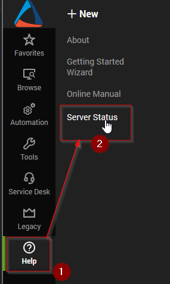
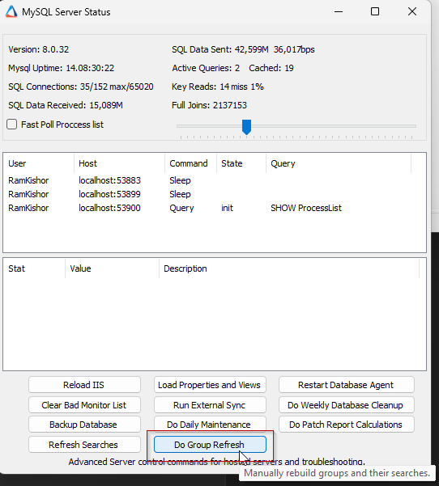
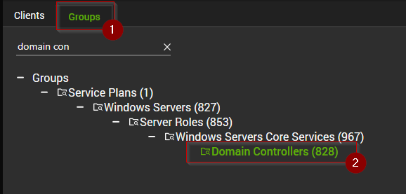

## Step 1
**Skip this step for new installations.**

Remove the existing `ProVal - Production - Security - Possible Brute Force Attack` remote monitor from the environment. This should only be installed on the Domain Controllers group, which you can verify using the SQL query below:

```sql
SELECT * FROM groupagents WHERE `Name` = 'ProVal - Production - Security - Possible Brute Force Attack';
```

Then you can delete them using the SQL queries below:

```sql
DELETE FROM groupagents WHERE `Name` = 'ProVal - Production - Security - Possible Brute Force Attack';
DELETE FROM agents WHERE `Name` = 'ProVal - Production - Security - Possible Brute Force Attack' AND computerid > 0;
```

---

## Step 2
**Skip this step for new installations.**

Navigate to `Help` > `Server Status` and select `Do Group Refresh`.





---

## Step 3
Execute the SQL query from a RAWSQL monitor set to import the monitor set.

```sql

SET @searchId = (SELECT MIN(sensID) FROM sensorchecks WHERE GUID = '430a4640-9c97-4344-bfe8-7a786b110729' OR `Name` = 'Server Role - AD - Infrastructure Master'); 
SET @groupid = (SELECT MIN(groupid) FROM mastergroups WHERE GUID = '3ac455da-f1fb-11e1-b4ec-1231391d2d19' OR FullName = 'Service Plans.Windows Servers.Server Roles.Windows Servers Core Services.Domain Controllers') ; 
INSERT INTO groupagents 
 SELECT '' as `AgentID`,
`groupid` as `GroupID`,
 @searchId as `SearchID`,
'ProVal - Production - Security - Possible Brute Force Attack' as `Name`,
'6' as `CheckAction`,
'1' as `AlertAction`,
'Possible Brute Force Attack on %COMPUTERNAME%~~~There are no potential brute force or logon failures. detected in the last hour on %CLIENTNAME%\\%COMPUTERNAME% at %LOCATIONNAME%!!!Possible Brute Force Attack on %COMPUTERNAME%~~~A possible brute force attack has been detected on %CLIENTNAME%\\%COMPUTERNAME% at %LOCATIONNAME%. \r\n\r\nHere is a breakdown of the logon attempts that failed over the past hour.\r\n\r\n%RESULT%\r\n\r\nLogon Type Reference Table: \r\n\r\n2: Interactive\r\n3: Network\r\n4: Batch\r\n5: Service\r\n7: Unlock\r\n8: NetworkCleartext\r\n9: NewCredentials\r\n10: RemoteInteractive\r\n11: CachedInteractive\r\n\r\nFailure Reason Reference Table: \r\n\r\n0XC000005E: There are currently no logon servers available to service the logon request.\r\n0xC0000064: User logon with misspelled or bad user account.\r\n0xC000006A: User logon with misspelled or bad password for critical accounts or service accounts.\r\n0XC000006D: This is either due to a bad username or authentication information for critical accounts or service accounts.\r\n0xC000006F: User logon outside authorized hours.\r\n0xC0000070: User logon from unauthorized workstation.\r\n0xC0000072: User logon to account disabled by administrator.\r\n0XC000015B: The user has not been granted the requested logon type (aka logon right) at this machine.\r\n0XC0000192: An attempt was made to logon, but the Netlogon service was not started.\r\n0xC0000193: User logon with expired account.\r\n0XC0000413: Logon Failure: The machine you are logging onto is protected by an authentication firewall. The specified account is not allowed to authenticate to the machine.\r\n\r\nNote: Compare FailureSubStatus (or FailureStatus if FailureSubStatus is not available) with the reference table mentioned above to identify the failure reason.\r\n\r\nFor more detailed information: https://learn.microsoft.com/en-us/previous-versions/windows/it-pro/windows-10/security/threat-protection/auditing/event-4625' as `AlertMessage`,
'0' as `ContactID`,
'3600' as `interval`,
'127.0.0.1' as `Where`,
'7' as `What`,
'C:\\Windows\\System32\\WindowsPowerShell\\v1.0\\powershell.exe -ExecutionPolicy Bypass -Command "$ErroractionPreference= \'SilentlyContinue\';$th = 10;$hours = 1;$StartTime = (Get-date).Addhours(-$hours);$filter = @{LogName = \'Security\'; ID = 4625; StartTime = $StartTime };$events = Get-WinEvent -FilterHashtable $filter;$filteredEvents = $events | Where-Object { $_.Message -notmatch \'Logon Type:\\s+4\' -and $_.Message -notmatch \'Logon Type:\\s+5\' };$total = ($filteredEvents | Measure-Object).count;if ($total -ge $th) {Write-output \\"`n$total failed logon event logs detected in the past $hours hour(s).`n\\";$groupedEvents = $filteredEvents | Where-Object { $_.Properties.Value -match \'\\S\' } | Group-Object  @{ Expression = { $_.Properties.Value } }, @{ Expression = { $_.Properties.Value } };$output = @();foreach ($group in $groupedEvents) { $ex = ([xml]$groupedEvents.Group[-1].ToXml()).Event;$time = ([DateTime]$ex.System.TimeCreated.SystemTime).ToString(\'yyyy-MM-dd HH:mm:ss\');$data = $ex.eventdata.data;$e = [Ordered]@{};$data | ForEach-Object { $e[$_.Name] = $_.\'#Text\' };$procid = [Convert]::ToInt64($e.ProcessId, 16);$processStatus = if ($procid -gt 0 -and (Get-Process -Id $procid)) { \'Running\' } else { \'Not Running\' };$op = [pscustomObject]@{UserName = $e.TargetUserName;UserSid = $e.TargetUserSid;Domain = $e.TargetDomainName;LogonType = $e.LogonType;WorkstationName = $e.WorkstationName;SourceIpAddress = $e.IpAddress;SourceIpPort = $e.IpPort;FailureStatus = $e.Status;FailureSubStatus = $e.SubStatus;callerProcessId = $procid;CallerProcessName = $e.ProcessName;CallerProcessStatus = $processStatus;LogonProcess = $e.LogonProcessName;AuthenticationPackage = $e.AuthenticationPackageName;TransmittedServices = $e.TransmittedServices;NTLMPackageName = $e.LmPackageName;KeyLength = $e.KeyLength;Occurrences = $group.Count;MostRecentDetection = $time };$output += $op}return $output}"' as `DataOut`,
'16' as `Comparor`,
'10|((^((OK){0,}(\\r\\n){0,}[\\r\\n]{0,}\\s{0,})$)%7C(^$))|11|((^((OK){0,}(\\r\\n){0,}[\\r\\n]{0,}\\s{0,})$)%7C(^$))%7C(^((\\r\\n){0,}[\\r\\n]{0,}\\s{0,})[0-9]{1,} failed logon event logs detected in the past [0-9]{1,} hour\\(s\\)\\.)|10|^((\\r\\n){0,}[\\r\\n]{0,}\\s{0,})[0-9]{1,} failed logon event logs detected in the past [0-9]{1,} hour\\(s\\)\\.' as `DataIn`,
'' as `IDField`,
'0' as `AlertStyle`,
'0' as `ScriptID`,
'' as `datacollector`,
'21' as `Category`,
'0' as `TicketCategory`,
'1' as `ScriptTarget`,
UUID() as `GUID`,
'root' as `UpdatedBy`,
(NOW()) as `UpdateDate`
FROM mastergroups m
WHERE m.groupid IN (@groupid)
AND m.groupid NOT IN (SELECT DISTINCT groupid FROM groupagents WHERE `Name` = 'ProVal - Production - Security - Possible Brute Force Attack'); 
```

---

## Step 4
Locate your remote monitor by navigating to the `Domain Controller`.



---

## Step 5
Ensure that the monitor set is limited to the `Server Role - AD - Infrastructure Master` search.


---

## Step 6
Implement the appropriate alert template for alerting.

Suggested alert template: `△ Custom - Ticket Creation Computer - Failures Only`