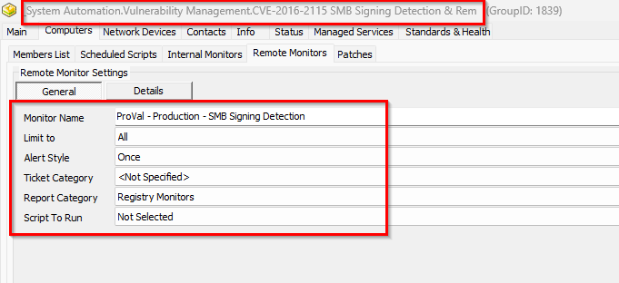
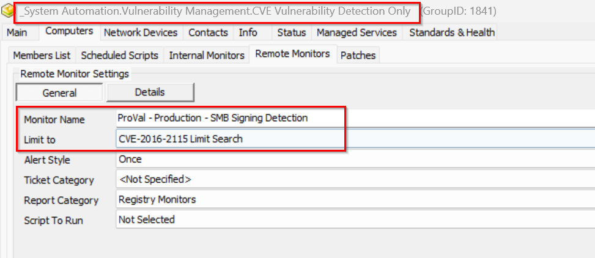

## Implementation

1. **Insert EDFs**

   ```sql
   INSERT IGNORE INTO `extrafield` (`Form`, `Name`, `Sort`, `NoBreak`, `FType`, `Section`, `UnEditable`, `Collapsed`, `Fill`, `LtGuid`, `IsPassword`, `IsEncrypted`, `IsHidden`, `IsRestricted`, `ViewPermissions`, `EditPermissions`) VALUES (3, 'CVE-2016-2115 Vul Detection and Remediation', 0, 0, 1, 'Vulnerability', 0, 0, '', '6e023e72-4b11-43ca-be9b-99fa067afc7c', 0, 0, 0, 0, '', '');
   INSERT IGNORE INTO `extrafield` (`Form`, `Name`, `Sort`, `NoBreak`, `FType`, `Section`, `UnEditable`, `Collapsed`, `Fill`, `LtGuid`, `IsPassword`, `IsEncrypted`, `IsHidden`, `IsRestricted`, `ViewPermissions`, `EditPermissions`) VALUES (1, 'CVE-2016-2115 Status', 0, 0, 0, 'Vulnerability', 0, 0, '', 'f30a0245-f162-45ec-8b7d-b57bff1c6b3a', 0, 0, 0, 0, '', '');
   INSERT IGNORE INTO `extrafield` (`Form`, `Name`, `Sort`, `NoBreak`, `FType`, `Section`, `UnEditable`, `Collapsed`, `Fill`, `LtGuid`, `IsPassword`, `IsEncrypted`, `IsHidden`, `IsRestricted`, `ViewPermissions`, `EditPermissions`) VALUES (1, 'CVE-2016-2115 Logging', 0, 0, 0, 'Vulnerability', 0, 0, '', '600dec9a-4513-4c4a-b28e-835ea95c1b91', 0, 0, 0, 0, '', '');
   INSERT IGNORE INTO `extrafield` (`Form`, `Name`, `Sort`, `NoBreak`, `FType`, `Section`, `UnEditable`, `Collapsed`, `Fill`, `LtGuid`, `IsPassword`, `IsEncrypted`, `IsHidden`, `IsRestricted`, `ViewPermissions`, `EditPermissions`) VALUES (1, 'CVE-2016-2115 Detection Date', 0, 0, 0, 'Vulnerability', 0, 0, '', 'c3c570ef-98f6-4ce6-ab56-10c6a365277c', 0, 0, 0, 0, '', '');
   INSERT IGNORE INTO `extrafield` (`Form`, `Name`, `Sort`, `NoBreak`, `FType`, `Section`, `UnEditable`, `Collapsed`, `Fill`, `LtGuid`, `IsPassword`, `IsEncrypted`, `IsHidden`, `IsRestricted`, `ViewPermissions`, `EditPermissions`) VALUES (1, 'CVE-2016-2115 Vulnerability', 0, 0, 0, 'Vulnerability', 0, 0, '', '3f4add83-e40b-4ba3-8644-5ea83ce876ba', 0, 0, 0, 0, '', '');
   INSERT IGNORE INTO `extrafield` (`Form`, `Name`, `Sort`, `NoBreak`, `FType`, `Section`, `UnEditable`, `Collapsed`, `Fill`, `LtGuid`, `IsPassword`, `IsEncrypted`, `IsHidden`, `IsRestricted`, `ViewPermissions`, `EditPermissions`) VALUES (1, 'CVE-2016-2115 Vul Detection and Remediation', 0, 0, 1, 'Vulnerability', 0, 0, '', 'bcb76c6b-4231-4ab7-b34c-0fb3dc34db5f', 0, 0, 0, 0, '', '');
   INSERT IGNORE INTO `extrafield` (`Form`, `Name`, `Sort`, `NoBreak`, `FType`, `Section`, `UnEditable`, `Collapsed`, `Fill`, `LtGuid`, `IsPassword`, `IsEncrypted`, `IsHidden`, `IsRestricted`, `ViewPermissions`, `EditPermissions`) VALUES (1, 'CVE-2016-2115 Vul Detection and Remediation Exclude', 0, 0, 1, 'Exclusions', 0, 0, '', 'ded8a1c5-c854-43e5-a7ba-b6dd2bf21b31', 0, 0, 0, 0, '', '');
   INSERT IGNORE INTO `extrafield` (`Form`, `Name`, `Sort`, `NoBreak`, `FType`, `Section`, `UnEditable`, `Collapsed`, `Fill`, `LtGuid`, `IsPassword`, `IsEncrypted`, `IsHidden`, `IsRestricted`, `ViewPermissions`, `EditPermissions`) VALUES (2, 'CVE-2016-2115 Vul Detection and Remediation Exclude', 0, 0, 1, 'Exclusions', 0, 0, '', '1bb5e9e8-0005-4d3d-bbc4-c0e6807b2967', 0, 0, 0, 0, '', '');
   ```

   **Insert Search: `CVE Vulnerability Detection Only`**

   ```sql
   INSERT INTO `sensorchecks` 
   SELECT 
   '' as `SensID`,
   'CVE Vulnerability Detection Only' as `Name`,
   'SELECT 
       computers.computerid as `Computer Id`,
       computers.name as `Computer Name`,
       clients.name as `Client Name`,
       computers.domain as `Computer Domain`,
       computers.username as `Computer User`,
       IFNULL(IFNULL(edfAssigned1.Value,edfDefault1.value),'0') as `Computer - Client - Extra Data Field - Vulnerability - CVE Vulnerability Detection Only`,
       IFNULL(IFNULL(edfAssigned2.Value,edfDefault2.value),'0') as `Computer - Extra Data Field - Exclusions - CVE Vulnerability Detection Only Exclude`,
       IFNULL(IFNULL(edfAssigned3.Value,edfDefault3.value),'0') as `Computer - Location - Extra Data Field - Exclusions - CVE Vulnerability Detection Only Exclude`,
       IFNULL(IFNULL(edfAssigned4.Value,edfDefault4.value),'0') as `Computer - Extra Data Field - Vulnerability - CVE Vulnerability Detection Only`
   FROM Computers 
   LEFT JOIN inv_operatingsystem ON (Computers.ComputerId=inv_operatingsystem.ComputerId)
   LEFT JOIN Clients ON (Computers.ClientId=Clients.ClientId)
   LEFT JOIN Locations ON (Computers.LocationId=Locations.LocationID)
   LEFT JOIN ExtraFieldData edfAssigned1 ON (edfAssigned1.id=Clients.ClientId and edfAssigned1.ExtraFieldId =(Select ExtraField.id FROM ExtraField WHERE LTGuid='b2a8e137-716d-4e63-a710-92bca0fb14aa'))
   LEFT JOIN ExtraFieldData edfDefault1 ON (edfDefault1.id=0 and edfDefault1.ExtraFieldId =(Select ExtraField.id FROM ExtraField WHERE LTGuid='b2a8e137-716d-4e63-a710-92bca0fb14aa'))
   LEFT JOIN ExtraFieldData edfAssigned2 ON (edfAssigned2.id=Computers.ComputerId and edfAssigned2.ExtraFieldId =(Select ExtraField.id FROM ExtraField WHERE LTGuid='a6a948ec-93e1-4b4d-8dec-31a1bc9bd244'))
   LEFT JOIN ExtraFieldData edfDefault2 ON (edfDefault2.id=0 and edfDefault2.ExtraFieldId =(Select ExtraField.id FROM ExtraField WHERE LTGuid='a6a948ec-93e1-4b4d-8dec-31a1bc9bd244'))
   LEFT JOIN ExtraFieldData edfAssigned3 ON (edfAssigned3.id=Locations.LocationId and edfAssigned3.ExtraFieldId =(Select ExtraField.id FROM ExtraField WHERE LTGuid='4e8cc4e6-4877-4ae9-bdda-7dd595b5c8a6'))
   LEFT JOIN ExtraFieldData edfDefault3 ON (edfDefault3.id=0 and edfDefault3.ExtraFieldId =(Select ExtraField.id FROM ExtraField WHERE LTGuid='4e8cc4e6-4877-4ae9-bdda-7dd595b5c8a6'))
   LEFT JOIN ExtraFieldData edfAssigned4 ON (edfAssigned4.id=Computers.ComputerId and edfAssigned4.ExtraFieldId =(Select ExtraField.id FROM ExtraField WHERE LTGuid='f4deaa69-d284-4346-9dfe-3491733a34ba'))
   LEFT JOIN ExtraFieldData edfDefault4 ON (edfDefault4.id=0 and edfDefault4.ExtraFieldId =(Select ExtraField.id FROM ExtraField WHERE LTGuid='f4deaa69-d284-4346-9dfe-3491733a34ba'))
   WHERE 
   (((((IFNULL(IFNULL(edfAssigned1.Value,edfDefault1.value),'0')<>0) AND (IFNULL(IFNULL(edfAssigned2.Value,edfDefault2.value),'0')=0) AND (IFNULL(IFNULL(edfAssigned3.Value,edfDefault3.value),'0')=0))) OR (IFNULL(IFNULL(edfAssigned4.Value,edfDefault4.value),'0')<>0))))
   ' as `SQL`,
   '4' as `QueryType`,
   'Select||=||=||=|^Select|||||||^' as `ListData`,
   '0' as `FolderID`,
   '716a3b4f-f28d-4ebf-84fe-f719f18d31e4' as `GUID`,
   '\\<LabTechAbstractSearch>\\<asn>\\<st>AndNode\\</st>\\<cn>\\<asn>\\<st>OrNode\\</st>\\<cn>\\<asn>\\<st>AndNode\\</st>\\<cn>\\<asn>\\<st>ComparisonNode\\</st>\\<lon>Computer.Client.Extra Data Field.Vulnerability.CVE Vulnerability Detection Only\\</lon>\\<lok>Computer.Client.Edf.b2a8e137-716d-4e63-a710-92bca0fb14aa\\</lok>\\<lmo>IsTrue\\</lmo>\\<dv>NULL\\</dv>\\<dk>NULL\\</dk>\\</asn>\\<asn>\\<st>ComparisonNode\\</st>\\<lon>Computer.Extra Data Field.Exclusions.CVE Vulnerability Detection Only Exclude\\</lon>\\<lok>Computer.Edf.a6a948ec-93e1-4b4d-8dec-31a1bc9bd244\\</lok>\\<lmo>IsFalse\\</lmo>\\<dv>NULL\\</dv>\\<dk>NULL\\</dk>\\</asn>\\<asn>\\<st>ComparisonNode\\</st>\\<lon>Computer.Location.Extra Data Field.Exclusions.CVE Vulnerability Detection Only Exclude\\</lon>\\<lok>Computer.Location.Edf.4e8cc4e6-4877-4ae9-bdda-7dd595b5c8a6\\</lok>\\<lmo>IsFalse\\</lmo>\\<dv>NULL\\</dv>\\<dk>NULL\\</dk>\\</asn>\\</cn>\\</asn>\\<asn>\\<st>ComparisonNode\\</st>\\<lon>Computer.Extra Data Field.Vulnerability.CVE Vulnerability Detection Only\\</lon>\\<lok>Computer.Edf.f4deaa69-d284-4346-9dfe-3491733a34ba\\</lok>\\<lmo>IsTrue\\</lmo>\\<dv>NULL\\</dv>\\<dk>NULL\\</dk>\\</asn>\\</cn>\\</asn>\\</LabTechAbstractSearch>' as `SearchXML`,
   (NULL) as `UpdatedBy`,
   (NULL) as `UpdateDate`
   FROM  (SELECT MIN(computerid) FROM computers) a
   WHERE (SELECT count(*) From SensorChecks where `GUID` = '716a3b4f-f28d-4ebf-84fe-f719f18d31e4') = 0 ;
   ```

   **Insert Search: `CVE-2016-2115 Limit Search`**

   ```sql
   INSERT INTO `sensorchecks` 
   SELECT 
   '' as `SensID`,
   'CVE-2016-2115 Limit Search' as `Name`,
   'SELECT 
       computers.computerid as `Computer Id`,
       computers.name as `Computer Name`,
       clients.name as `Client Name`,
       computers.domain as `Computer Domain`,
       computers.username as `Computer User`,
       IFNULL(IFNULL(edfAssigned1.Value,edfDefault1.value),'0') as `Computer - Client - Extra Data Field - Vulnerability - CVE Vulnerability Detection Only`,
       IFNULL(IFNULL(edfAssigned2.Value,edfDefault2.value),'0') as `Computer - Extra Data Field - Exclusions - CVE Vulnerability Detection Only Exclude`,
       IFNULL(IFNULL(edfAssigned3.Value,edfDefault3.value),'0') as `Computer - Location - Extra Data Field - Exclusions - CVE Vulnerability Detection Only Exclude`,
       IFNULL(IFNULL(edfAssigned4.Value,edfDefault4.value),'0') as `Computer - Client - Extra Data Field - Vulnerability - CVE-2016-2115 Vul Detection and Remediation`,
       IFNULL(IFNULL(edfAssigned5.Value,edfDefault5.value),'0') as `Computer - Extra Data Field - Vulnerability - CVE-2016-2115 Vul Detection and Remediation`,
       IFNULL(IFNULL(edfAssigned6.Value,edfDefault6.value),'0') as `Computer - Extra Data Field - Vulnerability - CVE Vulnerability Detection Only`
   FROM Computers 
   LEFT JOIN inv_operatingsystem ON (Computers.ComputerId=inv_operatingsystem.ComputerId)
   LEFT JOIN Clients ON (Computers.ClientId=Clients.ClientId)
   LEFT JOIN Locations ON (Computers.LocationId=Locations.LocationID)
   LEFT JOIN ExtraFieldData edfAssigned1 ON (edfAssigned1.id=Clients.ClientId and edfAssigned1.ExtraFieldId =(Select ExtraField.id FROM ExtraField WHERE LTGuid='b2a8e137-716d-4e63-a710-92bca0fb14aa'))
   LEFT JOIN ExtraFieldData edfDefault1 ON (edfDefault1.id=0 and edfDefault1.ExtraFieldId =(Select ExtraField.id FROM ExtraField WHERE LTGuid='b2a8e137-716d-4e63-a710-92bca0fb14aa'))
   LEFT JOIN ExtraFieldData edfAssigned2 ON (edfAssigned2.id=Computers.ComputerId and edfAssigned2.ExtraFieldId =(Select ExtraField.id FROM ExtraField WHERE LTGuid='a6a948ec-93e1-4b4d-8dec-31a1bc9bd244'))
   LEFT JOIN ExtraFieldData edfDefault2 ON (edfDefault2.id=0 and edfDefault2.ExtraFieldId =(Select ExtraField.id FROM ExtraField WHERE LTGuid='a6a948ec-93e1-4b4d-8dec-31a1bc9bd244'))
   LEFT JOIN ExtraFieldData edfAssigned3 ON (edfAssigned3.id=Locations.LocationId and edfAssigned3.ExtraFieldId =(Select ExtraField.id FROM ExtraField WHERE LTGuid='4e8cc4e6-4877-4ae9-bdda-7dd595b5c8a6'))
   LEFT JOIN ExtraFieldData edfDefault3 ON (edfDefault3.id=0 and edfDefault3.ExtraFieldId =(Select ExtraField.id FROM ExtraField WHERE LTGuid='4e8cc4e6-4877-4ae9-bdda-7dd595b5c8a6'))
   LEFT JOIN ExtraFieldData edfAssigned4 ON (edfAssigned4.id=Clients.ClientId and edfAssigned4.ExtraFieldId =(Select ExtraField.id FROM ExtraField WHERE LTGuid='6e023e72-4b11-43ca-be9b-99fa067afc7c'))
   LEFT JOIN ExtraFieldData edfDefault4 ON (edfDefault4.id=0 and edfDefault4.ExtraFieldId =(Select ExtraField.id FROM ExtraField WHERE LTGuid='6e023e72-4b11-43ca-be9b-99fa067afc7c'))
   LEFT JOIN ExtraFieldData edfAssigned5 ON (edfAssigned5.id=Computers.ComputerId and edfAssigned5.ExtraFieldId =(Select ExtraField.id FROM ExtraField WHERE LTGuid='bcb76c6b-4231-4ab7-b34c-0fb3dc34db5f'))
   LEFT JOIN ExtraFieldData edfDefault5 ON (edfDefault5.id=0 and edfDefault5.ExtraFieldId =(Select ExtraField.id FROM ExtraField WHERE LTGuid='bcb76c6b-4231-4ab7-b34c-0fb3dc34db5f'))
   LEFT JOIN ExtraFieldData edfAssigned6 ON (edfAssigned6.id=Computers.ComputerId and edfAssigned6.ExtraFieldId =(Select ExtraField.id FROM ExtraField WHERE LTGuid='f4deaa69-d284-4346-9dfe-3491733a34ba'))
   LEFT JOIN ExtraFieldData edfDefault6 ON (edfDefault6.id=0 and edfDefault6.ExtraFieldId =(Select ExtraField.id FROM ExtraField WHERE LTGuid='f4deaa69-d284-4346-9dfe-3491733a34ba'))
   WHERE 
   (((((IFNULL(IFNULL(edfAssigned1.Value,edfDefault1.value),'0')<>0) AND (IFNULL(IFNULL(edfAssigned2.Value,edfDefault2.value),'0')=0) AND (IFNULL(IFNULL(edfAssigned3.Value,edfDefault3.value),'0')=0) AND (IFNULL(IFNULL(edfAssigned4.Value,edfDefault4.value),'0')=0) AND (IFNULL(IFNULL(edfAssigned5.Value,edfDefault5.value),'0')=0))) OR (IFNULL(IFNULL(edfAssigned6.Value,edfDefault6.value),'0')<>0))))
   ' as `SQL`,
   '4' as `QueryType`,
   'Select||=||=||=|^Select|||||||^' as `ListData`,
   '0' as `FolderID`,
   'e1ee6e8b-d44b-4aa5-8a1a-4b799dc018f4' as `GUID`,
   '\\<LabTechAbstractSearch>\\<asn>\\<st>AndNode\\</st>\\<cn>\\<asn>\\<st>OrNode\\</st>\\<cn>\\<asn>\\<st>AndNode\\</st>\\<cn>\\<asn>\\<st>ComparisonNode\\</st>\\<lon>Computer.Client.Extra Data Field.Vulnerability.CVE Vulnerability Detection Only\\</lon>\\<lok>Computer.Client.Edf.b2a8e137-716d-4e63-a710-92bca0fb14aa\\</lok>\\<lmo>IsTrue\\</lmo>\\<dv>NULL\\</dv>\\<dk>NULL\\</dk>\\</asn>\\<asn>\\<st>ComparisonNode\\</st>\\<lon>Computer.Extra Data Field.Exclusions.CVE Vulnerability Detection Only Exclude\\</lon>\\<lok>Computer.Edf.a6a948ec-93e1-4b4d-8dec-31a1bc9bd244\\</lok>\\<lmo>IsFalse\\</lmo>\\<dv>NULL\\</dv>\\<dk>NULL\\</dk>\\</asn>\\<asn>\\<st>ComparisonNode\\</st>\\<lon>Computer.Location.Extra Data Field.Exclusions.CVE Vulnerability Detection Only Exclude\\</lon>\\<lok>Computer.Location.Edf.4e8cc4e6-4877-4ae9-bdda-7dd595b5c8a6\\</lok>\\<lmo>IsFalse\\</lmo>\\<dv>NULL\\</dv>\\<dk>NULL\\</dk>\\</asn>\\</cn>\\</asn>\\<asn>\\<st>ComparisonNode\\</st>\\<lon>Computer.Extra Data Field.Vulnerability.CVE-2016-2115 Vul Detection and Remediation\\</lon>\\<lok>Computer.Edf.6e023e72-4b11-43ca-be9b-99fa067afc7c\\</lok>\\<lmo>IsFalse\\</lmo>\\<dv>NULL\\</dv>\\<dk>NULL\\</dk>\\</asn>\\<asn>\\<st>ComparisonNode\\</st>\\<lon>Computer.Extra Data Field.Vulnerability.CVE-2016-2115 Vul Detection and Remediation\\</lon>\\<lok>Computer.Edf.bcb76c6b-4231-4ab7-b34c-0fb3dc34db5f\\</lok>\\<lmo>IsFalse\\</lmo>\\<dv>NULL\\</dv>\\<dk>NULL\\</dk>\\</asn>\\</cn>\\</asn>\\<asn>\\<st>ComparisonNode\\</st>\\<lon>Computer.Extra Data Field.Vulnerability.CVE Vulnerability Detection Only\\</lon>\\<lok>Computer.Edf.f4deaa69-d284-4346-9dfe-3491733a34ba\\</lok>\\<lmo>IsTrue\\</lmo>\\<dv>NULL\\</dv>\\<dk>NULL\\</dk>\\</asn>\\</cn>\\</asn>\\</LabTechAbstractSearch>' as `SearchXML`,
   (NULL) as `UpdatedBy`,
   (NULL) as `UpdateDate`
   FROM  (SELECT MIN(computerid) FROM computers) a
   WHERE (SELECT count(*) From SensorChecks where `GUID` = 'e1ee6e8b-d44b-4aa5-8a1a-4b799dc018f4') = 0 ;
   ```

   **Insert Search: `CVE-2016-2115 SMB Signing`**

   ```sql
   INSERT INTO `sensorchecks` 
   SELECT 
   '' as `SensID`,
   'CVE-2016-2115 SMB Signing' as `Name`,
   'SELECT 
       computers.computerid as `Computer Id`,
       computers.name as `Computer Name`,
       clients.name as `Client Name`,
       computers.domain as `Computer Domain`,
       computers.username as `Computer User`,
       IFNULL(IFNULL(edfAssigned1.Value,edfDefault1.value),'0') as `Computer - Client - Extra Data Field - Vulnerability - CVE-2016-2115 Vul Detection and Remediation`,
       IFNULL(IFNULL(edfAssigned2.Value,edfDefault2.value),'0') as `Computer - Location - Extra Data Field - Exclusions - CVE-2016-2115 Vul Detection and Remediation Exclude`,
       IFNULL(IFNULL(edfAssigned3.Value,edfDefault3.value),'0') as `Computer - Extra Data Field - Exclusions - CVE-2016-2115 Vul Detection and Remediation Exclude`,
       IFNULL(IFNULL(edfAssigned4.Value,edfDefault4.value),'0') as `Computer - Extra Data Field - Vulnerability - CVE-2016-2115 Vul Detection and Remediation`
   FROM Computers 
   LEFT JOIN inv_operatingsystem ON (Computers.ComputerId=inv_operatingsystem.ComputerId)
   LEFT JOIN Clients ON (Computers.ClientId=Clients.ClientId)
   LEFT JOIN Locations ON (Computers.LocationId=Locations.LocationID)
   LEFT JOIN ExtraFieldData edfAssigned1 ON (edfAssigned1.id=Clients.ClientId and edfAssigned1.ExtraFieldId =(Select ExtraField.id FROM ExtraField WHERE LTGuid='6e023e72-4b11-43ca-be9b-99fa067afc7c'))
   LEFT JOIN ExtraFieldData edfDefault1 ON (edfDefault1.id=0 and edfDefault1.ExtraFieldId =(Select ExtraField.id FROM ExtraField WHERE LTGuid='6e023e72-4b11-43ca-be9b-99fa067afc7c'))
   LEFT JOIN ExtraFieldData edfAssigned2 ON (edfAssigned2.id=Locations.LocationId and edfAssigned2.ExtraFieldId =(Select ExtraField.id FROM ExtraField WHERE LTGuid='1bb5e9e8-0005-4d3d-bbc4-c0e6807b2967'))
   LEFT JOIN ExtraFieldData edfDefault2 ON (edfDefault2.id=0 and edfDefault2.ExtraFieldId =(Select ExtraField.id FROM ExtraField WHERE LTGuid='1bb5e9e8-0005-4d3d-bbc4-c0e6807b2967'))
   LEFT JOIN ExtraFieldData edfAssigned3 ON (edfAssigned3.id=Computers.ComputerId and edfAssigned3.ExtraFieldId =(Select ExtraField.id FROM ExtraField WHERE LTGuid='ded8a1c5-c854-43e5-a7ba-b6dd2bf21b31'))
   LEFT JOIN ExtraFieldData edfDefault3 ON (edfDefault3.id=0 and edfDefault3.ExtraFieldId =(Select ExtraField.id FROM ExtraField WHERE LTGuid='ded8a1c5-c854-43e5-a7ba-b6dd2bf21b31'))
   LEFT JOIN ExtraFieldData edfAssigned4 ON (edfAssigned4.id=Computers.ComputerId and edfAssigned4.ExtraFieldId =(Select ExtraField.id FROM ExtraField WHERE LTGuid='bcb76c6b-4231-4ab7-b34c-0fb3dc34db5f'))
   LEFT JOIN ExtraFieldData edfDefault4 ON (edfDefault4.id=0 and edfDefault4.ExtraFieldId =(Select ExtraField.id FROM ExtraField WHERE LTGuid='bcb76c6b-4231-4ab7-b34c-0fb3dc34db5f'))
   WHERE 
   (((((IFNULL(IFNULL(edfAssigned1.Value,edfDefault1.value),'0')<>0) AND (IFNULL(IFNULL(edfAssigned2.Value,edfDefault2.value),'0')=0) AND (IFNULL(IFNULL(edfAssigned3.Value,edfDefault3.value),'0')=0))) OR (IFNULL(IFNULL(edfAssigned4.Value,edfDefault4.value),'0')<>0))))
   ' as `SQL`,
   '4' as `QueryType`,
   'Select||=||=||=|^Select|||||||^' as `ListData`,
   '0' as `FolderID`,
   '74f0d0d7-bc52-4656-b5d9-3ba9e913da0b' as `GUID`,
   '\\<LabTechAbstractSearch>\\<asn>\\<st>AndNode\\</st>\\<cn>\\<asn>\\<st>OrNode\\</st>\\<cn>\\<asn>\\<st>AndNode\\</st>\\<cn>\\<asn>\\<st>ComparisonNode\\</st>\\<lon>Computer.Client.Extra Data Field.Vulnerability.CVE-2016-2115 Vul Detection and Remediation\\</lon>\\<lok>Computer.Client.Edf.6e023e72-4b11-43ca-be9b-99fa067afc7c\\</lok>\\<lmo>IsTrue\\</lmo>\\<dv>NULL\\</dv>\\<dk>NULL\\</dk>\\</asn>\\<asn>\\<st>ComparisonNode\\</st>\\<lon>Computer.Location.Extra Data Field.Exclusions.CVE-2016-2115 Vul Detection and Remediation Exclude\\</lon>\\<lok>Computer.Location.Edf.1bb5e9e8-0005-4d3d-bbc4-c0e6807b2967\\</lok>\\<lmo>IsFalse\\</lmo>\\<dv>NULL\\</dv>\\<dk>NULL\\</dk>\\</asn>\\<asn>\\<st>ComparisonNode\\</st>\\<lon>Computer.Extra Data Field.Exclusions.CVE-2016-2115 Vul Detection and Remediation Exclude\\</lon>\\<lok>Computer.Edf.ded8a1c5-c854-43e5-a7ba-b6dd2bf21b31\\</lok>\\<lmo>IsFalse\\</lmo>\\<dv>NULL\\</dv>\\<dk>NULL\\</dk>\\</asn>\\</cn>\\</asn>\\<asn>\\<st>ComparisonNode\\</st>\\<lon>Computer.Extra Data Field.Vulnerability.CVE-2016-2115 Vul Detection and Remediation\\</lon>\\<lok>Computer.Edf.bcb76c6b-4231-4ab7-b34c-0fb3dc34db5f\\</lok>\\<lmo>IsTrue\\</lmo>\\<dv>NULL\\</dv>\\<dk>NULL\\</dk>\\</asn>\\</cn>\\</asn>\\</LabTechAbstractSearch>' as `SearchXML`,
   (NULL) as `UpdatedBy`,
   (NULL) as `UpdateDate`
   FROM  (SELECT MIN(computerid) FROM computers) a
   WHERE (SELECT count(*) From SensorChecks where `GUID` = '74f0d0d7-bc52-4656-b5d9-3ba9e913da0b') = 0 ;
   ```

2. Locate your remote monitor by opening the group(s) remote monitors tab, then apply the appropriate alert template.

   

   


