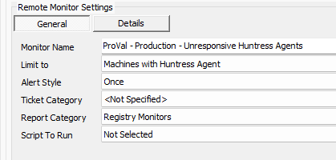
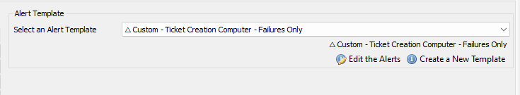

## Step 1
Import the Alert Template ` '△ Custom - Ticket Creation - Computer [Failures Only]'`.

## Step 2
Run this SQL query from a RAWSQL monitor set to import the required search:

```
INSERT INTO `sensorchecks` 
SELECT 
'' AS `SensID`,
'ProVal - Machines with Huntress Agent' AS `Name`, 
'SELECT 
   computers.computerid as `Computer Id`,
   computers.name as `Computer Name`,
   clients.name as `Client Name`,
   computers.domain as `Computer Domain`,
   computers.username as `Computer User`,
   Software.Name as `Computer.Applications.Name`,
   inv_operatingsystem.name as `Computer.OS.Name`
FROM Computers 
LEFT JOIN inv_operatingsystem ON (Computers.ComputerId=inv_operatingsystem.ComputerId)
LEFT JOIN Clients ON (Computers.ClientId=Clients.ClientId)
LEFT JOIN Locations ON (Computers.LocationId=Locations.LocationID)
LEFT JOIN Software ON (Software.ComputerId = Computers.ComputerId)
 WHERE 
((((Software.Name = 'Huntress Agent') AND (Instr(inv_operatingsystem.name,'Windows') > 0))))
' AS `SQL`,
'4' AS `QueryType`,
'Select||=||=||=|^Select|||||||^' AS `ListData`,
'0' AS `FolderID`,
'f7b8ea5a-235d-11ef-9836-8600008a66b7' AS `GUID`,
'\\<LabTechAbstractSearch>\\<asn>\\<st>AndNode\\</st>\\<cn>\\<asn>\\<st>AndNode\\</st>\\<cn>\\<asn>\\<st>ComparisonNode\\</st>\\<lon>Computer.Applications.Name\\</lon>\\<lok>Computer.Applications.Name\\</lok>\\<lmo>Equals\\</lmo>\\<dv>Huntress Agent\\</dv>\\<dk>Huntress Agent\\</dk>\\</asn>\\<asn>\\<st>ComparisonNode\\</st>\\<lon>Computer.OS.Name\\</lon>\\<lok>Computer.OS.Name\\</lok>\\<lmo>Contains\\</lmo>\\<dv>Windows\\</dv>\\<dk>Windows\\</dk>\\</asn>\\</cn>\\</asn>\\</cn>\\</asn>\\</LabTechAbstractSearch>' AS `SearchXML`,
(NULL) AS `UpdatedBy`,
(NULL) AS `UpdateDate`
FROM  (SELECT MIN(computerid) FROM computers) a
WHERE (SELECT COUNT(*) FROM SensorChecks WHERE `GUID` = 'f7b8ea5a-235d-11ef-9836-8600008a66b7') = 0 ;
```

## Step 3
Obtain the groupid(s) of the group(s) that the remote monitor should be applied to.

## Step 4
Copy the following query and replace **YOUR COMMA SEPARATED LIST OF GROUPID(S)** with the Groupid(s) of the relevant groups: (The string to replace can be found at the very bottom of the query, right after **WHERE**).

```
SET @searchid = (SELECT sensid FROM sensorchecks WHERE `GUID` = 'f7b8ea5a-235d-11ef-9836-8600008a66b7');
```

```
INSERT INTO groupagents 
 SELECT '' as `AgentID`,
`groupid` as `GroupID`,
@searchid as `SearchID`,
'ProVal - Production - Unresponsive Huntress Agents' as `Name`,
'6' as `CheckAction`,
'1' as `AlertAction`,
'Unresponsive Huntress Agent Detected on %COMPUTERNAME%~~~Huntress Agent is not orphaned anymore.!!!Unresponsive Huntress Agent Detected on %COMPUTERNAME%~~~The machine %computername% located at %clientname%//%locationname% is currently reporting its huntress agent has been orphaned. This means the agent has not been able to communicate with Huntress for over 30 days and its license key has been revoked by huntress and may no longer be performing security functions on the machine. Please validate the agent is communicating with Huntress and if it is not, re-install the application to resolve the issue.' as `AlertMessage`,
'0' as `ContactID`,
'86400' as `interval`,
'127.0.0.1' as `Where`,
'7' as `What`,
'%SystemRoot%//System32//WindowsPowerShell//v1.0//powershell.exe -ExecutionPolicy ByPass -Command "if (Test-Path /'C://Program Files//Huntress//HuntressAgent.log/') {$Path = /'C://Program Files//Huntress//HuntressAgent.log/'} elseif (Test-Path /'C://Program Files (x86)//Huntress//HuntressAgent.log/') {$Path = /'C://Program Files (x86)//Huntress//HuntressAgent.log/'} else {$Path = /'Huntress Log File Missing/'}; if ($Path -notmatch /'HuntressAgent.log/') {Write-Output $Path} else {$Log = Get-Content $Path | ForEach-Object { if ($_ -match /'(?\\<time>//d+-//d+-//d+T//d+://d+://d+-//d+://d+).+(?\\<level>(?\\<=level=)//w+).+(?\\<msg>(?\\<=msg=).*)//') {$Matches.Remove(0); [PSCustomObject]$Matches}} | Where-Object {$_.level -match /'error/' -and $_.msg -match /'status code:401/'}; if ($Log.count -ge 1) {Write-Output /'Huntress Agent is orphaned/'} else {Write-Output /'Huntress Agent is not Orphaned/'}}" as `DataOut`,
'16' as `Comparor`,
'10|Huntress Agent is not Orphaned|11|Huntress Log File Missing%7CHuntress Agent is orphaned%7CHuntress Agent is not Orphaned|10|Huntress Log File Missing%7CHuntress Agent is orphaned' as `DataIn`,
'' as `IDField`,
'1' as `AlertStyle`,
'0' as `ScriptID`,
'' as `datacollector`,
'21' as `Category`,
'0' as `TicketCategory`,
'1' as `ScriptTarget`,
CONCAT(
SUBSTRING('abcdef0123456789', FLOOR(RAND()*16+1), 1),
SUBSTRING('abcdef0123456789', FLOOR(RAND()*16+1), 1),
SUBSTRING('abcdef0123456789', FLOOR(RAND()*16+1), 1),
SUBSTRING('abcdef0123456789', FLOOR(RAND()*16+1), 1),
SUBSTRING('abcdef0123456789', FLOOR(RAND()*16+1), 1),
SUBSTRING('abcdef0123456789', FLOOR(RAND()*16+1), 1),
SUBSTRING('abcdef0123456789', FLOOR(RAND()*16+1), 1),
SUBSTRING('abcdef0123456789', FLOOR(RAND()*16+1), 1),
'-',
SUBSTRING('abcdef0123456789', FLOOR(RAND()*16+1), 1),
SUBSTRING('abcdef0123456789', FLOOR(RAND()*16+1), 1),
SUBSTRING('abcdef0123456789', FLOOR(RAND()*16+1), 1),
SUBSTRING('abcdef0123456789', FLOOR(RAND()*16+1), 1),
'-',
SUBSTRING('abcdef0123456789', FLOOR(RAND()*16+1), 1),
SUBSTRING('abcdef0123456789', FLOOR(RAND()*16+1), 1),
SUBSTRING('abcdef0123456789', FLOOR(RAND()*16+1), 1),
SUBSTRING('abcdef0123456789', FLOOR(RAND()*16+1), 1),
'-',
SUBSTRING('abcdef0123456789', FLOOR(RAND()*16+1), 1),
SUBSTRING('abcdef0123456789', FLOOR(RAND()*16+1), 1),
SUBSTRING('abcdef0123456789', FLOOR(RAND()*16+1), 1),
SUBSTRING('abcdef0123456789', FLOOR(RAND()*16+1), 1),
'-',
SUBSTRING('abcdef0123456789', FLOOR(RAND()*16+1), 1),
SUBSTRING('abcdef0123456789', FLOOR(RAND()*16+1), 1),
SUBSTRING('abcdef0123456789', FLOOR(RAND()*16+1), 1),
SUBSTRING('abcdef0123456789', FLOOR(RAND()*16+1), 1),
'-',
SUBSTRING('abcdef0123456789', FLOOR(RAND()*16+1), 1),
SUBSTRING('abcdef0123456789', FLOOR(RAND()*16+1), 1),
SUBSTRING('abcdef0123456789', FLOOR(RAND()*16+1), 1),
SUBSTRING('abcdef0123456789', FLOOR(RAND()*16+1), 1),
'-',
SUBSTRING('abcdef0123456789', FLOOR(RAND()*16+1), 1),
SUBSTRING('abcdef0123456789', FLOOR(RAND()*16+1), 1),
SUBSTRING('abcdef0123456789', FLOOR(RAND()*16+1), 1),
SUBSTRING('abcdef0123456789', FLOOR(RAND()*16+1), 1),
'-',
SUBSTRING('abcdef0123456789', FLOOR(RAND()*16+1), 1),
SUBSTRING('abcdef0123456789', FLOOR(RAND()*16+1), 1),
SUBSTRING('abcdef0123456789', FLOOR(RAND()*16+1), 1),
SUBSTRING('abcdef0123456789', FLOOR(RAND()*16+1), 1),
'-',
SUBSTRING('abcdef0123456789', FLOOR(RAND()*16+1), 1),
SUBSTRING('abcdef0123456789', FLOOR(RAND()*16+1), 1),
SUBSTRING('abcdef0123456789', FLOOR(RAND()*16+1), 1),
SUBSTRING('abcdef0123456789', FLOOR(RAND()*16+1), 1),
'-',
SUBSTRING('abcdef0123456789', FLOOR(RAND()*16+1), 1),
SUBSTRING('abcdef0123456789', FLOOR(RAND()*16+1), 1),
SUBSTRING('abcdef0123456789', FLOOR(RAND()*16+1), 1),
SUBSTRING('abcdef0123456789', FLOOR(RAND()*16+1), 1),
'-',
SUBSTRING('abcdef0123456789', FLOOR(RAND()*16+1), 1),
SUBSTRING('abcdef0123456789', FLOOR(RAND()*16+1), 1),
SUBSTRING('abcdef0123456789', FLOOR(RAND()*16+1), 1),
SUBSTRING('abcdef0123456789', FLOOR(RAND()*16+1), 1),
'-',
SUBSTRING('abcdef0123456789', FLOOR(RAND()*16+1), 1),
SUBSTRING('abcdef0123456789', FLOOR(RAND()*16+1), 1),
SUBSTRING('abcdef0123456789', FLOOR(RAND()*16+1), 1),
SUBSTRING('abcdef0123456789', FLOOR(RAND()*16+1), 1),
'-',
SUBSTRING('abcdef0123456789', FLOOR(RAND()*16+1), 1),
SUBSTRING('abcdef0123456789', FLOOR(RAND()*16+1), 1),
SUBSTRING('abcdef0123456789', FLOOR(RAND()*16+1), 1),
SUBSTRING('abcdef0123456789', FLOOR(RAND()*16+1), 1)
) as `GUID`,
'root' as `UpdatedBy`,
(NOW()) as `UpdateDate`
FROM mastergroups m
WHERE m.groupid IN (YOUR COMMA SEPARATED LIST OF GROUPID(S))
AND m.groupid NOT IN  (SELECT DISTINCT groupid FROM groupagents WHERE `Name` = 'ProVal - Production - Unresponsive Huntress Agents')
```

## Step 5
An example of the query with groupids and modified thresholds:

```
SET @searchid = (SELECT sensid FROM sensorchecks WHERE `GUID` = 'f7b8ea5a-235d-11ef-9836-8600008a66b7');
```

```
INSERT INTO groupagents 
 SELECT '' as `AgentID`,
`groupid` as `GroupID`,
@searchid as `SearchID`,
'ProVal - Production - Unresponsive Huntress Agents' as `Name`,
'6' as `CheckAction`,
'1' as `AlertAction`,
'Unresponsive Huntress Agent Detected on %COMPUTERNAME%~~~Huntress Agent is not orphaned anymore.!!!Unresponsive Huntress Agent Detected on %COMPUTERNAME%~~~The machine %computername% located at %clientname%//%locationname% is currently reporting its huntress agent has been orphaned. This means the agent has not been able to communicate with Huntress for over 30 days and its license key has been revoked by huntress and may no longer be performing security functions on the machine. Please validate the agent is communicating with Huntress and if it is not, re-install the application to resolve the issue.' as `AlertMessage`,
'0' as `ContactID`,
'86400' as `interval`,
'127.0.0.1' as `Where`,
'7' as `What`,
'%SystemRoot%//System32//WindowsPowerShell//v1.0//powershell.exe -ExecutionPolicy ByPass -Command "if (Test-Path /'C://Program Files//Huntress//HuntressAgent.log/') {$Path = /'C://Program Files//Huntress//HuntressAgent.log/'} elseif (Test-Path /'C://Program Files (x86)//Huntress//HuntressAgent.log/') {$Path = /'C://Program Files (x86)//Huntress//HuntressAgent.log/'} else {$Path = /'Huntress Log File Missing/'}; if ($Path -notmatch /'HuntressAgent.log/') {Write-Output $Path} else {$Log = Get-Content $Path | ForEach-Object { if ($_ -match /'(?\\<time>//d+-//d+-//d+T//d+://d+://d+-//d+://d+).+(?\\<level>(?\\<=level=)//w+).+(?\\<msg>(?\\<=msg=).*)//') {$Matches.Remove(0); [PSCustomObject]$Matches}} | Where-Object {$_.level -match /'error/' -and $_.msg -match /'status code:401/'}; if ($Log.count -ge 1) {Write-Output /'Huntress Agent is orphaned/'} else {Write-Output /'Huntress Agent is not Orphaned/'}}" as `DataOut`,
'16' as `Comparor`,
'10|Huntress Agent is not Orphaned|11|Huntress Log File Missing%7CHuntress Agent is orphaned%7CHuntress Agent is not Orphaned|10|Huntress Log File Missing%7CHuntress Agent is orphaned' as `DataIn`,
'' as `IDField`,
'1' as `AlertStyle`,
'0' as `ScriptID`,
'' as `datacollector`,
'21' as `Category`,
'0' as `TicketCategory`,
'1' as `ScriptTarget`,
CONCAT(
SUBSTRING('abcdef0123456789', FLOOR(RAND()*16+1), 1),
SUBSTRING('abcdef0123456789', FLOOR(RAND()*16+1), 1),
SUBSTRING('abcdef0123456789', FLOOR(RAND()*16+1), 1),
SUBSTRING('abcdef0123456789', FLOOR(RAND()*16+1), 1),
SUBSTRING('abcdef0123456789', FLOOR(RAND()*16+1), 1),
SUBSTRING('abcdef0123456789', FLOOR(RAND()*16+1), 1),
SUBSTRING('abcdef0123456789', FLOOR(RAND()*16+1), 1),
SUBSTRING('abcdef0123456789', FLOOR(RAND()*16+1), 1),
'-',
SUBSTRING('abcdef0123456789', FLOOR(RAND()*16+1), 1),
SUBSTRING('abcdef0123456789', FLOOR(RAND()*16+1), 1),
SUBSTRING('abcdef0123456789', FLOOR(RAND()*16+1), 1),
SUBSTRING('abcdef0123456789', FLOOR(RAND()*16+1), 1),
'-',
SUBSTRING('abcdef0123456789', FLOOR(RAND()*16+1), 1),
SUBSTRING('abcdef0123456789', FLOOR(RAND()*16+1), 1),
SUBSTRING('abcdef0123456789', FLOOR(RAND()*16+1), 1),
SUBSTRING('abcdef0123456789', FLOOR(RAND()*16+1), 1),
'-',
SUBSTRING('abcdef0123456789', FLOOR(RAND()*16+1), 1),
SUBSTRING('abcdef0123456789', FLOOR(RAND()*16+1), 1),
SUBSTRING('abcdef0123456789', FLOOR(RAND()*16+1), 1),
SUBSTRING('abcdef0123456789', FLOOR(RAND()*16+1), 1),
'-',
SUBSTRING('abcdef0123456789', FLOOR(RAND()*16+1), 1),
SUBSTRING('abcdef0123456789', FLOOR(RAND()*16+1), 1),
SUBSTRING('abcdef0123456789', FLOOR(RAND()*16+1), 1),
SUBSTRING('abcdef0123456789', FLOOR(RAND()*16+1), 1),
'-',
SUBSTRING('abcdef0123456789', FLOOR(RAND()*16+1), 1),
SUBSTRING('abcdef0123456789', FLOOR(RAND()*16+1), 1),
SUBSTRING('abcdef0123456789', FLOOR(RAND()*16+1), 1),
SUBSTRING('abcdef0123456789', FLOOR(RAND()*16+1), 1),
'-',
SUBSTRING('abcdef0123456789', FLOOR(RAND()*16+1), 1),
SUBSTRING('abcdef0123456789', FLOOR(RAND()*16+1), 1),
SUBSTRING('abcdef0123456789', FLOOR(RAND()*16+1), 1),
SUBSTRING('abcdef0123456789', FLOOR(RAND()*16+1), 1),
'-',
SUBSTRING('abcdef0123456789', FLOOR(RAND()*16+1), 1),
SUBSTRING('abcdef0123456789', FLOOR(RAND()*16+1), 1),
SUBSTRING('abcdef0123456789', FLOOR(RAND()*16+1), 1),
SUBSTRING('abcdef0123456789', FLOOR(RAND()*16+1), 1),
'-',
SUBSTRING('abcdef0123456789', FLOOR(RAND()*16+1), 1),
SUBSTRING('abcdef0123456789', FLOOR(RAND()*16+1), 1),
SUBSTRING('abcdef0123456789', FLOOR(RAND()*16+1), 1),
SUBSTRING('abcdef0123456789', FLOOR(RAND()*16+1), 1),
'-',
SUBSTRING('abcdef0123456789', FLOOR(RAND()*16+1), 1),
SUBSTRING('abcdef0123456789', FLOOR(RAND()*16+1), 1),
SUBSTRING('abcdef0123456789', FLOOR(RAND()*16+1), 1),
SUBSTRING('abcdef0123456789', FLOOR(RAND()*16+1), 1)
) as `GUID`,
'root' as `UpdatedBy`,
(NOW()) as `UpdateDate`
FROM mastergroups m
WHERE m.groupid IN (536.421)
AND m.groupid NOT IN  (SELECT DISTINCT groupid FROM groupagents WHERE `Name` = 'ProVal - Production - Unresponsive Huntress Agents')
```

## Step 6
Check the concerned groups, ensure the monitor set is created and configured with the correct search.  
**Limit to:**  ` Machines with Huntress Agent`



## Step 7
Set the alert template to ` '△ Custom - Ticket Creation - Computer [Failures Only]'` on the monitor 


