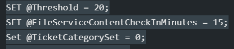

## Implementation

- Use the MySQL command below to import the remote monitor to the Labtech or Automate Server group.

```sql
SET @GroupID = (SELECT groupid FROM mastergroups WHERE NAME REGEXP 'Automate Server|Labtech Server' AND fullname LIKE 'Service Plans%');
SET @Threshold = 20;
SET @FileServiceContentCheckInMinutes = 15;
SET @TicketCategorySet = 0;

INSERT INTO groupagents 
  SELECT '' as `AgentID`,
  @GroupID as `GroupID`,
  '0' as `SearchID`,
  'ProVal - Production - CWAFileService - Invalid Token' as `Name`,
  '6' as `CheckAction`,
  '1' as `AlertAction`,
  'CWA - Invalid Authorization Token - %Computername%~~~The occurrence(s) of an Invalid Token Authorization error within the logs C:\Windows\Temp\FileService.log is fixed after restarting the CWAFileService.!!!CWA - Invalid Authorization Token - %Computername%~~~The %computername% (Automate) Server is currently reporting an Invalid Token Authorization error within the logs C:\Windows\Temp\FileService.log. The occurrences are %RESULT%. Typically, restarting the CWAFileService resolves this, but we have attempted to restart the service 4 times and the errors persist after every restart.' as `AlertMessage`,
  '0' as `ContactID`,
  '900' as `interval`,
  '127.0.0.1' as `Where`,
  '7' as `What`,
  CONCAT('C:\Windows\System32\WindowsPowerShell\v1.0\powershell.exe -ExecutionPolicy Bypass -Command \"$threshold = ', @Threshold, ';$path = ''C:\Windows\Temp\FileService.log''; if (Test-Path $path) { $content = foreach ( $line in $(Get-Content -path $path | Where-Object { $_ -match ''HttpRequest is missing or has invalid Authorization Token'' } ) ) { $line }; $problems = foreach ($err in $content) { if ($err -match '' - (([0-9]{1,2}/){2}[0-9]{4} ([0-9]{1,2}:){2}[0-9]{1,2} [AP]M) -'') { if ([DateTime]$matches[1] -ge (Get-Date).AddMinutes(-', @FileServiceContentCheckInMinutes, ')) {$err} } } if ($problems.count -ge $threshold) { Restart-Service -Name ''CWAFileService'' -Force -ErrorAction SilentlyContinue -WarningAction SilentlyContinue; return $problems.count}}/\"') as `DataOut`,
  '16' as `Comparor`,
  '10|(^$)%7C(^OK$)%7C(^\r\n$)%7C(^\s$)|11|^[0-9]+$%7C(^$)%7C(^OK$)%7C(^\r\n$)%7C(^\s$)|10|^[0-9]+$' as `DataIn`,
  '' as `IDField`,
  '4' as `AlertStyle`,
  '0' as `ScriptID`,
  '' as `datacollector`,
  '18' as `Category`,
  @TicketCategorySet as `TicketCategory`,
  '1' as `ScriptTarget`,
  CONCAT(
    SUBSTRING('abcdef0123456789', FLOOR(RAND()*16+1), 1),
    SUBSTRING('abcdef0123456789', FLOOR(RAND()*16+1), 1),
    SUBSTRING('abcdef0123456789', FLOOR(RAND()*16+1), 1),
    SUBSTRING('abcdef0123456789', FLOOR(RAND()*16+1), 1),
    SUBSTRING('abcdef0123456789', FLOOR(RAND()*16+1), 1),
    SUBSTRING('abcdef0123456789', FLOOR(RAND()*16+1), 1),
    SUBSTRING('abcdef0123456789', FLOOR(RAND()*16+1), 1),
    SUBSTRING('abcdef0123456789', FLOOR(RAND()*16+1), 1),
    '-',
    SUBSTRING('abcdef0123456789', FLOOR(RAND()*16+1), 1),
    SUBSTRING('abcdef0123456789', FLOOR(RAND()*16+1), 1),
    SUBSTRING('abcdef0123456789', FLOOR(RAND()*16+1), 1),
    SUBSTRING('abcdef0123456789', FLOOR(RAND()*16+1), 1),
    '-',
    SUBSTRING('abcdef0123456789', FLOOR(RAND()*16+1), 1),
    SUBSTRING('abcdef0123456789', FLOOR(RAND()*16+1), 1),
    SUBSTRING('abcdef0123456789', FLOOR(RAND()*16+1), 1),
    SUBSTRING('abcdef0123456789', FLOOR(RAND()*16+1), 1),
    '-',
    SUBSTRING('abcdef0123456789', FLOOR(RAND()*16+1), 1),
    SUBSTRING('abcdef0123456789', FLOOR(RAND()*16+1), 1),
    SUBSTRING('abcdef0123456789', FLOOR(RAND()*16+1), 1),
    SUBSTRING('abcdef0123456789', FLOOR(RAND()*16+1), 1),
    SUBSTRING('abcdef0123456789', FLOOR(RAND()*16+1), 1),
    SUBSTRING('abcdef0123456789', FLOOR(RAND()*16+1), 1),
    SUBSTRING('abcdef0123456789', FLOOR(RAND()*16+1), 1),
    SUBSTRING('abcdef0123456789', FLOOR(RAND()*16+1), 1),
    SUBSTRING('abcdef0123456789', FLOOR(RAND()*16+1), 1),
    SUBSTRING('abcdef0123456789', FLOOR(RAND()*16+1), 1),
    SUBSTRING('abcdef0123456789', FLOOR(RAND()*16+1), 1),
    SUBSTRING('abcdef0123456789', FLOOR(RAND()*16+1), 1)
  ) as `GUID`,
  'root' as `UpdatedBy`,
  (NOW()) as `UpdateDate`
FROM mastergroups m
WHERE m.groupid NOT IN (SELECT DISTINCT groupid FROM groupagents WHERE `Name` = 'ProVal - Production - CWAFileService - Invalid Token') AND m.groupid = @GroupID;
```

- Before executing the query, make sure to change the values of `@Threshold` and `@FileServiceContentCheckInMinutes` as per the client's requirements:



This sets the remote monitor to check the contents of the FileService logs at the path `C:/Windows/Temp/FileService.log` for error messages 'HttpRequest is missing or has invalid Authorization Token' from the last 15 minutes, based on the value set in `@FileServiceContentCheckInMinutes`. It checks if the error message count exceeds 20 based on the `@Threshold` set.

- You can also set the `TicketCategory` in the `SET` query.
- Once the values are set, you can execute this query to create the remote monitor.
- After executing, the remote monitor will appear as follows:


- Make sure to set the Alert Style to either "Thrice" or "Fourth," so that it will raise a ticket only if the monitor continues to fail after 4 attempts to restart the service.
- The suggested Alert Template for this monitor is 'Default - Create Automate Ticket'.


