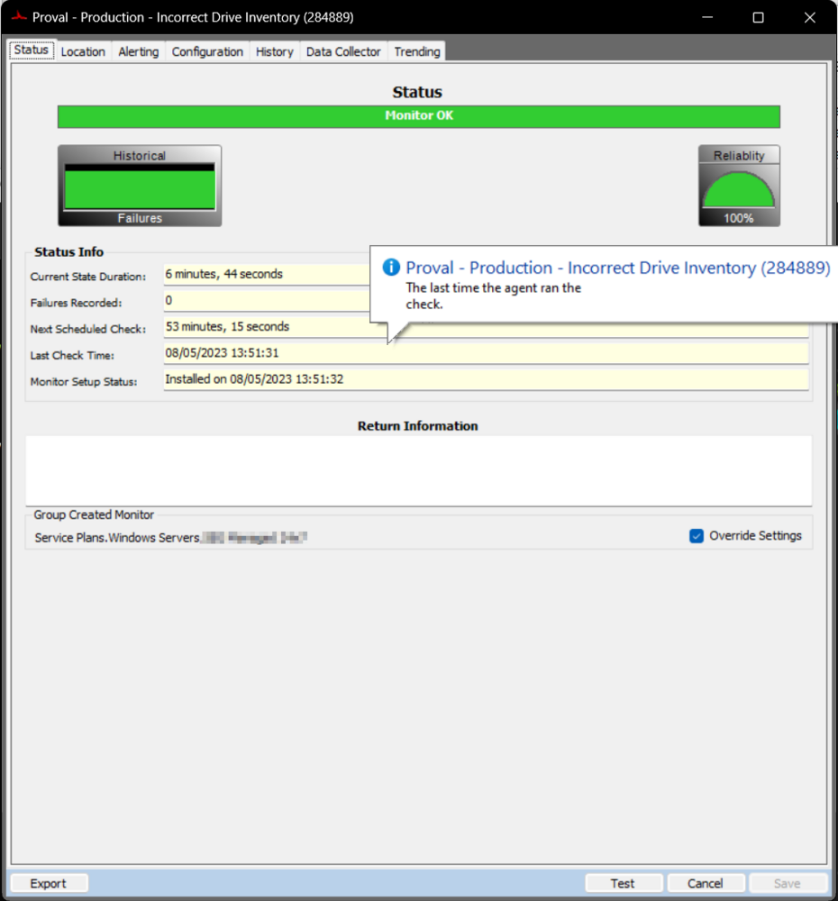
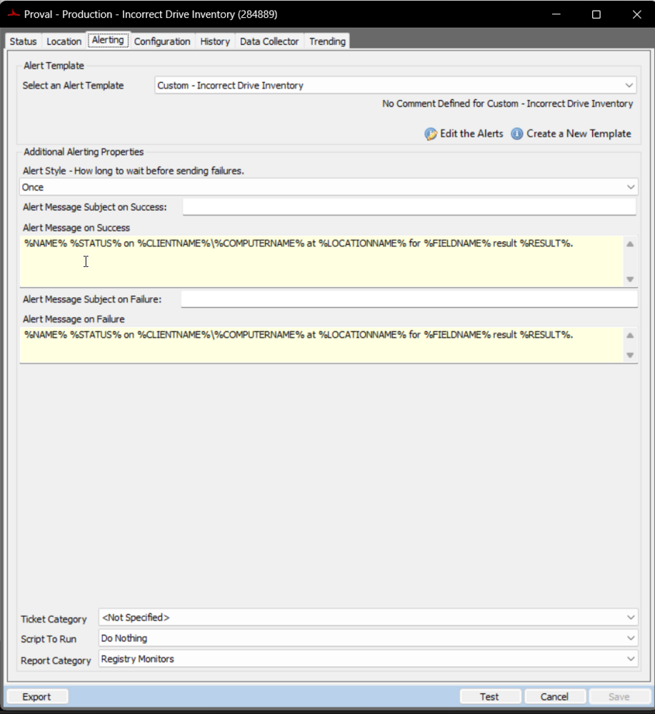
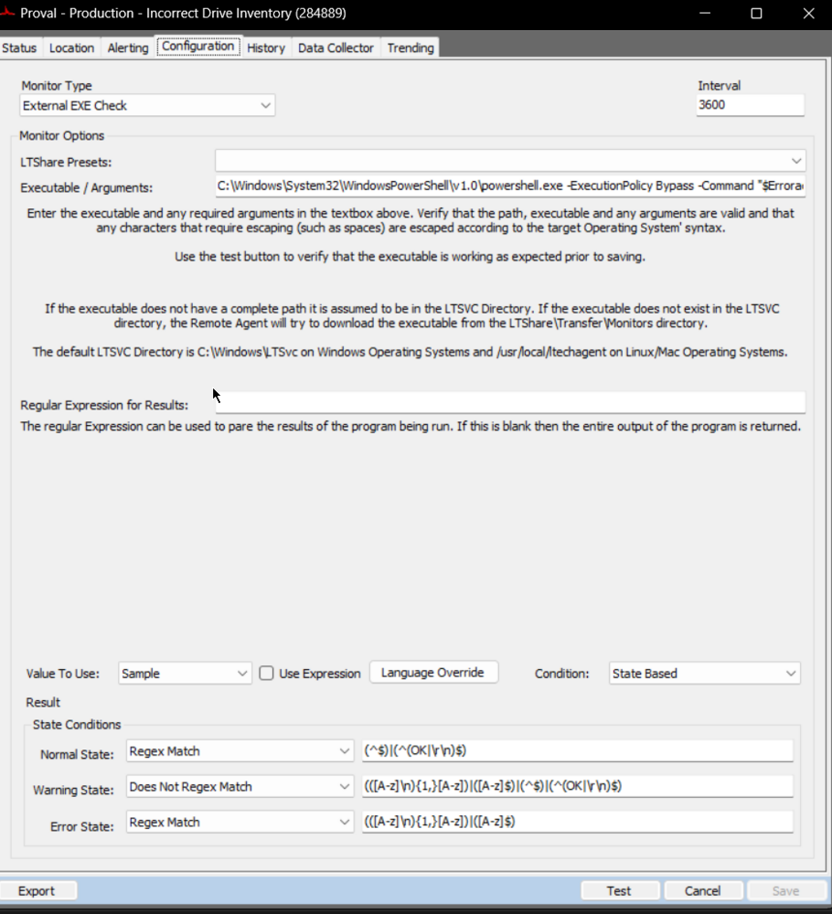

## Summary

Issue:  Upgrade/Swap Agents Hard-Drives or SSDs with Imaged Drives and the Model Number in ConnectWise Automate® still reflects the original Hard-Drive / SSD.

Detects the machines where [Automate is not pulling newly imaged HDD or SSD.](https://docs.connectwise.com/ConnectWise_Automate_Support_Wiki/100/Automate_Not_Pulling_NEW_Imaged_HDD_or_SSD)

It is a State based monitor and the WARNING state indicates the PowerShell failures or any security program is blocking PowerShell from reading the registry keys.

## Details

**Suggested "Limit to"**: Managed Windows Machines

**Suggested Alert Style**: Once  
**Suggested Alert Template**: △ Custom - Incorrect Drive Inventory

## Dependencies

[CWM - Automate - Script - Incorrect Drive Inventory [Autofix]](https://proval.itglue.com/DOC-5078775-11801993)

## Target

- Service Plans.Windows Workstations.Managed 24x7
- Service Plans.Windows Workstations.Managed 8x5
- Service Plans.Windows Servers.Managed 8x5
- Service Plans.Windows Servers.Managed 24x7

## Screenshots

**Status Tab:**  

**Alerting Tab:**  

**Configuration Tab:**  

