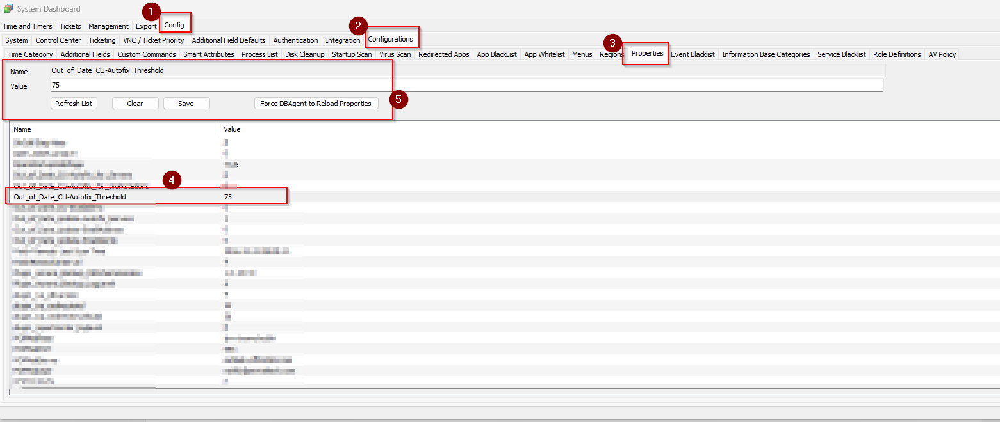
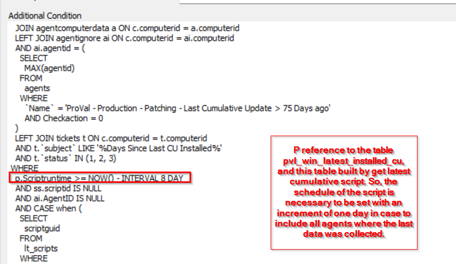
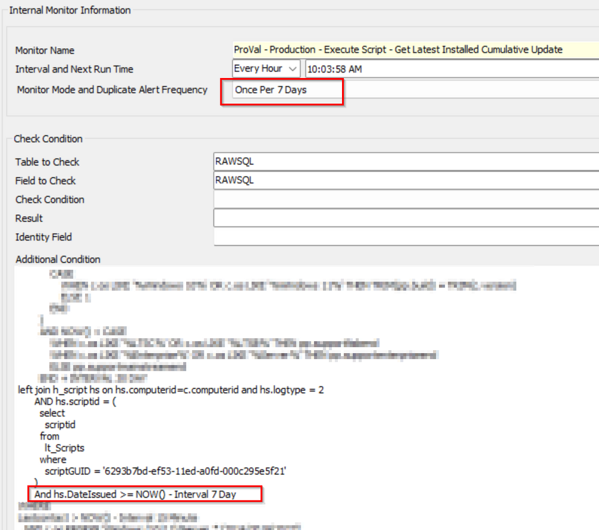

## Summary

This document identifies computers that have not installed a Cumulative Update in the last 75 days, excluding End-of-Life (EOL) machines.

If requested, the monitor can easily be adjusted to a lower or higher number of days since the last cumulative update was installed before a ticket was generated.

The monitor set will not continue detecting computers for which a ticket has already been generated if it is using the suggested alert template `△ Custom - Autofix - Out of Date Cumulative Updates`.

This monitor has direct dependencies on the [Script - Get Latest Installed Cumulative Update](<../scripts/Get Latest Installed Cumulative Update.md>) schedule.

The `p.Scriptruntime` days in the monitor need to be set with one increment day to the [Script - Get Latest Installed Cumulative Update](<../scripts/Get Latest Installed Cumulative Update.md>) schedule, as shown below:

Please review the monitor [Internal Monitor - Execute Script - Get Latest Installed Cumulative Update](<./Execute Script - Get Latest Installed Cumulative Update.md>) and obtain the value from the `hs.dateissued` days. Set it with one day added to the `p.scriptruntime` value in the monitor.

## Dependencies

- [CWM - Automate - Custom Table - pvl_win_latest_installed_cu](<../tables/pvl_win_latest_installed_cu.md>)
- [EPM - Windows Update - Script - Get Latest Installed Cumulative Update](<../scripts/Get Latest Installed Cumulative Update.md>)
- [CWM - Automate - Script - Out of Date Cumulative Updates [Autofix]*](<../scripts/Out of Date Cumulative Updates Autofix.md>)
- [SEC - Windows Patching - Custom Table - plugin_proval_windows_os_support](<../tables/plugin_proval_windows_os_support.md>)
- [Internal Monitor - Execute Script - Get Latest Installed Cumulative Update](<./Execute Script - Get Latest Installed Cumulative Update.md>)

## Target

Global

## Alert Template

`△ Custom - Autofix - Out of Date Cumulative Updates`

The alert template executes the [CWM - Automate - Script - Out of Date Cumulative Updates [Autofix]*](<../scripts/Out of Date Cumulative Updates Autofix.md>) script.

## FAQ

**Q1)** What happens if the machine hasn't logged in for several days, or if the interval of the [Script - Get Latest Installed Cumulative Update](<../scripts/Get Latest Installed Cumulative Update.md>) is different from the `lastruntime` check in the table "[Custom Table - pvl_win_latest_installed_cu](<../tables/pvl_win_latest_installed_cu.md>)"?

**Ans)** This monitor will ignore agents whose last contact date is older than 7 days from monitoring. It will also exclude agents where the [Script - Get Latest Installed Cumulative Update](<../scripts/Get Latest Installed Cumulative Update.md>) has not run within the scheduled days period, which should match the `p.scriptruntime` set in the monitor.

