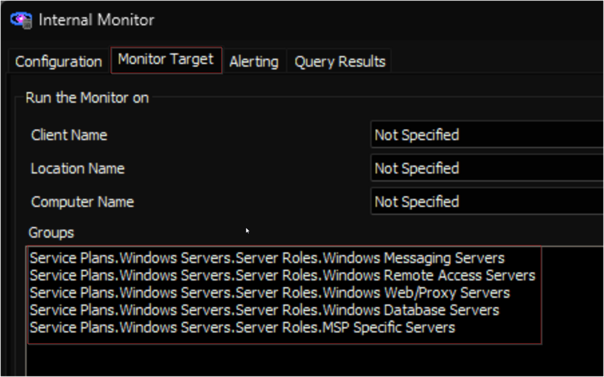

## Summary

The purpose of the internal monitor is to detect the concerned servers where the [Windows - Certificates (My) - Local Machine - Audit](https://proval.itglue.com/DOC-5078775-9256568) script has not executed in the past 7 days.

## Dependencies

[EPM - Network - Script - Certificate - Windows - Certificates (My) - Local Machine - Audit](https://proval.itglue.com/DOC-5078775-9256568)

## Target

The internal monitor should be explicitly limited to the following groups:

- Service Plans.Windows Servers.Server Roles.Windows Messaging Servers
- Service Plans.Windows Servers.Server Roles.Windows Remote Access Servers
- Service Plans.Windows Servers.Server Roles.Windows Web/Proxy Servers
- Service Plans.Windows Servers.Server Roles.Windows Database Servers
- Service Plans.Windows Servers.Server Roles.MSP Specific Servers

## Alert Template

**Name:**  △ Custom - Local Machine Certificate Audit

