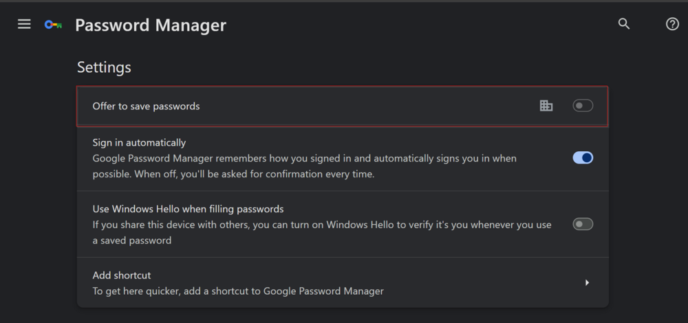
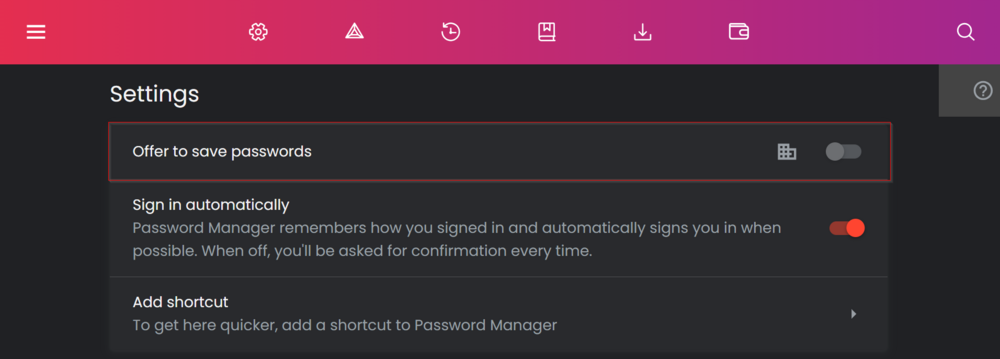
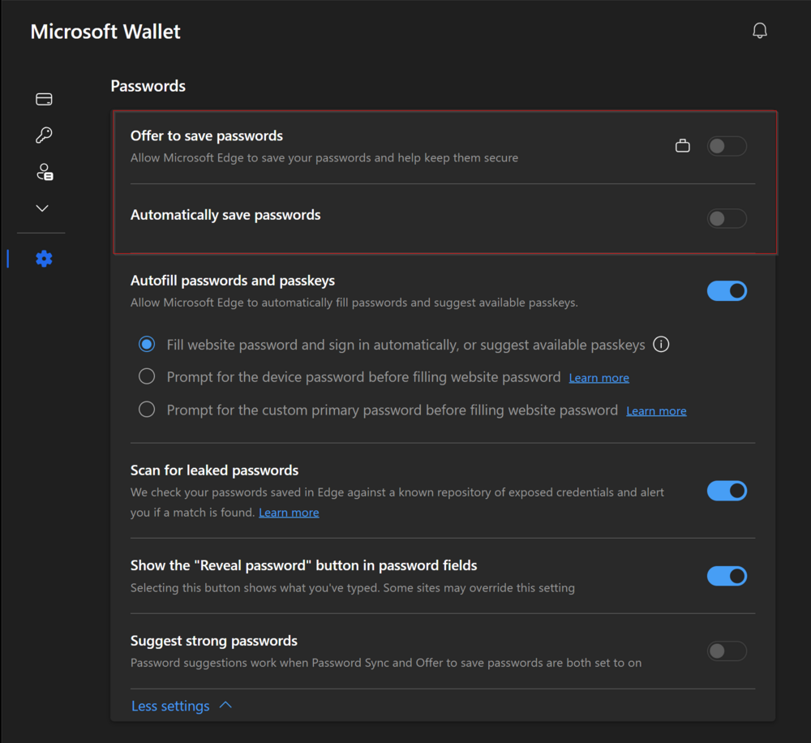
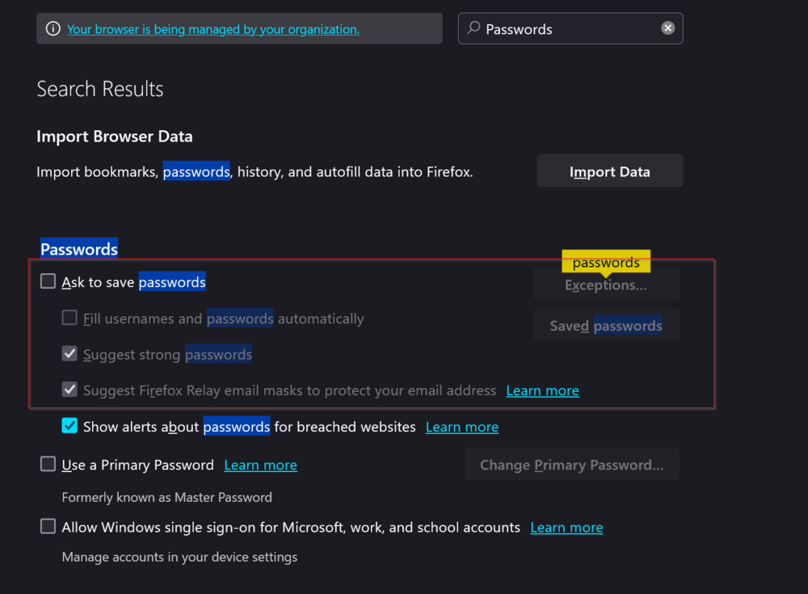
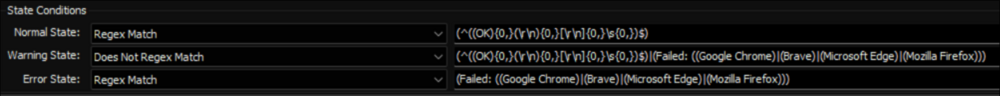

## Summary

The remote monitor is trying to turn off the Password Manager in specific web browsers like Google Chrome, Mozilla Firefox, Microsoft Edge, and Brave. The solution involves making changes to the computer's registry.

It's important to know that for browsers based on Chromium (like Google Chrome, Mozilla Firefox, and Microsoft Edge), turning off the Password Manager won't stop the Autofill (or Sign in Automatically) feature. If Autofill (or Sign in Automatically) is enabled and there are saved passwords, it will still automatically fill in credentials for websites. But, if the Password Manager is disabled, new passwords won't be saved, and the browser won't ask to store passwords. However, the saved passwords will still work.

For Firefox, turning off the Password Manager will also disable Autofill.

**Affected Setting for Google Chrome:**  

**Affected Setting for Brave:**  

**Affected Settings for Microsoft Edge:**  

**Affected Settings for Mozilla Firefox:**  

**Note:**
- The changes will only happen once the browser is restarted if it's currently open. In certain situations, especially for Microsoft Edge, the user might need to restart the entire computer for the changes to take effect.
- If the PowerShell version on the machines is older than version 5, the remote monitor may not produce the expected outcomes.

## Details

**Suggested "Limit to":** Lockdown Browsers Password Manager  
**Suggested Alert Style:** Continuous  
**Suggested Alert Template:** Default - Do Nothing  

**Using any alert templates is not recommended unless the partner specifically desires an alert for failures. The remote monitor records both its successes and failures in the [Browsers Password Lockdown - Status](https://proval.itglue.com/DOC-5078775-15018073) dataview.**

| Check Action | Server Address | Check Type | Execute Info | Comparator | Interval | Result |
|--------------|----------------|------------|---------------|-------------|----------|--------|
| System       | 127.0.0.1     | Run File   | **REDACTED**  | State Based | 604800 (Weekly) | Screenshot attached below. |

## Dependencies

**Search:** `Lockdown Browsers Autofill`  
**Search:** `Lockdown Browsers Password Manager`  
**Group:** `△ Lockdown Browsers Autofill`  
**Dataview:** [EPM - Software Configuration - Dataview - Browsers Password Lockdown - Status](https://proval.itglue.com/DOC-5078775-15018073)  

## Target

**Group:** △ Lockdown Browsers Autofill  

## Implementation

[Implement - Group Monitors - △ Lockdown Browsers Autofill](https://proval.itglue.com/DOC-5078775-15025130)  

