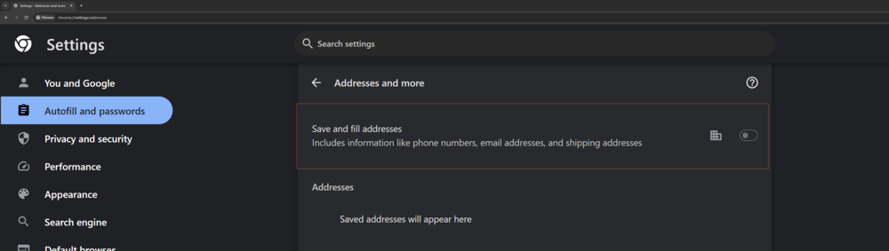
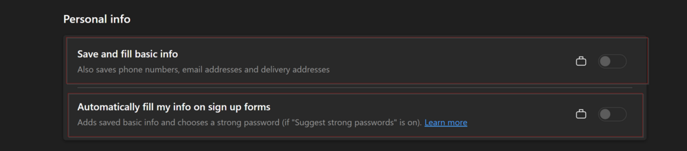
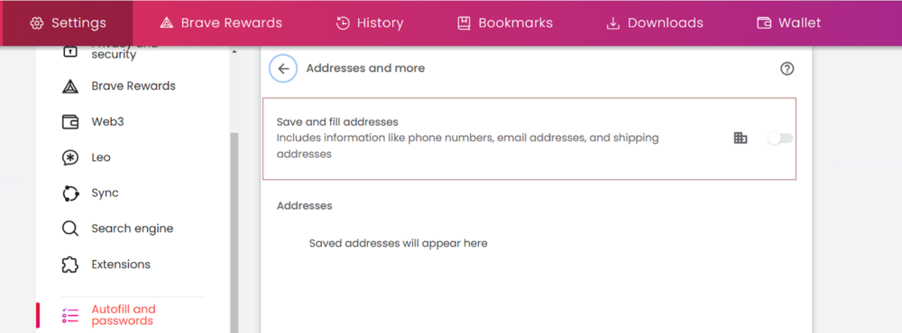
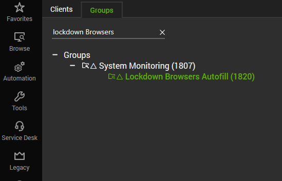

## Summary

The remote monitor attempts to disable the Autofilling feature for addresses in Chromium-based browsers such as Google Chrome, Microsoft Edge, and Brave. This solution entails modifying the computer's registry settings.

**Affected Setting for Google Chrome:**  

**Affected Settings for Microsoft Edge:**  

**Affected Setting for Brave:**  

**Note:**
- The changes will take effect only after the browser is restarted if it is currently open.
- If the PowerShell version on the machines is older than version 5, the remote monitor may not produce the expected outcomes.

## Details

**Suggested "Limit to":** Lockdown Browsers Password Manager  
**Suggested Alert Style:** Continuous  
**Suggested Alert Template:** Default - Do Nothing  

Using any alert templates is not recommended unless the partner specifically desires an alert for failures. The remote monitor records both its successes and failures in the [Chromium Browsers Address Lockdown - Status](<../dataviews/Chromium Browsers Address Autofill Lockdown - Status.md>) dataview.

| Check Action | Server Address | Check Type | Execute Info | Comparator | Interval | Result |
|--------------|----------------|------------|---------------|------------|----------|--------|
| System       | 127.0.0.1     | Run File   | **REDACTED**  | State Based| 604800 (Weekly) | Screenshot attached below. |

## Dependencies

**Search:** `Lockdown Browsers Address Autofill`  
**Search:** `Lockdown Browsers Autofill`  
**Group:** `△ Lockdown Browsers Autofill`  
**Dataview:** [EPM - Dataview - Chromium Browsers Address Lockdown - Status](<../dataviews/Chromium Browsers Address Autofill Lockdown - Status.md>)

## Target

**Group:** △ Lockdown Browsers Autofill  

## Implementation

[Implement - Group Monitors - △ Lockdown Browsers Autofill](https://proval.itglue.com/DOC-5078775-15025130)
