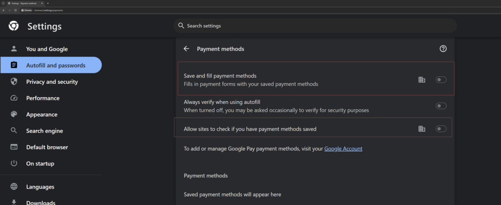
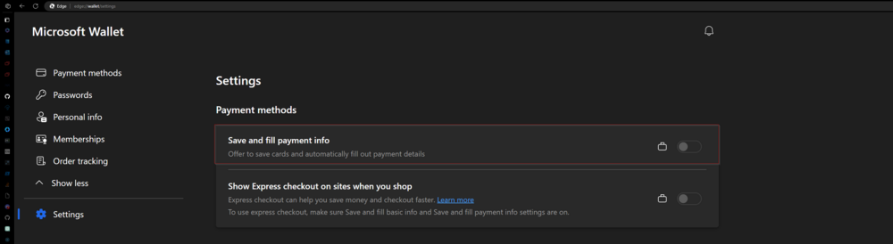
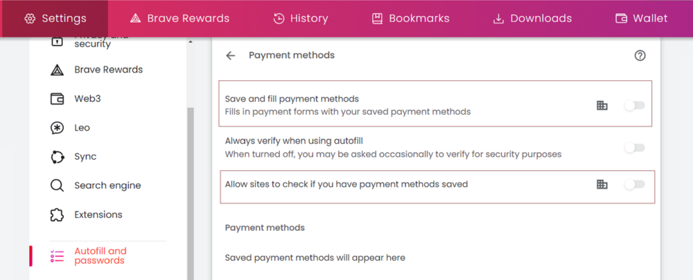
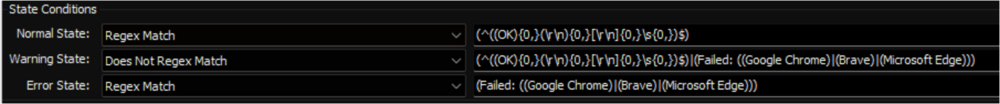

## Summary

The remote monitor attempts to disable the Autofilling feature for credit cards in Chromium-based browsers such as Google Chrome, Microsoft Edge, and Brave. This solution entails modifying the computer's registry settings.

**Affected Setting for Google Chrome:**  


**Affected Settings for Microsoft Edge:**  


**Affected Setting for Brave:**  


**Note:**
- The changes will only take effect once the browser is restarted if it is currently open.
- If the PowerShell version on the machines is older than version 5, the remote monitor may not produce the expected outcomes.

## Details

**Suggested "Limit to":** Lockdown Browsers Credit Card Autofill  
**Suggested Alert Style:** Continuous  
**Suggested Alert Template:** Default - Do Nothing  

Using any alert templates is not recommended unless the partner specifically desires an alert for failures. The remote monitor records both its successes and failures in the [Chromium Browsers Credit Card Lockdown - Status](<../dataviews/Chromium Browsers Credit Card Autofill Lockdown - Status.md>) dataview.

| Check Action | Server Address | Check Type | Execute Info | Comparator | Interval | Result |
|--------------|----------------|------------|---------------|------------|----------|--------|
| System       | 127.0.0.1     | Run File   | **REDACTED**  | State Based | 604800 (Weekly) | Screenshot attached below. |



## Dependencies

**Search:** `Lockdown Browsers Credit Card Autofill`  
**Search:** `Lockdown Browsers Autofill`  
**Group:** `△ Lockdown Browsers Autofill`  
**Dataview:** [EPM - Dataview - Chromium Browsers Credit Card Lockdown - Status](<../dataviews/Chromium Browsers Credit Card Autofill Lockdown - Status.md>)

## Target

**Group:** △ Lockdown Browsers Password Manager  


## Implementation

### Step 1
Execute the provided SQL query from a RAWSQL monitor set in the provided order to import the following contents:

- **Client Level EDFs:** 
    - Lockdown Browsers Password Manager 
    - Lockdown Browsers Credit Card Autofill
    - Lockdown Browsers Address Autofill
- **Location Level EDFs:**
    - Exclude Browser Lockdown
    - Exclude Browser Credit Card Lockdown
    - Lockdown Browsers Address Autofill
- **Computer Level EDFs:**
    - Exclude Browser Lockdown
    - Exclude Browser Credit Card Lockdown
    - Lockdown Browsers Address Autofill
- **Searches:** 
    - Lockdown Browsers Autofill
    - Lockdown Browsers Password Manager
    - Lockdown Browsers Credit Card Autofill 
    - Lockdown Browsers Address Autofill
- **Groups:** 
    - △ System Monitoring, 
    - △ Lockdown Browsers Autofill
- **Remote Monitors:**
    - ProVal - Production - Lockdown Browsers Password Manager
    - ProVal - Production - Lockdown Chromium Browsers Credit Card Autofill
    - ProVal - Production - Lockdown Chromium Browsers Address Autofill

---
### Step 2
#### Remove Existing Content
```sql
Delete From groupagents where groupid = ( Select distinct groupid from mastergroups where `GUID` = 'eea5f14b-c12a-11ee-a53f-960002890dfa' );
Delete From mastergroups where `GUID` = 'eea5f14b-c12a-11ee-a53f-960002890dfa';
Delete From sensorchecks where `GUID` = '80d153cb-440b-4312-9191-a9f5dd20744a';
```
---
### Step 3
#### Create EDFs
```sql
INSERT IGNORE INTO `extrafield` 
    (`Form`, `Name`, `Sort`, `NoBreak`, `FType`, `Section`, `UnEditable`, `Collapsed`, `Fill`, `LtGuid`, `IsPassword`, `IsEncrypted`, `IsHidden`, `IsRestricted`, `ViewPermissions`, `EditPermissions`) 
VALUES 
    (1, 'Exclude Browser Password Lockdown', 0, 0, 1, 'Exclusions', 0, 0, '', '427b21d2-e43a-4638-b692-3a15f56f7092', 0, 0, 0, 0, '', ''),
    (2, 'Exclude Browser Password Lockdown', 0, 0, 1, 'Exclusions', 0, 0, '', '5dd1e888-f7f8-4e2d-af53-b6cac8c00efb', 0, 0, 0, 0, '', ''),
    (1, 'Exclude Browser Address Autofill Lockdown', 0, 0, 1, 'Exclusions', 0, 0, '', '2de882af-81ea-4300-b410-d6c155239a83', 0, 0, 0, 0, '', ''),
    (2, 'Exclude Browser Credit Card Lockdown', 0, 0, 1, 'Exclusions', 0, 0, '', '5126b37d-1d63-456c-b44b-180871bd5d97', 0, 0, 0, 0, '', ''),
    (1, 'Exclude Browser Credit Card Lockdown', 0, 0, 1, 'Exclusions', 0, 0, '', '3eb6042d-68f3-4c87-b2cf-72d69bb57e45', 0, 0, 0, 0, '', ''),
    (2, 'Exclude Browser Address Autofill Lockdown', 0, 0, 1, 'Exclusions', 0, 0, '', 'ffd807a0-62a6-4cfa-86e6-d90cfc9f0f3c', 0, 0, 0, 0, '', ''),
    (3, 'Lockdown Browsers Password Manager', 0, 0, 1, 'Security', 0, 0, '', '611dcf5a-b316-4986-a624-a176efe4b5c6', 0, 0, 0, 0, '', ''),
    (3, 'Lockdown Browsers Credit Card Autofill', 0, 0, 1, 'Security', 0, 0, '', 'e74a03bc-b190-4ccb-9c29-95d7f3b23c1f', 0, 0, 0, 0, '', ''),
    (3, 'Lockdown Browsers Address Autofill', 0, 0, 1, 'Security', 0, 0, '', '3c002fdd-a25a-4bc2-bb1e-1a6f7af67432', 0, 0, 0, 0, '', '');
CALL v_extradata(1,'computers');
CALL v_ExtraDataRefresh(1,'computers');
CALL v_extradata(2,'locations');
CALL v_ExtraDataRefresh(2,'locations');
CALL v_extradata(3,'clients');
CALL v_ExtraDataRefresh(3,'clients');
```
---
### Step 4
#### Create Searches 
```sql
INSERT INTO `sensorchecks` 
    (`Name`, `SQL`, `QueryType`, `ListDATA`, `FolderID`, `GUID`, `SearchXML`)
SELECT 
    'Lockdown Browsers Autofill'  as `Name`, 
    'SELECT \n   computers.computerid as `Computer Id`,\n   computers.name as `Computer Name`,\n   clients.name as `Client Name`,\n   computers.domain as `Computer Domain`,\n   computers.username as `Computer User`,\n   IF(INSTR(IFNULL(inv_operatingsystem.Name, Computers.OS), \'windows\')>0, 1, IF(INSTR(IFNULL(inv_operatingsystem.Name, Computers.OS), \'darwin\') >0, 2, 3)) as `Computer.OS.Type`,\n   IFNULL(IFNULL(edfAssigned1.Value,edfDefault1.value),\'0\') as `Computer - Client - Extra Data Field - Security - Lockdown Browsers Password Manager`,\n   IFNULL(IFNULL(edfAssigned2.Value,edfDefault2.value),\'0\') as `Computer - Client - Extra Data Field - Security - Lockdown Browsers Credit Card Autofill`,\n   IFNULL(IFNULL(edfAssigned3.Value,edfDefault3.value),\'0\') as `Computer - Client - Extra Data Field - Security - Lockdown Browsers Address Autofill`\nFROM Computers \nLEFT JOIN inv_operatingsystem ON (Computers.ComputerId=inv_operatingsystem.ComputerId)\nLEFT JOIN Clients ON (Computers.ClientId=Clients.ClientId)\nLEFT JOIN Locations ON (Computers.LocationId=Locations.LocationID)\nLEFT JOIN ExtraFieldData edfAssigned1 ON (edfAssigned1.id=Clients.ClientId and edfAssigned1.ExtraFieldId =(Select ExtraField.id FROM ExtraField WHERE LTGuid=\'611dcf5a-b316-4986-a624-a176efe4b5c6\'))\nLEFT JOIN ExtraFieldData edfDefault1 ON (edfDefault1.id=0 and edfDefault1.ExtraFieldId =(Select ExtraField.id FROM ExtraField WHERE LTGuid=\'611dcf5a-b316-4986-a624-a176efe4b5c6\'))\nLEFT JOIN ExtraFieldData edfAssigned2 ON (edfAssigned2.id=Clients.ClientId and edfAssigned2.ExtraFieldId =(Select ExtraField.id FROM ExtraField WHERE LTGuid=\'e74a03bc-b190-4ccb-9c29-95d7f3b23c1f\'))\nLEFT JOIN ExtraFieldData edfDefault2 ON (edfDefault2.id=0 and edfDefault2.ExtraFieldId =(Select ExtraField.id FROM ExtraField WHERE LTGuid=\'e74a03bc-b190-4ccb-9c29-95d7f3b23c1f\'))\nLEFT JOIN ExtraFieldData edfAssigned3 ON (edfAssigned3.id=Clients.ClientId and edfAssigned3.ExtraFieldId =(Select ExtraField.id FROM ExtraField WHERE LTGuid=\'3c002fdd-a25a-4bc2-bb1e-1a6f7af67432\'))\nLEFT JOIN ExtraFieldData edfDefault3 ON (edfDefault3.id=0 and edfDefault3.ExtraFieldId =(Select ExtraField.id FROM ExtraField WHERE LTGuid=\'3c002fdd-a25a-4bc2-bb1e-1a6f7af67432\'))\n WHERE \n((((IF(INSTR(IFNULL(inv_operatingsystem.Name, Computers.OS), \'windows\')>0, 1, IF(INSTR(IFNULL(inv_operatingsystem.Name, Computers.OS), \'darwin\') >0, 2, 3)) = \'1\') AND (((IFNULL(IFNULL(edfAssigned1.Value,edfDefault1.value),\'0\')<>0) OR (IFNULL(IFNULL(edfAssigned2.Value,edfDefault2.value),\'0\')<>0) OR (IFNULL(IFNULL(edfAssigned3.Value,edfDefault3.value),\'0\')<>0))))))\n' as `SQL`,
    '4' as `QueryType`,
    'Select||=||=||=|^Select|||||||^' as `ListData`,
    '0' as `FolderID`,
    '80d153cb-440b-4312-9191-a9f5dd20744a' as `GUID`,'<LabTechAbstractSearch><asn><st>AndNode</st><cn><asn><st>AndNode</st><cn><asn><st>ComparisonNode</st><lon>Computer.OS.Type</lon><lok>Computer.OS.Type</lok><lmo>Equals</lmo><dv>Windows</dv><dk>1</dk></asn><asn><st>OrNode</st><cn><asn><st>ComparisonNode</st><lon>Computer.Client.Extra Data Field.Security.Lockdown Browsers Password Manager</lon><lok>Computer.Client.Edf.611dcf5a-b316-4986-a624-a176efe4b5c6</lok><lmo>IsTrue</lmo><dv>NULL</dv><dk>NULL</dk></asn><asn><st>ComparisonNode</st><lon>Computer.Client.Extra Data Field.Security.Lockdown Browsers Credit Card Autofill</lon><lok>Computer.Client.Edf.e74a03bc-b190-4ccb-9c29-95d7f3b23c1f</lok><lmo>IsTrue</lmo><dv>NULL</dv><dk>NULL</dk></asn><asn><st>ComparisonNode</st><lon>Computer.Client.Extra Data Field.Security.Lockdown Browsers Address Autofill</lon><lok>Computer.Client.Edf.3c002fdd-a25a-4bc2-bb1e-1a6f7af67432</lok><lmo>IsTrue</lmo><dv>NULL</dv><dk>NULL</dk></asn></cn></asn></cn></asn></cn></asn></LabTechAbstractSearch>' as `SearchXML`
FROM  
    (SELECT MIN(computerid) FROM computers) a
WHERE 
    (SELECT count(*) From SensorChecks where `GUID` = '80d153cb-440b-4312-9191-a9f5dd20744a') = 0 ;
INSERT INTO `sensorchecks` 
    (`Name`, `SQL`, `QueryType`, `ListDATA`, `FolderID`, `GUID`, `SearchXML`)
SELECT 
    'Lockdown Browsers Password Manager'  as `Name`, 
    'SELECT \r\n   computers.computerid as `Computer Id`,\r\n   computers.name as `Computer Name`,\r\n   clients.name as `Client Name`,\r\n   computers.domain as `Computer Domain`,\r\n   computers.username as `Computer User`,\r\n   IF(INSTR(IFNULL(inv_operatingsystem.Name, Computers.OS), \'windows\')>0, 1, IF(INSTR(IFNULL(inv_operatingsystem.Name, Computers.OS), \'darwin\') >0, 2, 3)) as `Computer.OS.Type`,\r\n   IFNULL(IFNULL(edfAssigned1.Value,edfDefault1.value),\'0\') as `Computer - Client - Extra Data Field - Security - Lockdown Browsers Password Manager`,\r\n   IFNULL(IFNULL(edfAssigned2.Value,edfDefault2.value),\'0\') as `Computer - Location - Extra Data Field - Exclusions - Exclude Browser Password Lockdown`,\r\n   IFNULL(IFNULL(edfAssigned3.Value,edfDefault3.value),\'0\') as `Computer - Extra Data Field - Exclusions - Exclude Browser Password Lockdown`\r\nFROM Computers \r\nLEFT JOIN inv_operatingsystem ON (Computers.ComputerId=inv_operatingsystem.ComputerId)\r\nLEFT JOIN Clients ON (Computers.ClientId=Clients.ClientId)\r\nLEFT JOIN Locations ON (Computers.LocationId=Locations.LocationID)\r\nLEFT JOIN ExtraFieldData edfAssigned1 ON (edfAssigned1.id=Clients.ClientId and edfAssigned1.ExtraFieldId =(Select ExtraField.id FROM ExtraField WHERE LTGuid=\'611dcf5a-b316-4986-a624-a176efe4b5c6\'))\r\nLEFT JOIN ExtraFieldData edfDefault1 ON (edfDefault1.id=0 and edfDefault1.ExtraFieldId =(Select ExtraField.id FROM ExtraField WHERE LTGuid=\'611dcf5a-b316-4986-a624-a176efe4b5c6\'))\r\nLEFT JOIN ExtraFieldData edfAssigned2 ON (edfAssigned2.id=Locations.LocationId and edfAssigned2.ExtraFieldId =(Select ExtraField.id FROM ExtraField WHERE LTGuid=\'5dd1e888-f7f8-4e2d-af53-b6cac8c00efb\'))\r\nLEFT JOIN ExtraFieldData edfDefault2 ON (edfDefault2.id=0 and edfDefault2.ExtraFieldId =(Select ExtraField.id FROM ExtraField WHERE LTGuid=\'5dd1e888-f7f8-4e2d-af53-b6cac8c00efb\'))\r\nLEFT JOIN ExtraFieldData edfAssigned3 ON (edfAssigned3.id=Computers.ComputerId and edfAssigned3.ExtraFieldId =(Select ExtraField.id FROM ExtraField WHERE LTGuid=\'427b21d2-e43a-4638-b692-3a15f56f7092\'))\r\nLEFT JOIN ExtraFieldData edfDefault3 ON (edfDefault3.id=0 and edfDefault3.ExtraFieldId =(Select ExtraField.id FROM ExtraField WHERE LTGuid=\'427b21d2-e43a-4638-b692-3a15f56f7092\'))\r\n WHERE \r\n((((IF(INSTR(IFNULL(inv_operatingsystem.Name, Computers.OS), \'windows\')>0, 1, IF(INSTR(IFNULL(inv_operatingsystem.Name, Computers.OS), \'darwin\') >0, 2, 3)) = \'1\') AND (IFNULL(IFNULL(edfAssigned1.Value,edfDefault1.value),\'0\')<>0) AND (IFNULL(IFNULL(edfAssigned2.Value,edfDefault2.value),\'0\')=0) AND (IFNULL(IFNULL(edfAssigned3.Value,edfDefault3.value),\'0\')=0))))\r\n' as `SQL`,
    '4' as `QueryType`,
    'Select||=||=||=|^Select|||||||^' as `ListData`,
    '0' as `FolderID`,
    '40d97d6b-8726-48f3-ac28-eeaed20f75d7' as `GUID`,'<LabTechAbstractSearch><asn><st>AndNode</st><cn><asn><st>AndNode</st><cn><asn><st>ComparisonNode</st><lon>Computer.OS.Type</lon><lok>Computer.OS.Type</lok><lmo>Equals</lmo><dv>Windows</dv><dk>1</dk></asn><asn><st>ComparisonNode</st><lon>Computer.Client.Extra Data Field.Security.Lockdown Browsers Password Manager</lon><lok>Computer.Client.Edf.611dcf5a-b316-4986-a624-a176efe4b5c6</lok><lmo>IsTrue</lmo><dv>NULL</dv><dk>NULL</dk></asn><asn><st>ComparisonNode</st><lon>Computer.Location.Extra Data Field.Exclusions.Exclude Browser Password Lockdown</lon><lok>Computer.Location.Edf.5dd1e888-f7f8-4e2d-af53-b6cac8c00efb</lok><lmo>IsFalse</lmo><dv>NULL</dv><dk>NULL</dk></asn><asn><st>ComparisonNode</st><lon>Computer.Extra Data Field.Exclusions.Exclude Browser Password Lockdown</lon><lok>Computer.Edf.427b21d2-e43a-4638-b692-3a15f56f7092</lok><lmo>IsFalse</lmo><dv>NULL</dv><dk>NULL</dk></asn></cn></asn></cn></asn></LabTechAbstractSearch>' as `SearchXML`
FROM  
    (SELECT MIN(computerid) FROM computers) a
WHERE 
    (SELECT count(*) From SensorChecks where `GUID` = '40d97d6b-8726-48f3-ac28-eeaed20f75d7') = 0 ;
INSERT INTO `sensorchecks` 
    (`Name`, `SQL`, `QueryType`, `ListDATA`, `FolderID`, `GUID`, `SearchXML`)
SELECT 
    'Lockdown Browsers Credit Card Autofill'  as `Name`, 
    'SELECT \r\n   computers.computerid as `Computer Id`,\r\n   computers.name as `Computer Name`,\r\n   clients.name as `Client Name`,\r\n   computers.domain as `Computer Domain`,\r\n   computers.username as `Computer User`,\r\n   IF(INSTR(IFNULL(inv_operatingsystem.Name, Computers.OS), \'windows\')>0, 1, IF(INSTR(IFNULL(inv_operatingsystem.Name, Computers.OS), \'darwin\') >0, 2, 3)) as `Computer.OS.Type`,\r\n   IFNULL(IFNULL(edfAssigned1.Value,edfDefault1.value),\'0\') as `Computer - Client - Extra Data Field - Security - Lockdown Browsers Credit Card Autofill`,\r\n   IFNULL(IFNULL(edfAssigned2.Value,edfDefault2.value),\'0\') as `Computer - Location - Extra Data Field - Exclusions - Exclude Browser Credit Card Lockdown`,\r\n   IFNULL(IFNULL(edfAssigned3.Value,edfDefault3.value),\'0\') as `Computer - Extra Data Field - Exclusions - Exclude Browser Credit Card Lockdown`\r\nFROM Computers \r\nLEFT JOIN inv_operatingsystem ON (Computers.ComputerId=inv_operatingsystem.ComputerId)\r\nLEFT JOIN Clients ON (Computers.ClientId=Clients.ClientId)\r\nLEFT JOIN Locations ON (Computers.LocationId=Locations.LocationID)\r\nLEFT JOIN ExtraFieldData edfAssigned1 ON (edfAssigned1.id=Clients.ClientId and edfAssigned1.ExtraFieldId =(Select ExtraField.id FROM ExtraField WHERE LTGuid=\'e74a03bc-b190-4ccb-9c29-95d7f3b23c1f\'))\r\nLEFT JOIN ExtraFieldData edfDefault1 ON (edfDefault1.id=0 and edfDefault1.ExtraFieldId =(Select ExtraField.id FROM ExtraField WHERE LTGuid=\'e74a03bc-b190-4ccb-9c29-95d7f3b23c1f\'))\r\nLEFT JOIN ExtraFieldData edfAssigned2 ON (edfAssigned2.id=Locations.LocationId and edfAssigned2.ExtraFieldId =(Select ExtraField.id FROM ExtraField WHERE LTGuid=\'5126b37d-1d63-456c-b44b-180871bd5d97\'))\r\nLEFT JOIN ExtraFieldData edfDefault2 ON (edfDefault2.id=0 and edfDefault2.ExtraFieldId =(Select ExtraField.id FROM ExtraField WHERE LTGuid=\'5126b37d-1d63-456c-b44b-180871bd5d97\'))\r\nLEFT JOIN ExtraFieldData edfAssigned3 ON (edfAssigned3.id=Computers.ComputerId and edfAssigned3.ExtraFieldId =(Select ExtraField.id FROM ExtraField WHERE LTGuid=\'3eb6042d-68f3-4c87-b2cf-72d69bb57e45\'))\r\nLEFT JOIN ExtraFieldData edfDefault3 ON (edfDefault3.id=0 and edfDefault3.ExtraFieldId =(Select ExtraField.id FROM ExtraField WHERE LTGuid=\'3eb6042d-68f3-4c87-b2cf-72d69bb57e45\'))\r\n WHERE \r\n((((IF(INSTR(IFNULL(inv_operatingsystem.Name, Computers.OS), \'windows\')>0, 1, IF(INSTR(IFNULL(inv_operatingsystem.Name, Computers.OS), \'darwin\') >0, 2, 3)) = \'1\') AND (IFNULL(IFNULL(edfAssigned1.Value,edfDefault1.value),\'0\')<>0) AND (IFNULL(IFNULL(edfAssigned2.Value,edfDefault2.value),\'0\')=0) AND (IFNULL(IFNULL(edfAssigned3.Value,edfDefault3.value),\'0\')=0))))\r\n' as `SQL`,
    '4' as `QueryType`,
    'Select||=||=||=|^Select|||||||^' as `ListData`,
    '0' as `FolderID`,
    'bcfaf65a-4eb7-4cf9-9496-0c94ae86e59b' as `GUID`,'<LabTechAbstractSearch><asn><st>AndNode</st><cn><asn><st>AndNode</st><cn><asn><st>ComparisonNode</st><lon>Computer.OS.Type</lon><lok>Computer.OS.Type</lok><lmo>Equals</lmo><dv>Windows</dv><dk>1</dk></asn><asn><st>ComparisonNode</st><lon>Computer.Client.Extra Data Field.Security.Lockdown Browsers Credit Card Autofill</lon><lok>Computer.Client.Edf.e74a03bc-b190-4ccb-9c29-95d7f3b23c1f</lok><lmo>IsTrue</lmo><dv>NULL</dv><dk>NULL</dk></asn><asn><st>ComparisonNode</st><lon>Computer.Location.Extra Data Field.Exclusions.Exclude Browser Credit Card Lockdown</lon><lok>Computer.Location.Edf.5126b37d-1d63-456c-b44b-180871bd5d97</lok><lmo>IsFalse</lmo><dv>NULL</dv><dk>NULL</dk></asn><asn><st>ComparisonNode</st><lon>Computer.Extra Data Field.Exclusions.Exclude Browser Credit Card Lockdown</lon><lok>Computer.Edf.3eb6042d-68f3-4c87-b2cf-72d69bb57e45</lok><lmo>IsFalse</lmo><dv>NULL</dv><dk>NULL</dk></asn></cn></asn></cn></asn></LabTechAbstractSearch>' as `SearchXML`
FROM  
    (SELECT MIN(computerid) FROM computers) a
WHERE 
    (SELECT count(*) From SensorChecks where `GUID` = 'bcfaf65a-4eb7-4cf9-9496-0c94ae86e59b') = 0 ;
INSERT INTO `sensorchecks` 
    (`Name`, `SQL`, `QueryType`, `ListDATA`, `FolderID`, `GUID`, `SearchXML`)
SELECT 
    'Lockdown Browsers Address Autofill'  as `Name`, 
    'SELECT \r\n   computers.computerid as `Computer Id`,\r\n   computers.name as `Computer Name`,\r\n   clients.name as `Client Name`,\r\n   computers.domain as `Computer Domain`,\r\n   computers.username as `Computer User`,\r\n   IF(INSTR(IFNULL(inv_operatingsystem.Name, Computers.OS), \'windows\')>0, 1, IF(INSTR(IFNULL(inv_operatingsystem.Name, Computers.OS), \'darwin\') >0, 2, 3)) as `Computer.OS.Type`,\r\n   IFNULL(IFNULL(edfAssigned1.Value,edfDefault1.value),\'0\') as `Computer - Client - Extra Data Field - Security - Lockdown Browsers Address Autofill`,\r\n   IFNULL(IFNULL(edfAssigned2.Value,edfDefault2.value),\'0\') as `Computer - Location - Extra Data Field - Exclusions - Exclude Browser Address Autofill Lockdown`,\r\n   IFNULL(IFNULL(edfAssigned3.Value,edfDefault3.value),\'0\') as `Computer - Extra Data Field - Exclusions - Exclude Browser Address Autofill Lockdown`\r\nFROM Computers \r\nLEFT JOIN inv_operatingsystem ON (Computers.ComputerId=inv_operatingsystem.ComputerId)\r\nLEFT JOIN Clients ON (Computers.ClientId=Clients.ClientId)\r\nLEFT JOIN Locations ON (Computers.LocationId=Locations.LocationID)\r\nLEFT JOIN ExtraFieldData edfAssigned1 ON (edfAssigned1.id=Clients.ClientId and edfAssigned1.ExtraFieldId =(Select ExtraField.id FROM ExtraField WHERE LTGuid=\'3c002fdd-a25a-4bc2-bb1e-1a6f7af67432\'))\r\nLEFT JOIN ExtraFieldData edfDefault1 ON (edfDefault1.id=0 and edfDefault1.ExtraFieldId =(Select ExtraField.id FROM ExtraField WHERE LTGuid=\'3c002fdd-a25a-4bc2-bb1e-1a6f7af67432\'))\r\nLEFT JOIN ExtraFieldData edfAssigned2 ON (edfAssigned2.id=Locations.LocationId and edfAssigned2.ExtraFieldId =(Select ExtraField.id FROM ExtraField WHERE LTGuid=\'ffd807a0-62a6-4cfa-86e6-d90cfc9f0f3c\'))\r\nLEFT JOIN ExtraFieldData edfDefault2 ON (edfDefault2.id=0 and edfDefault2.ExtraFieldId =(Select ExtraField.id FROM ExtraField WHERE LTGuid=\'ffd807a0-62a6-4cfa-86e6-d90cfc9f0f3c\'))\r\nLEFT JOIN ExtraFieldData edfAssigned3 ON (edfAssigned3.id=Computers.ComputerId and edfAssigned3.ExtraFieldId =(Select ExtraField.id FROM ExtraField WHERE LTGuid=\'2de882af-81ea-4300-b410-d6c155239a83\'))\r\nLEFT JOIN ExtraFieldData edfDefault3 ON (edfDefault3.id=0 and edfDefault3.ExtraFieldId =(Select ExtraField.id FROM ExtraField WHERE LTGuid=\'2de882af-81ea-4300-b410-d6c155239a83\'))\r\n WHERE \r\n((((IF(INSTR(IFNULL(inv_operatingsystem.Name, Computers.OS), \'windows\')>0, 1, IF(INSTR(IFNULL(inv_operatingsystem.Name, Computers.OS), \'darwin\') >0, 2, 3)) = \'1\') AND (IFNULL(IFNULL(edfAssigned1.Value,edfDefault1.value),\'0\')<>0) AND (IFNULL(IFNULL(edfAssigned2.Value,edfDefault2.value),\'0\')=0) AND (IFNULL(IFNULL(edfAssigned3.Value,edfDefault3.value),\'0\')=0))))\r\n' as `SQL`,
    '4' as `QueryType`,
    'Select||=||=||=|^Select|||||||^' as `ListData`,
    '0' as `FolderID`,
    'c95002e6-0cfb-4a47-8e28-fa4092ef2826' as `GUID`,'<LabTechAbstractSearch><asn><st>AndNode</st><cn><asn><st>AndNode</st><cn><asn><st>ComparisonNode</st><lon>Computer.OS.Type</lon><lok>Computer.OS.Type</lok><lmo>Equals</lmo><dv>Windows</dv><dk>1</dk></asn><asn><st>ComparisonNode</st><lon>Computer.Client.Extra Data Field.Security.Lockdown Browsers Address Autofill</lon><lok>Computer.Client.Edf.3c002fdd-a25a-4bc2-bb1e-1a6f7af67432</lok><lmo>IsTrue</lmo><dv>NULL</dv><dk>NULL</dk></asn><asn><st>ComparisonNode</st><lon>Computer.Location.Extra Data Field.Exclusions.Exclude Browser Address Autofill Lockdown</lon><lok>Computer.Location.Edf.ffd807a0-62a6-4cfa-86e6-d90cfc9f0f3c</lok><lmo>IsFalse</lmo><dv>NULL</dv><dk>NULL</dk></asn><asn><st>ComparisonNode</st><lon>Computer.Extra Data Field.Exclusions.Exclude Browser Address Autofill Lockdown</lon><lok>Computer.Edf.2de882af-81ea-4300-b410-d6c155239a83</lok><lmo>IsFalse</lmo><dv>NULL</dv><dk>NULL</dk></asn></cn></asn></cn></asn></LabTechAbstractSearch>' as `SearchXML`
FROM  
    (SELECT MIN(computerid) FROM computers) a
WHERE 
    (SELECT count(*) From SensorChecks where `GUID` = 'c95002e6-0cfb-4a47-8e28-fa4092ef2826') = 0 ;
```
---
### Step 5
#### Create Groups
```sql
INSERT IGNORE INTO `mastergroups` (
  `ParentID`, `Parents`, `Children`, 
  `depth`, `Name`, `FullName`, `Permissions`, 
  `Template`, `AutoJoinScript`, `Master`, 
  `LimitToParent`, `Control`, `ControlID`, 
  `Notes`, `MaintenanceID`, `MaintWindowApplied`, 
  `GroupType`, `Priority`, `GUID`, 
  `assetID`, `NetworkPermissions`, 
  `NetworkJoin`, `NetworkJoinOptions`, 
  `ContactPermissions`, `ContactJoin`, 
  `ContactJoinOptions`
) 
VALUES 
  (
    0, 
    ',', 
    ',', 
    0, 
    '△ System Monitoring', 
    '△ System Monitoring', 
    0, 
    0, 
    0, 
    2, 
    0, 
    0, 
    0, 
    '', 
    0, 
    (NOW()), 
    5, 
    5, 
    '1749280f-9114-11ed-9c83-000c295e5f17', 
    NULL, 
    NULL, 
    0, 
    0, 
    NULL, 
    0, 
    0
  );
SET 
  @searchid = (
    SELECT 
      DISTINCT sensid 
    FROM 
      sensorchecks 
    WHERE 
      `GUID` = '80d153cb-440b-4312-9191-a9f5dd20744a'
  );
SET 
  @parentid = (
    SELECT 
      groupid 
    FROM 
      mastergroups 
    WHERE 
      GUID = '1749280f-9114-11ed-9c83-000c295e5f17'
  );
SET 
  @parents = CONCAT(',', @parentid, ',');
INSERT IGNORE INTO `mastergroups` (
  `ParentID`, `Parents`, `Children`, 
  `depth`, `Name`, FullName, `Permissions`, 
  `Template`, `AutoJoinScript`, `Master`, 
  `LimitToParent`, `Control`, `ControlID`, 
  `Notes`, `MaintenanceID`, `MaintWindowApplied`, 
  `GroupType`, `Priority`, `GUID`, 
  `NetworkJoin`, `NetworkJoinOptions`, 
  `ContactJoin`, `ContactJoinOptions`
) 
VALUES 
  (
    @parentid, @parents, ',', 1, '△ Lockdown Browsers Autofill', 
    '△ System Monitoring.△ Lockdown Browsers Autofill', 
    0, 0, @searchid, 2, 1, 0, 0, '', 0, NOW(), 
    5, 5, 'eea5f14b-c12a-11ee-a53f-960002890dfa', 
    0, 0, 0, 0
  );
```
---
### Step 6
#### Create Remote Monitors
```sql
SET @groupid = (SELECT groupid from mastergroups where `GUID` = 'eea5f14b-c12a-11ee-a53f-960002890dfa') ;
SET @searchid = (SELECT SensID from sensorchecks where `GUID` = '40d97d6b-8726-48f3-ac28-eeaed20f75d7') ;
INSERT INTO groupagents 
 SELECT '' as `AgentID`,
`groupid` as `GroupID`,
 @Searchid as `SearchID`,
'ProVal - Production - Lockdown Browsers Password Manager' as `Name`,
'6' as `CheckAction`,
'1' as `AlertAction`,
'Browsers Password Manager Lockdown - Failed on %CLIENTNAME%\\%COMPUTERNAME%~~~Successfully Disabled the Password Manager for the Installed Browsers. !!!Browsers Password Manager Lockdown - Failed on %CLIENTNAME%\\%COMPUTERNAME%~~~Password Manager Lockdown failed on %CLIENTNAME%\\%COMPUTERNAME%. The script was unable to disable the Password Manager on the following browsers:
%RESULT%
Manual investigation is required.' as `AlertMessage`,
'0' as `ContactID`,
'604800' as `interval`,
'127.0.0.1' as `Where`,
'7' as `What`,
'C:\\Windows\\System32\\WindowsPowerShell\\v1.0\\powershell.exe -ExecutionPolicy Bypass -Command "$erroractionpreference = \'silentlycontinue\'; $browsers = @{\'Google Chrome\' = \'HKLM:\\Software\\Policies\\Google\\Chrome\'; \'Microsoft Edge\' = \'HKLM:\\SOFTWARE\\Policies\\Microsoft\\Edge\'; Brave = \'HKLM:\\SOFTWARE\\Policies\\BraveSoftware\\Brave\'; \'Mozilla Firefox\' = \'HKLM:\\Software\\Policies\\Mozilla\\Firefox\'}; function find-application {Param([Parameter()][String]$Name); if (Get-ChildItem -Path HKLM:\\SOFTWARE\\Microsoft\\Windows\\CurrentVersion\\Uninstall, HKLM:\\SOFTWARE\\Wow6432Node\\Microsoft\\Windows\\CurrentVersion\\Uninstall | Get-ItemProperty | Where-Object { $_.DisplayName -match $name }) {return $true} else {return $false} }; function check-regvalue { Param([Parameter()][String]$path); (Get-ItemProperty -Path $path ).passwordmanagerenabled }; function set-regvalue { Param([Parameter()][String]$path) ;  if ( ( check-regvalue -path $path ) -ne \'0\' ) { if ( !( Test-Path $path ) ) { New-Item -Path $path -Force | Out-Null }; Set-ItemProperty -Path $path -Name PasswordManagerEnabled -Value 0 -Force } } ; $failed=@(); foreach ( $browser in $browsers.Keys ) { if ( find-application -Name $browser ) { set-regvalue -Path $browsers.($browser); if ( ( check-regvalue -path $browsers.($browser) ) -ne \'0\' ) { $failed += $browser } } }; if ( $failed ) { return \\"Failed: $($failed)\\" }"' as `DataOut`,
'16' as `Comparor`,
'10|(^((OK){0,}(\\r\\n){0,}[\\r\\n]{0,}\\s{0,})$)|11|(^((OK){0,}(\\r\\n){0,}[\\r\\n]{0,}\\s{0,})$)%7C(Failed: ((Google Chrome)%7C(Brave)%7C(Microsoft Edge)%7C(Mozilla Firefox)))|10|(Failed: ((Google Chrome)%7C(Brave)%7C(Microsoft Edge)%7C(Mozilla Firefox)))' as `DataIn`,
'' as `IDField`,
'0' as `AlertStyle`,
'0' as `ScriptID`,
'' as `datacollector`,
'21' as `Category`,
'0' as `TicketCategory`,
'1' as `ScriptTarget`,
UUID() as `GUID`,
'root' as `UpdatedBy`,
(NOW()) as `UpdateDate`
FROM mastergroups m
WHERE m.groupid = @groupid
AND m.groupid NOT IN  (SELECT DISTINCT groupid FROM groupagents WHERE `Name` = 'ProVal - Production - Lockdown Browsers Password Manager');
SET @groupid = (SELECT groupid from mastergroups where `GUID` = 'eea5f14b-c12a-11ee-a53f-960002890dfa') ;
SET @searchid = (SELECT SensID from sensorchecks where `GUID` = 'bcfaf65a-4eb7-4cf9-9496-0c94ae86e59b') ;
INSERT INTO groupagents 
 SELECT '' as `AgentID`,
`groupid` as `GroupID`,
 @Searchid as `SearchID`,
'ProVal - Production - Lockdown Chromium Browsers Credit Card Autofill' as `Name`,
'6' as `CheckAction`,
'1' as `AlertAction`,
'Chromium Browsers Credit Cards Autofill Lockdown - Failed on %CLIENTNAME%\\%COMPUTERNAME%~~~Successfully Disabled the Credit Cards Autofill for the Installed Browsers. !!!Chromium Browsers Credit Cards Autofill Lockdown - Failed on %CLIENTNAME%\\%COMPUTERNAME%~~~Credit Cards Autofill Lockdown Failed on %CLIENTNAME%\\%COMPUTERNAME%. The script was unable to disable the Autofill of Credit Cards on the following browsers:
%RESULT%
Manual investigation is required.' as `AlertMessage`,
'0' as `ContactID`,
'604800' as `interval`,
'127.0.0.1' as `Where`,
'7' as `What`,
'C:\\Windows\\System32\\WindowsPowerShell\\v1.0\\powershell.exe -ExecutionPolicy Bypass -Command "$ErrorActionPreference = \'SilentlyContinue\';$browsers = @{\'Google Chrome\' = \'HKLM:\\Software\\Policies\\Google\\Chrome\';\'Microsoft Edge\' = \'HKLM:\\SOFTWARE\\Policies\\Microsoft\\Edge\';\'Brave\' = \'HKLM:\\SOFTWARE\\Policies\\BraveSoftware\\Brave\'}; Function Find-Application { Param([Parameter()][String]$Name); if ( Get-ChildItem -Path HKLM:\\SOFTWARE\\Microsoft\\Windows\\CurrentVersion\\Uninstall, HKLM:\\SOFTWARE\\Wow6432Node\\Microsoft\\Windows\\CurrentVersion\\Uninstall | Get-ItemProperty | Where-Object { $_.DisplayName -match "$Name" } ) { return $Name } else { return $false } }; Function Get-RegValue { Param([Parameter()][String]$path,$Reg); ( Get-ItemProperty -Path $path )."$Reg" }; Function Set-RegValue { Param([Parameter()][String]$path,$Reg); if ( ( Get-RegValue -path $path -Reg $Reg ) -ne \'0\' ) { if ( !( Test-Path $path ) ) { New-Item -Path $path -Force | Out-Null }; Set-ItemProperty -Path $path -Name $Reg -Value 0 -Force } }; $failed = @(); foreach ( $browser in $browsers.Keys ) { if ( Find-Application -Name $browser ) { foreach ( $Reg in (\'AutofillCreditCardEnabled\', \'PaymentMethodQueryEnabled\') ) { Set-RegValue -Path $browsers.($browser) -Reg $Reg; if ( ( Get-RegValue -path $browsers.($browser) -Reg $Reg ) -ne \'0\' ) { $failed += $browser } } } }; if ( $failed ) { return \\"Failed: $($failed)\\" }"' as `DataOut`,
'16' as `Comparor`,
'10|(^((OK){0,}(\\r\\n){0,}[\\r\\n]{0,}\\s{0,})$)|11|(^((OK){0,}(\\r\\n){0,}[\\r\\n]{0,}\\s{0,})$)%7C(Failed: ((Google Chrome)%7C(Brave)%7C(Microsoft Edge)))|10|(Failed: ((Google Chrome)%7C(Brave)%7C(Microsoft Edge)))' as `DataIn`,
'' as `IDField`,
'0' as `AlertStyle`,
'0' as `ScriptID`,
'' as `datacollector`,
'21' as `Category`,
'0' as `TicketCategory`,
'1' as `ScriptTarget`,
UUID() as `GUID`,
'root' as `UpdatedBy`,
(NOW()) as `UpdateDate`
FROM mastergroups m
WHERE m.groupid = @groupid
AND m.groupid NOT IN  (SELECT DISTINCT groupid FROM groupagents WHERE `Name` = 'ProVal - Production - Lockdown Chromium Browsers Credit Card Autofill');
SET @groupid = (SELECT groupid from mastergroups where `GUID` = 'eea5f14b-c12a-11ee-a53f-960002890dfa') ;
SET @searchid = (SELECT SensID from sensorchecks where `GUID` = 'c95002e6-0cfb-4a47-8e28-fa4092ef2826') ;
INSERT INTO groupagents 
 SELECT '' as `AgentID`,
`groupid` as `GroupID`,
 @searchid as `SearchID`,
'ProVal - Production - Lockdown Chromium Browsers Address Autofill' as `Name`,
'6' as `CheckAction`,
'1' as `AlertAction`,
'Chromium Browsers Address Autofill Lockdown - Failed on %CLIENTNAME%\\%COMPUTERNAME%~~~Successfully Disabled the Address Autofill for the Installed Browsers.!!!Chromium Browsers Address Autofill Lockdown - Failed on %CLIENTNAME%\\%COMPUTERNAME%~~~Addresses Autofill Lockdown Failed on %CLIENTNAME%\\%COMPUTERNAME%. The script was unable to disable the Autofill of Addresses on the following browsers:
%RESULT%
Manual investigation is required.' as `AlertMessage`,
'0' as `ContactID`,
'604800' as `interval`,
'127.0.0.1' as `Where`,
'7' as `What`,
'C:\\Windows\\System32\\WindowsPowerShell\\v1.0\\powershell.exe -ExecutionPolicy Bypass -Command "$ErrorActionPreference = \'SilentlyContinue\';$browsers = @{\'Google Chrome\' = \'HKLM:\\Software\\Policies\\Google\\Chrome\';\'Microsoft Edge\' = \'HKLM:\\SOFTWARE\\Policies\\Microsoft\\Edge\';\'Brave\' = \'HKLM:\\SOFTWARE\\Policies\\BraveSoftware\\Brave\'}; Function Find-Application { Param([Parameter()][String]$Name); if ( Get-ChildItem -Path HKLM:\\SOFTWARE\\Microsoft\\Windows\\CurrentVersion\\Uninstall, HKLM:\\SOFTWARE\\Wow6432Node\\Microsoft\\Windows\\CurrentVersion\\Uninstall | Get-ItemProperty | Where-Object { $_.DisplayName -match "$Name" } ) { return $Name } else { return $false } }; Function Get-RegValue { Param([Parameter()][String]$path,$Reg); ( Get-ItemProperty -Path $path )."$Reg" }; Function Set-RegValue { Param([Parameter()][String]$path,$Reg); if ( ( Get-RegValue -path $path -Reg $Reg ) -ne \'0\' ) { if ( !( Test-Path $path ) ) { New-Item -Path $path -Force | Out-Null }; Set-ItemProperty -Path $path -Name $Reg -Value 0 -Force } }; $failed = @(); foreach ( $browser in $browsers.Keys ) { if ( Find-Application -Name $browser ) { foreach ( $Reg in (\'AutofillAddressEnabled\') ) { Set-RegValue -Path $browsers.($browser) -Reg $Reg; if ( ( Get-RegValue -path $browsers.($browser) -Reg $Reg ) -ne \'0\' ) { $failed += $browser } } } }; if ( $failed ) { return \\"Failed: $($failed)\\" }"' as `DataOut`,
'16' as `Comparor`,
'10|(^((OK){0,}(\\r\\n){0,}[\\r\\n]{0,}\\s{0,})$)|11|(^((OK){0,}(\\r\\n){0,}[\\r\\n]{0,}\\s{0,})$)%7C(Failed: ((Google Chrome)%7C(Brave)%7C(Microsoft Edge)))|10|(Failed: ((Google Chrome)%7C(Brave)%7C(Microsoft Edge)))' as `DataIn`,
'' as `IDField`,
'0' as `AlertStyle`,
'0' as `ScriptID`,
'' as `datacollector`,
'21' as `Category`,
'0' as `TicketCategory`,
'1' as `ScriptTarget`,
UUID() as `GUID`,
'root' as `UpdatedBy`,
(NOW()) as `UpdateDate`
FROM mastergroups m
WHERE m.groupid = @groupid
AND m.groupid NOT IN  (SELECT DISTINCT groupid FROM groupagents WHERE `Name` = 'ProVal - Production - Lockdown Chromium Browsers Address Autofill');
```
---
### Step 7
#### Reload System Cache


---
### Step 8
#### Refresh Searches and Groups.


---
### Step 9
Confirm the presence of the following remote monitors on the `△ Lockdown Browsers Autofill` group: 
- `ProVal - Production - Lockdown Browsers Password Manager`
- `ProVal - Production - Lockdown Chromium Browsers Credit Card Autofill`
- `ProVal - Production - Lockdown Chromium Browsers Address Autofill`

