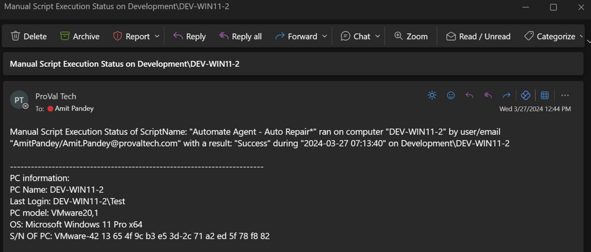

## Summary

This monitor detects the manual script execution by the LT User.

It has a couple of restrictions.

- It will not give reliable data if someone executes the script frequently in less than 2 or 3-minute intervals.
- It will also not result if the script is scheduled once on Group; it can only result if the script is scheduled on the machines or multiple machines.

## Dependencies

[Email Creation - Computer - LTRunByUser](https://proval.itglue.com/DOC-5078775-15475751)

## Target

Global

## Alert Template

`△ Custom - Autofix - Email Send LTRunByUser`

## Emailing

**Subject**

Manual Script Execution Status on %CLIENTNAME%/%COMPUTERNAME%

**Body**

Manual Script Execution Status of %RESULT% on %CLIENTNAME%/%COMPUTERNAME%

Here, %Result% contains the Script Name: "Scriptname" ran on computer "Computername" by user/email "LTUserName/Email address of the ltuser" with a result "Script Result" during "When script executed" on clientname/computername.

**Email Example:**

