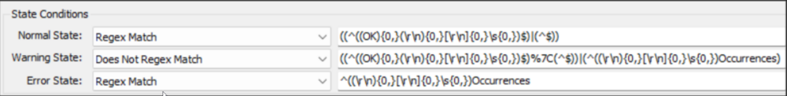
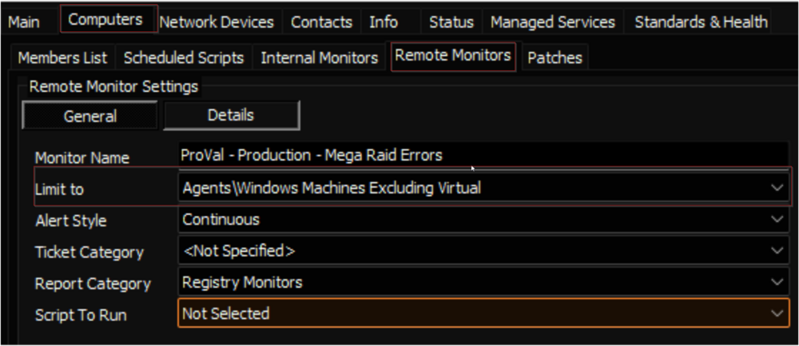
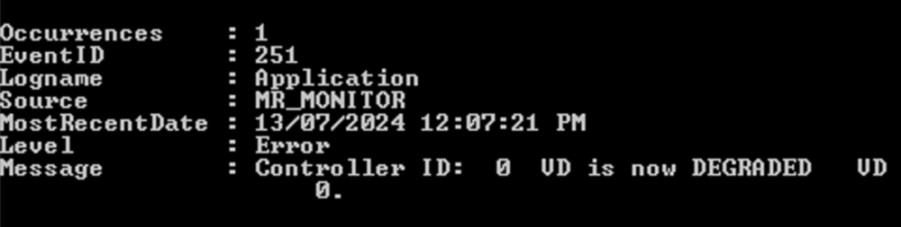

## Summary

This remote monitor detects the error and critical event logs generated by the 'MR_MONITOR' event source within the last 60 minutes.

## Details

**Suggested "Limit to"**: Windows Machines Excluding Virtual  
**Suggested Alert Style**: Continuous  
**Suggested Alert Template**: `<code>△ Custom - Ticket Creation - Computer - Failures Only</code>`

Insert the details of the monitor in the below table.

| Check Action | Server Address | Check Type | Execute Info | Comparator | Interval | Result |
|--------------|----------------|-------------|---------------|------------|----------|--------|
| System       | 127.0.0.1      | Run File    | **REDACTED**  | State Based | 3600     |  |

## Target

Managed Windows Servers  

## Implementation

[Implement - Remote Monitor - Mega RAID Errors](https://proval.itglue.com/DOC-5078775-16770355)

## Ticketing

**Subject:** `<code>Mega Raid Error Detected on %CLIENTNAME%//%COMPUTERNAME%</code>`  

**Body:**  
`Mega Raid Error Detected on %CLIENTNAME%//%COMPUTERNAME%.`  
`Details:`  
`%RESULT%`  

**Sample RESULT:**  

