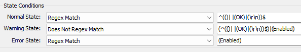

## Summary

Checks whether the NTLMv1.1 is enabled on the end machine or not.

## Details

**Suggested "Limit to"**: Managed Windows Computers  
**Suggested Alert Style**: Once  
**Suggested Alert Template**: Default Do Nothing  

Insert the details of the monitor in the below table.

| Check Action | Server Address | Check Type | Check Value | Comparator   | Interval | Result                                       |
|--------------|----------------|-------------|-------------|---------------|----------|----------------------------------------------|
| System       | 127.0.0.1     | Run File    | REDACTED    | State Based   | 900      |  |

## Target

Managed Windows Computers

## Dependencies

[EPM - Windows Configuration - Dataview - NTLMv1.1 Status [Remote Monitor]](https://proval.itglue.com/DOC-5078775-14448790)

## How to Import

[Import - Remote Monitor - NTLMv1.1 Detection](https://proval.itglue.com/DOC-5078775-14448845)

