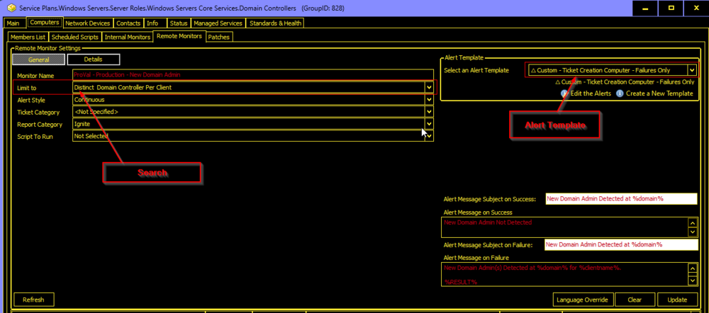
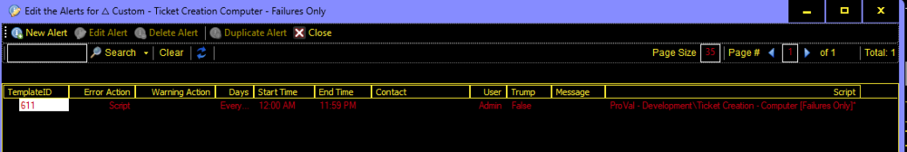

## Implementation Steps

- Import the Alert Template '△ Custom - Ticket Creation Computer - Failures Only'
  - Validate that the [CWM - Automate - Script - Ticket Creation - Computer [Failures Only]](../scripts/Ticket%20Creation%20-%20Computer%20Failures%20Only.md) script was imported as well.

- Run this SQL query from a RAWSQL monitor set to import the required search.
  ```sql
  INSERT INTO `sensorchecks`
  SELECT 
  '' as `SensID`,
  'Distinct Domain Controller Per Client' as `Name`,
  'Select DISTINCT Computers.ComputerID, Clients.Name as `Client Name`, Computers.Name as `Computer Name`, Computers.Domain, Computers.UserName as `Username`, Computers.ComputerID
  From Computers, Clients
  Where Computers.ClientID = Clients.ClientID
  and ((Computers.ComputerID in (SELECT c1.computerid FROM Computers c1 WHERE c1.domain LIKE 'DC:%' AND c1.lastcontact > NOW() - INTERVAL 10 MINUTE AND c1.computerid = ( SELECT MAX(c2.computerid) FROM Computers c2 WHERE c2.domain = c1.domain AND c2.clientid = c1.clientid AND c2.lastcontact > NOW() - INTERVAL 10 MINUTE ))))' as `SQL`,
  '4' as `QueryType`,
  'Computer ID||\\<=|*(SELECT c1.computerid FROM Computers c1 WHERE c1.domain LIKE 'DC:%' AND c1.lastcontact > NOW() - INTERVAL 10 MINUTE AND c1.computerid = ( SELECT MAX(c2.computerid) FROM Computers c2 WHERE c2.domain = c1.domain AND c2.clientid = c1.clientid AND c2.lastcontact > NOW() - INTERVAL 10 MINUTE ))|=||=|^' as `ListData`,
  '0' as `FolderID`,
  '13211dbf-74ba-4334-95d6-10a88d15ea46' as `GUID`,
  '' as `SearchXML`,
  (NULL) as `UpdatedBy`,
  (NULL) as `UpdateDate`
  FROM (SELECT MIN(computerid) FROM computers) a
  Where (SELECT count(*) From SensorChecks where `GUID` = '13211dbf-74ba-4334-95d6-10a88d15ea46') = 0 ;
  ```

- Run this SQL query from a RAWSQL monitor set to create and set up the remote monitor on the Domain Controllers group.
  ```sql
  SET @Groupid= (SELECT Groupid FROM mastergroups WHERE `GUID` = '3ac455da-f1fb-11e1-b4ec-1231391d2d19');
  SET @Searchid= (SELECT sensid FROM sensorchecks WHERE `GUID` = '13211dbf-74ba-4334-95d6-10a88d15ea46');
  SET @Alertaction= (SELECT alertactionid FROM alerttemplate WHERE `GUID` = 'f2fe531c-3116-4afa-85b6-bdb3f5c84a39');

  INSERT INTO groupagents 
  SELECT '' as `AgentID`,
  `groupid` as `GroupID`,
  @Searchid as `SearchID`,
  'ProVal - Production - New Domain Admin' as `Name`,
  '6' as `CheckAction`,
  @Alertaction as `AlertAction`,
  'New Domain Admin Detected at %domain%~~~New Domain Admin Not Detected!!!New Domain Admin Detected at %domain%~~~New Domain Admin(s) Detected at %domain% for %clientname%. %RESULT%' as `AlertMessage`,
  '0' as `ContactID`,
  '3600' as `interval`,
  '127.0.0.1' as `Where`,
  '7' as `What`,
  'C://Windows//System32//WindowsPowerShell//v1.0//powershell.exe -ExecutionPolicy Bypass -Command "[Net.ServicePointManager]::SecurityProtocol = [enum]::ToObject([Net.SecurityProtocolType], 3072); $ProjectName = ''Get-NewDomainAdmin''; $WorkingDirectory = ''C://ProgramData//_Automation//Script//$ProjectName//''; $scriptpath = ''$($WorkingDirectory)$($ProjectName).ps1''; $scripturl = ''https://file.provaltech.com/repo/script/Get-NewDomainAdmin.ps1''; if( !(Test-Path $WorkingDirectory) ) {mkdir $WorkingDirectory | Out-Null}; (New-Object System.Net.WebClient).DownloadFile($scripturl,$scriptpath); & $scriptpath"' as `DataOut`,
  '16' as `Comparor`,
  '10|^(()%7C %7C(OK)%7C(//r//n))$|11|(^(()%7C %7C(OK)%7C(//r//n))$)%7C(distinguishedName)|10|distinguishedName' as `DataIn`,
  '0' as `IDField`,
  '0' as `AlertStyle`,
  '0' as `ScriptID`,
  '' as `datacollector`,
  '0' as `Category`,
  '0' as `TicketCategory`,
  '1' as `ScriptTarget`,
  CONCAT(
  SUBSTRING('abcdef0123456789', FLOOR(RAND()*16+1), 1),
  SUBSTRING('abcdef0123456789', FLOOR(RAND()*16+1), 1),
  SUBSTRING('abcdef0123456789', FLOOR(RAND()*16+1), 1),
  SUBSTRING('abcdef0123456789', FLOOR(RAND()*16+1), 1),
  SUBSTRING('abcdef0123456789', FLOOR(RAND()*16+1), 1),
  SUBSTRING('abcdef0123456789', FLOOR(RAND()*16+1), 1),
  SUBSTRING('abcdef0123456789', FLOOR(RAND()*16+1), 1),
  SUBSTRING('abcdef0123456789', FLOOR(RAND()*16+1), 1),
  '-',
  SUBSTRING('abcdef0123456789', FLOOR(RAND()*16+1), 1),
  SUBSTRING('abcdef0123456789', FLOOR(RAND()*16+1), 1),
  SUBSTRING('abcdef0123456789', FLOOR(RAND()*16+1), 1),
  SUBSTRING('abcdef0123456789', FLOOR(RAND()*16+1), 1),
  '-',
  SUBSTRING('abcdef0123456789', FLOOR(RAND()*16+1), 1),
  SUBSTRING('abcdef0123456789', FLOOR(RAND()*16+1), 1),
  SUBSTRING('abcdef0123456789', FLOOR(RAND()*16+1), 1),
  SUBSTRING('abcdef0123456789', FLOOR(RAND()*16+1), 1),
  '-',
  SUBSTRING('abcdef0123456789', FLOOR(RAND()*16+1), 1),
  SUBSTRING('abcdef0123456789', FLOOR(RAND()*16+1), 1),
  SUBSTRING('abcdef0123456789', FLOOR(RAND()*16+1), 1),
  SUBSTRING('abcdef0123456789', FLOOR(RAND()*16+1), 1),
  '-',
  SUBSTRING('abcdef0123456789', FLOOR(RAND()*16+1), 1),
  SUBSTRING('abcdef0123456789', FLOOR(RAND()*16+1), 1),
  SUBSTRING('abcdef0123456789', FLOOR(RAND()*16+1), 1),
  SUBSTRING('abcdef0123456789', FLOOR(RAND()*16+1), 1),
  '-',
  SUBSTRING('abcdef0123456789', FLOOR(RAND()*16+1), 1),
  SUBSTRING('abcdef0123456789', FLOOR(RAND()*16+1), 1),
  SUBSTRING('abcdef0123456789', FLOOR(RAND()*16+1), 1),
  SUBSTRING('abcdef0123456789', FLOOR(RAND()*16+1), 1),
  '-',
  SUBSTRING('abcdef0123456789', FLOOR(RAND()*16+1), 1),
  SUBSTRING('abcdef0123456789', FLOOR(RAND()*16+1), 1),
  SUBSTRING('abcdef0123456789', FLOOR(RAND()*16+1), 1),
  SUBSTRING('abcdef0123456789', FLOOR(RAND()*16+1), 1),
  SUBSTRING('abcdef0123456789', FLOOR(RAND()*16+1), 1),
  SUBSTRING('abcdef0123456789', FLOOR(RAND()*16+1), 1),
  SUBSTRING('abcdef0123456789', FLOOR(RAND()*16+1), 1),
  SUBSTRING('abcdef0123456789', FLOOR(RAND()*16+1), 1),
  SUBSTRING('abcdef0123456789', FLOOR(RAND()*16+1), 1),
  SUBSTRING('abcdef0123456789', FLOOR(RAND()*16+1), 1),
  SUBSTRING('abcdef0123456789', FLOOR(RAND()*16+1), 1)
  ) as `GUID`,
  'root' as `UpdatedBy`,
  (NOW()) as `UpdateDate`
  FROM mastergroups m
  WHERE m.groupid = @Groupid
  AND m.groupid NOT IN (SELECT DISTINCT groupid FROM groupagents WHERE `Name` = 'ProVal - Production - New Domain Admin') ;
  ```

- Check the `Domain Controllers` group and ensure that the monitor set is created and configured with the correct search and alert template.  
  Limit To: Distinct Domain Controller Per Client  
  Alert Template: △ Custom - Ticket Creation Computer - Failures Only  
  

- Click `Edit the Alerts` and ensure that the alert template is using the correct script, [CWM - Automate - Script - Ticket Creation - Computer [Failures Only]](../scripts/Ticket%20Creation%20-%20Computer%20Failures%20Only.md)  
    


