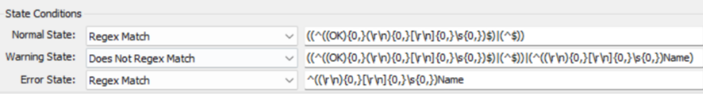
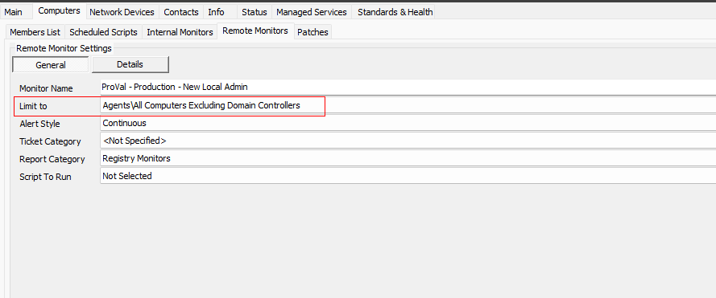
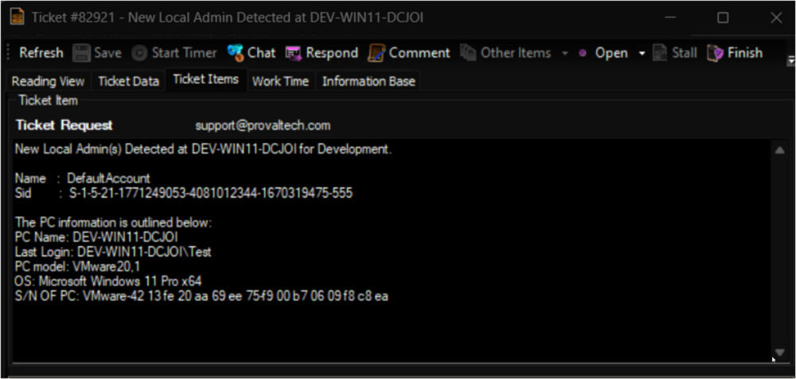

## Summary

The purpose of the remote monitor is to detect newly created or promoted local admins and create a ticket. It uses the [EPM - User Management - Agnostic - Get-NewLocalAdmin](<../../powershell/Get-NewLocalAdmin.md>) agnostic script to perform the monitoring.

## Details

**Suggested "Limit to"**: Windows Computers excluding domain controllers `\\<All Computers Excluding Domain Controllers>`

**Suggested Alert Style**: Continuous

**Suggested Alert Template**: △ Custom - Ticket Creation Computer - Failures Only

Insert the details of the monitor in the table below.

| Check Action | Server Address | Check Type | Execute Info | Comparator | Interval | Result |
|--------------|----------------|-------------|---------------|------------|----------|--------|
| System       | 127.0.0.1     | Run File    | **REDACTED**  | State Based | 3600     |  |

## Dependencies

[CWM - Automate - Script - Ticket Creation - Computer [Failures Only]](<../scripts/Ticket Creation - Computer Failures Only.md>)

## Target

Managed Windows Workstations and Servers.

The monitor set should be limited to the `\\<All Computers Excluding Domain Controllers>` search.

## Implementation

Please follow the instructions provided in the implementation article to implement the solution: [Implement - Remote Monitor - New Local Admin](<./New Local Admin.md>)

## Ticketing

**Subject:** `New Local Admin Detected at \\<DomainName>`

**Body:**  

`New Local Admin(s) Detected at %COMPUTERNAME% for %CLIENTNAME%.`  
`\\<Newly Created Local Admin(s)>`

**Example:**  

**Automate will never close the ticket; instead, it will keep adding the new detections to the same ticket as a comment/note, unless the ticket is closed/resolved manually.**

