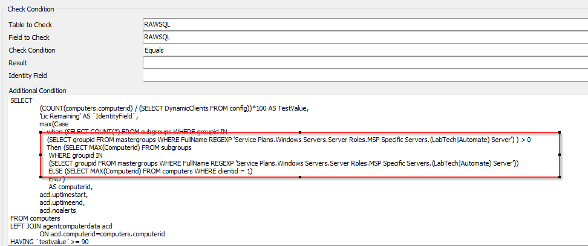

## Summary

This document checks the current Automate license availability. The suggested monitor failure threshold is 90% usage.  
The recommended alert template is "Default Create Automate Ticket."

## Important Notes

For on-prem partners, tickets will be generated for the Automate server.  
For hosted partners, it will be the minimum computer ID of Client ID 1. If Client ID 1 is not the primary client for a hosted partner, then the Client ID should be updated in the Additional Field:  

## Target

The suggested target for the monitor is as follows:  
Global - Should be run without explicitly defined targets.

