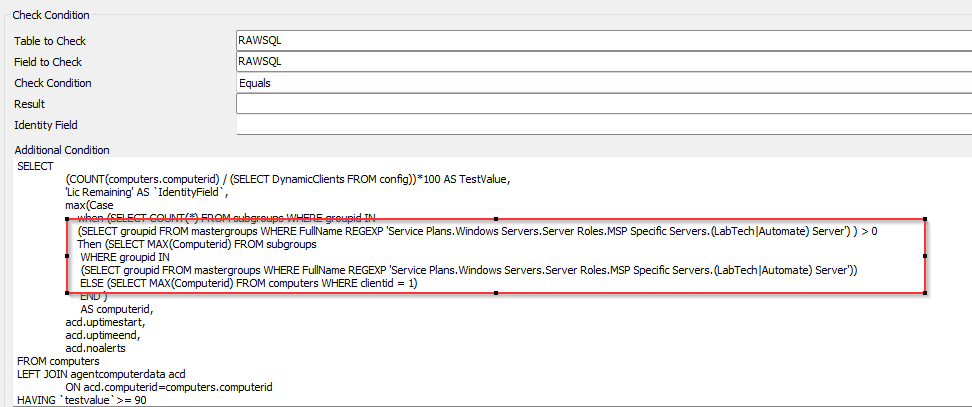

## Summary

Checks current Automate license availability. Suggested monitor failure is 90% usage.  
The suggested alert template is Default Create Automate Ticket.

## Important Notes

For the on-prem partners, tickets will be generated for the Automate server.  
For the hosted partners, it will be the minimum computerid of Clientid 1. If Clientid 1 is not the primary client for a hosted partner then the clientid should be updated in the Additional Field:  

## Target

The suggested target for the monitor.  
Global - Should be run without explicitly defined targets.

